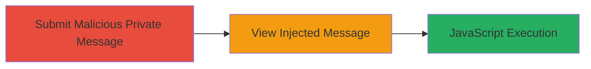

---
tags:
  - xss
  - concrete-cms
  - javascript-injection
  - session-hijacking
type: attack_chain
tools: []
tactics:
  - '[[Execution]]'
commands: []
platforms:
  - Web
complexity: low
procedures:
  - >-
    [[procedures/Inject-Malicious-Script-into-Concrete-CMS-Private-Message-Title]]
step_count: 1
techniques:
  - '[[JavaScript]]'
description: >-
  A single-stage attack exploiting insufficient input sanitization in the
  private message title field of Concrete CMS to inject and execute arbitrary
  JavaScript when the message is viewed by authenticated users.
skill_level: intermediate
impact_level: high
id: 7785ee7c-171d-42d7-8afc-b42301ff6cc8
created_at: '2025-12-14T03:16:25.406Z'
updated_at: '2025-12-14T03:16:25.406Z'
verified: false
validated: true
submitted: true
mitre_tactics:
  - '[[Execution]]'
mitre_techniques:
  - '[[JavaScript]]'
---
# XSS in Concrete CMS Private Message Title Leading to Arbitrary JavaScript Execution

Multi-stage attack chain demonstrating a complete attack workflow.

## Chain Metrics Dashboard

| Metric | Value |
|--------|-------|
| Chain Status | Unverified |
| Total Steps | 1 |
| Execution Time | ~1 minute |
| Skill Level | Intermediate |
| Complexity | Low |
| Impact Level | High |

## Attack Flow Visualization

## Prerequisites & Requirements

### Required Tools

- Web browser (e.g., Chrome with developer tools for payload testing)

### Target Environment

- Concrete CMS instance (PHP-based web application)
- Authenticated access to private messaging feature
- No specific ports required beyond standard HTTP/HTTPS (80/443)

### Initial Access Requirements

- Valid user credentials for Concrete CMS
- Network access to the target web application
- No prior elevated access needed; standard user privileges suffice

## Detailed Attack Procedures

### Step 1: Inject and Trigger XSS Payload
procedure: [[procedures/Inject-Malicious-Script-into-Concrete-CMS-Private-Message-Title]]

**Objective**: Submit a private message with a malicious JavaScript payload in the title field to exploit the lack of sanitization, enabling execution when another user views the message.

**Instructions**: Log in to the Concrete CMS dashboard as an authenticated user. Navigate to the private messaging section (typically under user profile or communications). In the message composition form, enter a harmless body text if required, but focus on the title field: inject an HTML script tag such as `` or a more advanced payload like `` to exfiltrate session data. Attach a screenshot or file if the form allows to mimic legitimate use. Submit the message to another user. Once the recipient views the message, the payload executes in their browser context.

**Expected Output**: Upon viewing, the script runs, displaying an alert or sending data to the attacker's server, confirming execution.

**Success Indicators**:
- Payload appears unsanitized in the sent message preview (if available)
- Recipient's browser executes the script, e.g., alert pops up or network request to attacker server is observed in dev tools
- Potential theft of session cookies or other client-side data

## Attack Chain Summary

### Key Achievements

1. Successful injection of arbitrary JavaScript via the private message title field
2. Execution of payload in the victim's browser context upon message view
3. Potential for session hijacking, data theft, or further client-side attacks

## Technique & Tactic Coverage

### MITRE ATT&CK Techniques

- [[JavaScript]]

### MITRE ATT&CK Tactics

- [[Execution]]

---
*Last updated: 2024-10-01*
