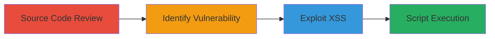

# XSS in Concrete CMS Theme Preview via Unescaped themeHandle Parameter

Multi-stage attack chain demonstrating the discovery of a Cross-Site Scripting (XSS) vulnerability in the Concrete CMS theme preview tool and its potential exploitation to inject malicious JavaScript.

## Chain Metrics Dashboard

| Metric | Value |
|--------|-------|
| Chain Status | Unverified |
| Total Steps | 2 |
| Execution Time | ~5 minutes |
| Skill Level | Intermediate |
| Complexity | Low |
| Impact Level | Medium |

## Attack Flow Visualization



## Prerequisites & Requirements

### Required Tools

- Git (for cloning repository)
- Web browser (for testing exploitation)

### Target Environment

- Concrete CMS installation (PHP-based web application)
- Access to the theme preview tool at /tools/themes/preview.php
- GitHub access for source code review

### Initial Access Requirements

- Public access to the Concrete CMS GitHub repository
- Network access to the target CMS instance for exploitation testing
- No credentials required for discovery, but authenticated session may aid exploitation

## Detailed Attack Procedures

### Step 1: Source Code Review
procedure: [[procedures/Review-Concrete-CMS-Source-Code-for-XSS]]

**Objective**: Examine the source code of the Concrete CMS theme preview tool to identify improper handling of user input that could lead to XSS.

**Instructions**: Clone the Concrete CMS repository from GitHub and navigate to the preview.php file to inspect line 7 for unescaped output of the themeHandle parameter.

Use git to clone the repository:

```bash
git clone https://github.com/concrete5/concrete5.git
```

Then open the file web/concrete/tools/themes/preview.php and review line 7, which outputs $_REQUEST['themeHandle'] directly into HTML without escaping.

**Expected Output**: Identification of vulnerable code snippet: echo $_REQUEST['themeHandle']; inserted into <script> or HTML context.

**Success Indicators**:
- Vulnerable code confirmed in preview.php
- Potential for XSS injection via themeHandle parameter noted

### Step 2: Exploit XSS in Theme Preview
procedure: [[procedures/Exploit-XSS-in-Theme-Preview-Tool]]

**Objective**: Inject malicious JavaScript via the themeHandle parameter to execute arbitrary code in the victim's browser, demonstrating the XSS impact.

**Instructions**: Access the theme preview tool URL, such as http://target.com/tools/themes/preview.php?themeHandle=<script>alert('XSS')</script>, to test for reflected XSS execution.

In a web browser, navigate to the preview endpoint and append the payload to the themeHandle parameter. Observe if the script executes.

For automated testing, use a browser developer tools or a simple curl request to send the payload:

```bash
curl "http://target.com/tools/themes/preview.php?themeHandle=%3Cscript%3Ealert('XSS')%3C/script%3E"
```

**Expected Output**: Alert box or script execution in the browser, confirming XSS. Note that practical exploitation may be limited due to context restrictions.

**Success Indicators**:
- Malicious script executes in the preview page
- Potential for session hijacking or data theft if chained with other vulns

## Attack Chain Summary

### Key Achievements

1. Successful identification of unescaped user input in Concrete CMS source code
2. Confirmation of reflected XSS vulnerability in theme preview tool
3. Demonstration of potential JavaScript injection, though exploitation difficulty noted

## Technique & Tactic Coverage

### MITRE ATT&CK Techniques

- [[Exploit Public-Facing Application]]
- [[JavaScript]]

### MITRE ATT&CK Tactics

- [[Initial Access]]
- [[Execution]]

---
*Last updated: 2023-10-01T00:00:00Z*
