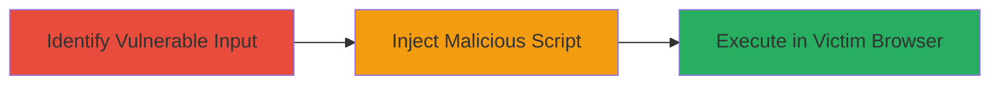

# XSS in Deriv.com Account Creation Leading to Script Injection and Session Hijacking

Multi-stage attack chain demonstrating exploitation of a reflected XSS vulnerability in the account creation process of Deriv.com, reported in 2015 via HackerOne.

## Chain Metrics Dashboard

| Metric | Value |
|--------|-------|
| Chain Status | Unverified |
| Total Steps | 1 |
| Execution Time | ~5 minutes |
| Skill Level | Beginner |
| Complexity | Low |
| Impact Level | Medium |

## Attack Flow Visualization

## Prerequisites & Requirements

### Required Tools

- Browser developer tools (e.g., Chrome DevTools)

### Target Environment

- Web platform
- Access to the account creation page (publicly accessible)
- No authentication required for initial testing

### Initial Access Requirements

- Internet access
- Victim interaction (e.g., tricking user into visiting crafted link)
- No prior credentials needed

## Detailed Attack Procedures

### Step 1: Exploit XSS in Account Creation
procedure: [[procedures/Exploit-XSS-in-Account-Creation-Form]]

**Objective**: Inject a malicious JavaScript payload into the account creation form to execute arbitrary scripts in the victim's browser, enabling session hijacking or data theft.

**Instructions**: Navigate to the vulnerable account creation page and identify unsanitized input fields (e.g., name or email). Craft a payload such as `` and submit it. For real exploitation, use a payload to steal cookies, like ``. Test in a browser to confirm execution.

**Expected Output**: Alert box or redirection to attacker's site with stolen data.

**Success Indicators**:
- Script executes in browser (e.g., alert pops up)
- Victim's session data is exfiltrated to attacker's controlled endpoint

## Attack Chain Summary

### Key Achievements

1. Successful injection of malicious script via account creation form
2. Execution of JavaScript in victim's browser context
3. Potential for session hijacking or sensitive data theft

## Technique & Tactic Coverage

### MITRE ATT&CK Techniques

- [[JavaScript]]

### MITRE ATT&CK Tactics

- [[Execution]]
- [[Collection]]

---
*Last updated: 2023-10-01T00:00:00Z*
