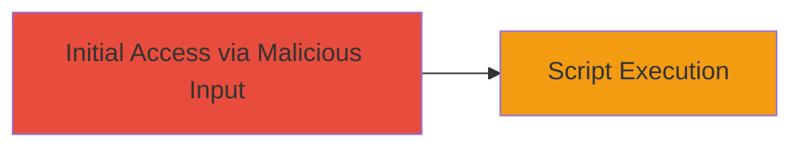

# XSS in FormAssembly api_v1 Endpoint for Arbitrary Script Execution

Multi-stage attack chain demonstrating a complete attack workflow.

## Chain Metrics Dashboard

| Metric | Value |
|--------|-------|
| Chain Status | Unverified |
| Total Steps | 1 |
| Execution Time | ~1 minutes |
| Skill Level | Beginner |
| Complexity | Low |
| Impact Level | Medium |

## Attack Flow Visualization

## Prerequisites & Requirements

### Required Tools

- Browser developer tools for payload testing

### Target Environment

- Web platform
- Access to FormAssembly api_v1 endpoint
- No specific services/ports required beyond standard HTTPS (443)

### Initial Access Requirements

- Ability to submit inputs to the api_v1 endpoint (e.g., via form or API call)
- No credentials needed for reflected XSS
- Network access to the FormAssembly domain

## Detailed Attack Procedures

### Step 1: Exploit XSS Vulnerability
procedure: [[procedures/Exploit-XSS-in-FormAssembly-api-v1]]

**Objective**: Inject and execute arbitrary JavaScript code in the victim's browser by exploiting insufficient input sanitization in the api_v1 endpoint.

**Instructions**: Craft a malicious payload such as `` and submit it to the api_v1 endpoint via a form or direct API request. Use browser tools to intercept and modify the request if needed. Observe the response for reflection of the payload without sanitization, leading to script execution.

**Expected Output**: An alert popup displaying 'XSS' in the browser, confirming arbitrary JavaScript execution.

**Success Indicators**:
- Payload reflected unsanitized in the response
- JavaScript alert or console log triggered
- Potential for further payloads to steal cookies or session data

## Attack Chain Summary

### Key Achievements

1. Successful injection of XSS payload into api_v1 endpoint
2. Demonstration of arbitrary script execution via alert popup
3. Highlighted risk of browser-based attacks on users interacting with the endpoint

## Technique & Tactic Coverage

### MITRE ATT&CK Techniques

- [[JavaScript]]

### MITRE ATT&CK Tactics

- [[Execution]]

---
*Last updated: 2023-10-01T00:00:00Z*
