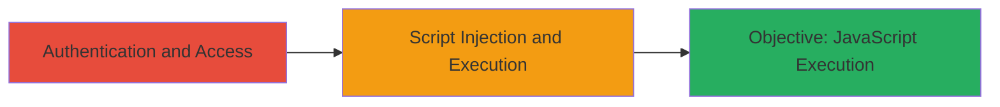

---
tags:
  - xss
  - javascript
  - web-vulnerability
type: attack_chain
tools: []
tactics:
  - '[[Initial Access]]'
  - '[[Execution]]'
verified: false
platforms:
  - Web
submitted: true
complexity: low
created_at: '2023-10-01T00:00:00Z'
procedures:
  - '[[procedures/Inject-Malicious-Script-in-Localize-Team-Only-Area]]'
step_count: 1
techniques:
  - '[[JavaScript]]'
  - '[[Exploit Public-Facing Application]]'
updated_at: '2025-12-14T03:15:53.236Z'
description: >-
  A single-stage attack exploiting a Cross-site Scripting (XSS) vulnerability in
  the Team Only Area of the Localize platform, allowing authenticated users to
  inject and execute arbitrary JavaScript.
skill_level: beginner
impact_level: medium
id: 7e66f458-727e-44e7-a44f-68e2df1320ea
validated: true
mitre_tactics:
  - '[[Initial Access]]'
  - '[[Execution]]'
mitre_techniques:
  - '[[JavaScript]]'
  - '[[Exploit Public-Facing Application]]'
---
# XSS in Localize Team Only Area for Arbitrary JavaScript Execution

Multi-stage attack chain demonstrating a complete attack workflow.

## Chain Metrics Dashboard

| Metric | Value |
|--------|-------|
| Chain Status | Unverified |
| Total Steps | 1 |
| Execution Time | ~5 minutes |
| Skill Level | Beginner |
| Complexity | Low |
| Impact Level | Medium |

## Attack Flow Visualization

## Prerequisites & Requirements

### Required Tools

- Browser developer tools for payload testing

### Target Environment

- Web platform: Localize application
- Required services/ports: HTTPS (port 443)
- Network access requirements: Internet access to Localize platform

### Initial Access Requirements

- Credential requirements: Valid authenticated account with access to Team Only Area
- Network position: External or internal network
- Prior access needed: User authentication

## Detailed Attack Procedures

### Step 1: Access and Exploit XSS in Team Only Area
procedure: [[procedures/Inject-Malicious-Script-in-Localize-Team-Only-Area]]

**Objective**: Gain access to the Team Only Area and inject a malicious JavaScript payload to execute arbitrary code in the context of the authenticated user.

**Instructions**: Authenticate to the Localize platform using valid credentials. Navigate to the Team Only Area, locate the vulnerable input field (likely a form or comment section lacking proper sanitization), and submit a test payload such as ``. Observe the execution of the script upon page load or interaction.

**Expected Output**: An alert box or console log confirming JavaScript execution, indicating successful injection.

**Success Indicators**:
- Alert or script output appears in the browser
- No sanitization errors; payload executes without modification

## Attack Chain Summary

### Key Achievements

1. Successful authentication and navigation to the vulnerable Team Only Area
2. Injection of arbitrary JavaScript payload
3. Execution of script in the authenticated user's context, potentially leading to session hijacking or data theft

## Technique & Tactic Coverage

### MITRE ATT&CK Techniques

- [[JavaScript]]
- [[Exploit Public-Facing Application]]

### MITRE ATT&CK Tactics

- [[Initial Access]]
- [[Execution]]

---
*Last updated: 2023-10-01T00:00:00Z*
