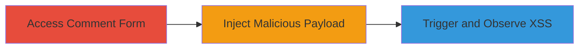

# XSS in Nextcloud Comment Form via HTML Injection

Multi-stage attack chain demonstrating exploitation of a Cross-Site Scripting (XSS) vulnerability in the comment-adding form on demo.nextcloud.com, caused by an outdated Nextcloud version that fails to sanitize HTML input. The attack injects a payload to break out of a textarea and execute JavaScript, potentially leading to session hijacking or phishing in victims' browsers. The demo server was later updated to patch this issue.

## Chain Metrics Dashboard

| Metric | Value |
|--------|-------|
| Chain Status | Unverified |
| Total Steps | 3 |
| Execution Time | ~2 minutes |
| Skill Level | Beginner |
| Complexity | Low |
| Impact Level | Medium |

## Attack Flow Visualization

## Prerequisites & Requirements

### Required Tools

- [[tools/Firefox]]

### Target Environment

- Web platform
- Nextcloud service (outdated version vulnerable to HTML injection)
- Publicly accessible demo site like demo.nextcloud.com

### Initial Access Requirements

- No credentials required
- Direct network access to the target web application
- No prior access needed

## Detailed Attack Procedures

### Step 1: Access Comment Form
procedure: [[procedures/Access-Nextcloud-Comment-Form]]

**Objective**: Locate and access the vulnerable comment-adding form on the target Nextcloud demo site to prepare for payload injection.

**Instructions**: Open a web browser and navigate to the demo site's page that contains the comment form, such as a file or post view in Nextcloud.

**Expected Output**: The comment-adding form is visible, typically a textarea field for entering comments.

**Success Indicators**:
- Form loads without errors
- Textarea input field is present and editable

### Step 2: Inject XSS Payload in Comment
procedure: [[procedures/Inject-XSS-Payload-in-Comment]]

**Objective**: Submit a crafted HTML payload into the comment field to break out of the textarea and inject executable JavaScript code.

**Instructions**: In the comment textarea, enter the payload `</textarea>` and submit the form. This payload closes the textarea tag prematurely and inserts an img element that triggers a JavaScript alert on mouseover.

**Expected Output**: The form submits successfully, and the comment appears on the page with the injected HTML rendered.

**Success Indicators**:
- No submission errors
- Injected content is visible in the rendered comments section

### Step 3: Observe XSS Execution
procedure: [[procedures/Observe-XSS-Execution]]

**Objective**: Trigger the injected JavaScript to confirm arbitrary code execution in the browser context.

**Instructions**: Hover the mouse over the injected img element in the rendered comment. This should execute the onmouseover event, displaying an alert box with the document domain.

**Expected Output**: A JavaScript alert pops up showing the domain (e.g., "demo.nextcloud.com").

**Success Indicators**:
- Alert dialog appears on hover
- JavaScript executes without browser errors

## Attack Chain Summary

### Key Achievements

1. Successfully injected HTML tags into the unsanitized comment form
2. Executed arbitrary JavaScript in the victim's browser context
3. Demonstrated potential for client-side attacks like session theft

## Technique & Tactic Coverage

### MITRE ATT&CK Techniques

- [[Exploit Public-Facing Application]]
- [[JavaScript]]

### MITRE ATT&CK Tactics

- [[Initial Access]]
- [[Execution]]

---
*Last updated: 2023-10-01T00:00:00Z*
