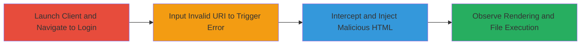

---
id: uuid-for-attack-chain
name: XSS in Nextcloud Desktop Client Leading to Arbitrary Local File Execution
type: attack_chain
description: A multi-stage attack exploiting an XSS vulnerability in the Nextcloud desktop client for Windows, allowing arbitrary local file execution via unsanitized error responses in the login form alert box.
verified: false
submitted: false
step_count: 4
created_at: 2023-10-01T00:00:00Z
updated_at: 2023-10-01T00:00:00Z
procedures: [[procedures/Launch-Nextcloud-Desktop-Client-and-Navigate-to-Login]], [[procedures/Input-Invalid-Server-URI-to-Trigger-Error]], [[procedures/Intercept-and-Inject-Malicious-HTML-Response]], [[procedures/Observe-HTML-Rendering-and-Local-File-Execution]]
techniques: [[Exploitation for Client Execution]], [[Adversary-in-the-Middle]]
tactics: [[Initial Access]]
tags: xss, nextcloud, desktop-client, local-file-execution, windows
platforms: Windows
tools: [[tools/Burp-Suite]]
---

# XSS in Nextcloud Desktop Client Leading to Arbitrary Local File Execution

Multi-stage attack chain demonstrating a complete attack workflow exploiting XSS in the Nextcloud desktop client to achieve arbitrary local file execution on Windows.

## Chain Metrics Dashboard

| Metric | Value |
|--------|-------|
| Chain Status | Unverified |
| Total Steps | 4 |
| Execution Time | ~5 minutes |
| Skill Level | Intermediate |
| Complexity | Medium |
| Impact Level | High |

## Attack Flow Visualization

## Prerequisites & Requirements

### Required Tools

- [[tools/Burp-Suite]]

### Target Environment

- Target OS/Platform: Windows
- Required services/ports: None (local client application)
- Network access requirements: Ability to control or intercept HTTP responses (e.g., via MITM proxy)

### Initial Access Requirements

- Credential requirements: None
- Network position: Attacker controls the error response server or can intercept traffic
- Prior access needed: None, but client must be installed on target Windows machine

## Detailed Attack Procedures

### Step 1: Launch Nextcloud Desktop Client and Navigate to Login
procedure: [[procedures/Launch-Nextcloud-Desktop-Client-and-Navigate-to-Login]]

**Objective**: Open the Nextcloud client and reach the initial server connection screen to prepare for vulnerability exploitation.

**Instructions**: Launch the Nextcloud desktop client executable and proceed to the login form for connecting to a server. No specific commands are needed beyond starting the application.

**Expected Output**: The client opens to the server address input field.

**Success Indicators**:
- Client application launches successfully
- Server connection/login form is displayed

### Step 2: Input Invalid Server URI to Trigger Error
procedure: [[procedures/Input-Invalid-Server-URI-to-Trigger-Error]]

**Objective**: Enter an invalid URI that provokes an error response (e.g., 403 Forbidden) from a controlled or interceptable server, setting up the XSS trigger.

**Instructions**: In the server address field, input a URI pointing to a server under attacker control or one that can be intercepted, such as http://attacker-controlled-site.com/invalid-path. Configure the proxy (e.g., Burp) to route traffic if needed.

**Expected Output**: The client attempts connection and displays an error alert box upon receiving the error response.

**Success Indicators**:
- Error response (e.g., 403) is sent
- Alert box appears in the client

### Step 3: Intercept and Inject Malicious HTML Response
procedure: [[procedures/Intercept-and-Inject-Malicious-HTML-Response]]

**Objective**: Modify the error response body to include unsanitized HTML payload that executes local files via file:// protocol.

**Instructions**: Using Burp Suite, intercept the HTTP request to the invalid URI and alter the response body to inject HTML like <A HREF="file:///C:/WINDOWS/system32/calc.exe">CALC.EXE</A>. Ensure the response status is 403 or similar to match the error condition.

**Expected Output**: Modified response is forwarded to the client, triggering the alert box with the injected HTML.

**Success Indicators**:
- Response interception and modification successful
- Injected HTML is rendered in the alert box

### Step 4: Observe HTML Rendering and Local File Execution
procedure: [[procedures/Observe-HTML-Rendering-and-Local-File-Execution]]

**Objective**: Confirm the client renders the malicious HTML in the alert box, leading to automatic execution of the local file without user confirmation.

**Instructions**: Interact with the alert box if necessary (e.g., click the link), but observe that the elevated permissions (similar to IE local zone) allow file:// execution directly.

**Expected Output**: The calculator (calc.exe) or targeted local file launches on the Windows system.

**Success Indicators**:
- HTML tags are interpreted and rendered
- Local file executes (e.g., calc.exe opens)

## Attack Chain Summary

### Key Achievements

1. Successful XSS exploitation in a trusted error context
2. Arbitrary local file execution bypassing confirmations
3. Demonstration of client-side vulnerability leading to system compromise

## Technique & Tactic Coverage

### MITRE ATT&CK Techniques

- [[Exploitation for Client Execution]] Exploitation for Client Execution
- [[Adversary-in-the-Middle]] Adversary-in-the-Middle

### MITRE ATT&CK Tactics

- [[Initial Access]] Initial Access

---
*Last updated: 2023-10-01T00:00:00Z*
