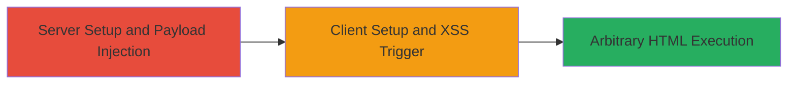

---

# XSS in Nextcloud Desktop Client via Unsanitized Full Name and Status Message

Multi-stage attack chain demonstrating a complete attack workflow.

## Chain Metrics Dashboard

| Metric | Value |
|--------|-------|
| Chain Status | Unverified |
| Total Steps | 2 |
| Execution Time | ~15 minutes |
| Skill Level | Intermediate |
| Complexity | Medium |
| Impact Level | High |

## Attack Flow Visualization

## Prerequisites & Requirements

### Required Tools

- None (uses built-in Nextcloud interfaces)

### Target Environment

- Nextcloud Server (web-based, any OS)
- Nextcloud Desktop Client on Windows 10 or similar
- Required services/ports: HTTP/HTTPS (default 80/443 for server)
- Network access requirements: Local network or internet access to server

### Initial Access Requirements

- Valid user account on Nextcloud Server
- Administrative access not required (user-level profile editing)
- Network position: Attacker must control a user account
- Prior access needed: Ability to edit own profile

## Detailed Attack Procedures

### Step 1: Server Setup and Payload Injection
procedure: [[procedures/Inject-XSS-Payload-into-Nextcloud-User-Profile]]

**Objective**: Establish a Nextcloud server instance, authenticate, and inject a malicious HTML payload into the user's Full Name and Status Message fields to prepare for client-side rendering.

**Instructions**: Follow the procedure to install and configure the server, log in, navigate to the profile, and set the fields to a payload like ``. This payload will be fetched and rendered as an image in the client.

**Expected Output**: Profile updated successfully on the server; no immediate visual change, but payload is stored.

**Success Indicators**:
- Profile fields saved without errors
- Payload visible in raw form if inspected via API or database

### Step 2: Client Setup and XSS Trigger
procedure: [[procedures/Trigger-XSS-in-Nextcloud-Desktop-Client]]

**Objective**: Install and authenticate the Nextcloud Desktop Client, then observe the unsanitized rendering of the injected payload as executable HTML, confirming the XSS vulnerability.

**Instructions**: Install the client on a Windows machine, log in with the affected account, open the main UI, and check the user information display. The payload should render as an actual image element, proving HTML interpretation.

**Expected Output**: Injected `` tag renders as a visible image in the client's Full Name and/or Status Message display.

**Success Indicators**:
- Image loads and displays in client UI
- No sanitization errors; HTML is executed client-side
- Potential for further payloads to inject scripts or resources

## Attack Chain Summary

### Key Achievements

1. Successful injection of arbitrary HTML into trusted user profile fields
2. Demonstration of client-side rendering without sanitization, enabling XSS
3. Potential for resource injection, session hijacking, or phishing via more advanced payloads

## Technique & Tactic Coverage

### MITRE ATT&CK Techniques

- [[JavaScript]]
- [[Exploitation for Client Execution]]

### MITRE ATT&CK Tactics

- [[Execution]]

---

*Last updated: 2023-10-01T12:00:00Z*
