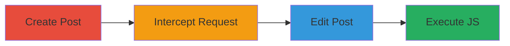

---
tags:
  - xss
  - web
  - api
  - javascript
type: attack_chain
tools:
  - '[[tools/Burp-Suite]]'
tactics:
  - '[[Execution]]'
  - '[[Persistence]]'
commands: []
platforms:
  - Web
complexity: medium
procedures:
  - '[[procedures/Create-Scheduled-Post-with-Link]]'
  - '[[procedures/Intercept-and-Modify-API-Request]]'
  - '[[procedures/Edit-Scheduled-Post]]'
  - '[[procedures/Execute-Malicious-JavaScript]]'
step_count: 4
techniques:
  - '[[JavaScript]]'
description: >-
  Exploiting a vulnerability in Reddit's RichText parser to inject and execute
  malicious JavaScript in scheduled posts.
skill_level: intermediate
impact_level: high
id: 77647db4-732f-4dad-8a8a-0182265acb37
created_at: '2025-12-14T00:11:16.446Z'
updated_at: '2025-12-14T00:11:16.446Z'
verified: false
validated: true
submitted: true
mitre_tactics:
  - '[[Execution]]'
  - '[[Persistence]]'
mitre_techniques:
  - '[[JavaScript]]'
---
# XSS in Reddit Scheduled Posts via Malicious JavaScript Link Injection

Multi-stage attack chain demonstrating how to exploit a cross-site scripting (XSS) vulnerability in Reddit's scheduled posts feature by injecting malicious JavaScript links through API request modification.

## Chain Metrics Dashboard

| Metric | Value |
|--------|-------|
| Chain Status | Unverified |
| Total Steps | 4 |
| Execution Time | ~5 minutes |
| Skill Level | Intermediate |
| Complexity | Medium |
| Impact Level | High |

## Attack Flow Visualization

## Prerequisites & Requirements

### Required Tools

- [[tools/Burp-Suite]]

### Target Environment

- Web platform
- Reddit API services
- Network access to Reddit's scheduled posts endpoint

### Initial Access Requirements

- Valid Reddit account with permission to create scheduled posts
- Proxy tool for request interception

## Detailed Attack Procedures

### Step 1: Create Scheduled Post with Link
procedure: [[procedures/Create-Scheduled-Post-with-Link]]

**Objective**: Set up a scheduled post containing a hyperlink to prepare for payload injection.

**Instructions**: Use the Reddit web interface to create a new scheduled post. Include a standard hyperlink in the RichText content, such as a markdown link [link](https://example.com).

**Expected Output**: A successfully created scheduled post visible in the Reddit dashboard.

**Success Indicators**:
- Post creation confirmed
- Hyperlink appears in the post content

### Step 2: Intercept and Modify API Request
procedure: [[procedures/Intercept-and-Modify-API-Request]]

**Objective**: Bypass client-side checks by modifying the API request to inject a malicious JavaScript scheme.

**Instructions**: Configure [[tools/Burp-Suite]] to intercept the HTTP request sent to Reddit's scheduled post API endpoint. Replace the hyperlink scheme with 'javascript:' followed by a payload, such as 'javascript:alert(document.cookie)'.

**Expected Output**: Modified request successfully sent and accepted by the server.

**Success Indicators**:
- Request interception successful
- Payload injection confirmed in the response

### Step 3: Edit Scheduled Post
procedure: [[procedures/Edit-Scheduled-Post]]

**Objective**: Access the editing interface to expose the injected malicious link.

**Instructions**: Navigate to the scheduled posts section in the Reddit interface and select the edit option for the modified post.

**Expected Output**: The editing page loads with the malicious link visible in the RichText editor.

**Success Indicators**:
- Editing page accessed
- Malicious link displayed without filtering

### Step 4: Execute Malicious JavaScript
procedure: [[procedures/Execute-Malicious-JavaScript]]

**Objective**: Trigger the XSS by interacting with the malicious link to execute arbitrary JavaScript.

**Instructions**: In the editing page, click the injected link (or use middle-click/CMD+click) to execute the JavaScript payload in the page's context.

**Expected Output**: JavaScript execution, such as an alert displaying document cookies.

**Success Indicators**:
- Script executes successfully
- Potential for cookie theft or other actions demonstrated

## Attack Chain Summary

### Key Achievements

1. Bypassed client-side hyperlink validation
2. Injected and executed malicious JavaScript in admin context
3. Demonstrated potential for session hijacking or data exfiltration

## Technique & Tactic Coverage

### MITRE ATT&CK Techniques

- [[JavaScript]]

### MITRE ATT&CK Tactics

- [[Execution]]
- [[Persistence]]

*Last updated: 2023-10-01*
