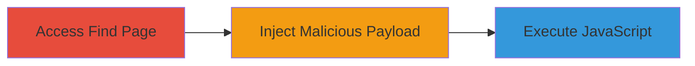

---
tags:
  - xss
  - javascript
  - web
  - respondly
type: attack_chain
tools: []
tactics:
  - '[[Execution]]'
verified: false
platforms:
  - Web
submitted: true
complexity: medium
created_at: '2024-10-01T12:00:00Z'
procedures:
  - '[[procedures/Inject-XSS-Payload-in-Respondly-Private-Notes]]'
step_count: 3
techniques:
  - '[[JavaScript]]'
updated_at: '2025-12-14T03:15:36.206Z'
description: >-
  A multi-step attack exploiting a Cross-site Scripting (XSS) vulnerability in
  the Respondly 'Find' page private notes feature, allowing injection and
  execution of malicious JavaScript.
skill_level: intermediate
impact_level: high
id: 573b9ae6-200d-44d8-888e-eeffd04e7cd5
validated: true
mitre_tactics:
  - '[[Execution]]'
mitre_techniques:
  - '[[JavaScript]]'
---
# XSS in Respondly Private Notes for Arbitrary JavaScript Execution

Multi-stage attack chain demonstrating a complete attack workflow exploiting insufficient input sanitization in the private notes feature of Respondly's 'Find' page.

## Chain Metrics Dashboard

| Metric | Value |
|--------|-------|
| Chain Status | Unverified |
| Total Steps | 3 |
| Execution Time | ~2 minutes |
| Skill Level | Intermediate |
| Complexity | Medium |
| Impact Level | High |

## Attack Flow Visualization

## Prerequisites & Requirements

### Required Tools

- Web browser (e.g., Chrome, Firefox)

### Target Environment

- Respondly web application
- Authenticated user session
- No specific ports or services beyond standard HTTPS access

### Initial Access Requirements

- Valid user credentials for Respondly
- Direct network access to the application
- No prior access needed beyond authentication

## Detailed Attack Procedures

### Step 1: Access the Find Page

**Objective**: Navigate to the vulnerable 'Find' page in the Respondly application to prepare for payload injection.

**Instructions**: Log in to the Respondly application using valid credentials, then navigate to the 'Find' page via the main menu or URL (e.g., https://respondly.com/find).

**Expected Output**: The 'Find' page loads, displaying search and notes functionality.

**Success Indicators**:
- Page loads without errors
- Private notes feature is accessible

### Step 2: Inject Malicious Payload into Private Note
procedure: [[procedures/Inject-XSS-Payload-in-Respondly-Private-Notes]]

**Objective**: Insert a malicious JavaScript payload into the private notes field to exploit the lack of sanitization.

**Instructions**: On the 'Find' page, locate the private notes input field. Enter the payload `` as the note content and save or submit the note.

**Expected Output**: The payload is accepted without sanitization, stored, and prepared for rendering.

**Success Indicators**:
- Payload is saved successfully
- No validation errors occur

### Step 3: Trigger and Observe Payload Execution
procedure: [[procedures/Inject-XSS-Payload-in-Respondly-Private-Notes]]

**Objective**: Render the private note to execute the injected JavaScript in the victim's browser context.

**Instructions**: View or refresh the private note on the 'Find' page. The payload should execute automatically upon rendering.

**Expected Output**: An alert box pops up displaying '4', confirming JavaScript execution.

**Success Indicators**:
- Alert(4) popup appears
- Browser console shows no blocking errors
- Potential for further payloads to steal session data or hijack actions

## Attack Chain Summary

### Key Achievements

1. Successful injection of unsanitized HTML/JavaScript into private notes
2. Execution of arbitrary code in the authenticated user's browser
3. Demonstration of high-impact risks like session hijacking and data theft

## Technique & Tactic Coverage

### MITRE ATT&CK Techniques

- [[JavaScript]]

### MITRE ATT&CK Tactics

- [[Execution]]

---

*Last updated: 2024-10-01T12:00:00Z*
