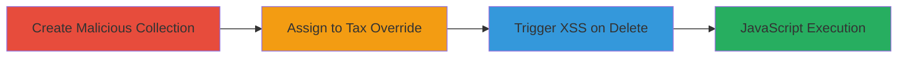

# XSS in Shopify Admin Tax Overrides via Unsanitized Collection Name

Multi-stage attack chain demonstrating a complete XSS workflow in Shopify's myshopify.com Admin site.

## Chain Metrics Dashboard

| Metric | Value |
|--------|-------|
| Chain Status | Unverified |
| Total Steps | 3 |
| Execution Time | ~5 minutes |
| Skill Level | Intermediate |
| Complexity | Medium |
| Impact Level | High |

## Attack Flow Visualization

## Prerequisites & Requirements

### Required Tools

- Web browser with developer tools (e.g., Chrome DevTools for payload testing)

### Target Environment

- Shopify myshopify.com Admin site
- Access to store settings (admin privileges required)
- Products or collections management enabled

### Initial Access Requirements

- Valid Shopify admin account credentials
- Network access to myshopify.com
- No prior compromise needed, but admin role is essential

## Detailed Attack Procedures

### Step 1: Create Malicious Collection
procedure: [[procedures/Create-Malicious-Collection-for-Shopify-XSS]]

**Objective**: Create a product collection with a name containing an XSS payload to inject malicious JavaScript.

**Instructions**: Log in to the Shopify admin dashboard. Navigate to Products > Collections > Create collection. In the title field, enter a payload like ``. Save the collection. This payload will be stored without sanitization.

**Expected Output**: A new collection appears in the list with the malicious name visible.

**Success Indicators**:
- Collection created successfully
- Malicious name displays without alteration in the admin UI

### Step 2: Assign Malicious Collection to Tax Override
procedure: [[procedures/Assign-Malicious-Collection-to-Tax-Override]]

**Objective**: Link the malicious collection to a 'Rest of World' tax override to set up the reflection point.

**Instructions**: Go to Settings > Taxes and duties. In the 'Tax overrides' section, select 'Add tax override for Rest of World'. Choose the collection with the payload from the dropdown. Configure any tax rate (e.g., 0%) and save the override.

**Expected Output**: The override is added, and the malicious collection name is visible in the override details (as shown in addtax.png screenshot).

**Success Indicators**:
- Override saved without errors
- Payload name reflected in the UI

### Step 3: Trigger XSS via Tax Override Deletion
procedure: [[procedures/Trigger-XSS-via-Tax-Override-Deletion]]

**Objective**: Execute the XSS payload by deleting the tax override, causing the unsanitized name to be processed.

**Instructions**: In the Taxes settings, locate the 'Rest of World' override. Click the recycle bin icon to 'Delete Entire Override'. Confirm the deletion. The payload executes due to lack of escaping in the delete confirmation.

**Expected Output**: A JavaScript prompt appears (e.g., alert with '7'), confirming execution (as shown in xss.png and delete.png screenshots).

**Success Indicators**:
- JavaScript alert/prompt triggers
- No server-side errors; payload runs in browser context

## Attack Chain Summary

### Key Achievements

1. Injected XSS payload via collection name without detection
2. Reflected payload in tax override UI
3. Achieved arbitrary JS execution in admin browser, enabling session theft or data exfil

## Technique & Tactic Coverage

### MITRE ATT&CK Techniques

- [[JavaScript]]

### MITRE ATT&CK Tactics

- [[Execution]]
- [[Collection]]

---

*Last updated: 2023-10-01T00:00:00Z*
