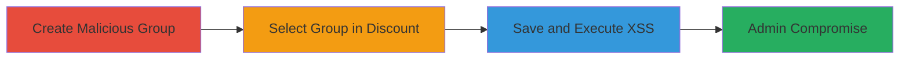

---
tags:
  - xss
  - shopify
  - admin-compromise
  - javascript-execution
type: attack_chain
tools: []
tactics:
  - '[[Execution]]'
  - '[[Collection]]'
verified: false
platforms:
  - Web
submitted: true
complexity: medium
created_at: '2023-10-01T00:00:00Z'
procedures:
  - '[[procedures/Create-Malicious-Customer-Search-Group-in-Shopify-Admin]]'
  - '[[procedures/Create-Discount-Code-Using-Malicious-Customer-Group]]'
  - '[[procedures/Trigger-XSS-by-Saving-Discount-in-Shopify-Admin]]'
step_count: 3
techniques:
  - '[[JavaScript]]'
updated_at: '2025-12-14T03:15:31.972Z'
description: >-
  A cross-site scripting attack exploiting unsanitized customer search group
  names in Shopify's admin interface to execute arbitrary JavaScript in the
  context of an authenticated admin user.
skill_level: intermediate
impact_level: high
id: f882ca7a-b696-41f7-83b4-bb4bc174086f
validated: true
mitre_tactics:
  - '[[Execution]]'
  - '[[Collection]]'
mitre_techniques:
  - '[[JavaScript]]'
---
# XSS in Shopify Admin via Unsanitized Customer Search Group Names

Multi-stage attack chain demonstrating a complete XSS workflow in Shopify's Myshopify Admin Site, where user-controlled input in customer search group names is reflected unsanitized in the discounts creation form, enabling arbitrary JavaScript execution.

## Chain Metrics Dashboard

| Metric | Value |
|--------|-------|
| Chain Status | Unverified |
| Total Steps | 3 |
| Execution Time | ~5 minutes |
| Skill Level | Intermediate |
| Complexity | Medium |
| Impact Level | High |

## Attack Flow Visualization

## Prerequisites & Requirements

### Required Tools

- Web browser (e.g., Chrome with developer tools for payload testing)

### Target Environment

- Shopify Myshopify Admin Site
- Authenticated admin access
- No specific ports or services beyond standard HTTPS web access

### Initial Access Requirements

- Valid admin credentials for the Shopify store
- Direct network access to the admin interface (myshopify.com/admin)
- No prior compromise needed, but admin privileges enable the attack

## Detailed Attack Procedures

### Step 1: Create Malicious Customer Search Group
procedure: [[procedures/Create-Malicious-Customer-Search-Group-in-Shopify-Admin]]

**Objective**: Inject an XSS payload into a customer search group name to prepare for reflection in downstream interfaces.

**Instructions**: Log in to the Shopify admin dashboard, navigate to the Customers section, apply a filter (e.g., search for 'XSS'), and save the search as a new group with a payload like `'>` in the name field.

**Expected Output**: The group is created and listed under saved searches without immediate execution.

**Success Indicators**:
- Group appears in the saved searches list with the injected payload visible in the name.
- No errors during creation.

### Step 2: Create Discount Code Using Malicious Customer Group
procedure: [[procedures/Create-Discount-Code-Using-Malicious-Customer-Group]]

**Objective**: Select the malicious group as the basis for a discount to set up reflection of the payload.

**Instructions**: In the Shopify admin, go to the Discounts section, initiate a new discount code creation, and choose the customer group from Step 1 when configuring the discount applicability.

**Expected Output**: The discount form populates with the group name, including the payload, but does not execute yet.

**Success Indicators**:
- Malicious group is selectable and appears in the discount configuration.
- Form proceeds without validation errors.

### Step 3: Trigger XSS by Saving Discount
procedure: [[procedures/Trigger-XSS-by-Saving-Discount-in-Shopify-Admin]]

**Objective**: Save the discount to reflect and execute the unsanitized payload in the admin context.

**Instructions**: Complete any remaining discount fields and click the Save button on the form, causing the group name to be rendered unsanitized and triggering the JavaScript execution.

**Expected Output**: Alert or prompt (e.g., prompt(7)) executes in the browser, confirming XSS.

**Success Indicators**:
- JavaScript payload executes, such as displaying an alert.
- Browser console shows no blocking errors; potential for further exploitation like session theft.

## Attack Chain Summary

### Key Achievements

1. Successful injection of XSS payload via customer group naming.
2. Reflection and execution in the admin interface without sanitization.
3. Potential for admin session hijacking, data theft, or interface manipulation.

## Technique & Tactic Coverage

### MITRE ATT&CK Techniques

- [[JavaScript]]

### MITRE ATT&CK Tactics

- [[Execution]]
- [[Collection]]

---
*Last updated: 2023-10-01T00:00:00Z*
