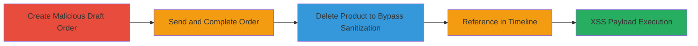

---
tags:
  - xss
  - shopify
  - admin
  - draft-orders
  - javascript-injection
type: attack_chain
tools: []
tactics:
  - '[[Execution]]'
commands: []
platforms:
  - Web
complexity: medium
procedures:
  - '[[procedures/Create-Draft-Order-with-Malicious-Product-Name]]'
  - '[[procedures/Send-and-Complete-Draft-Order]]'
  - '[[procedures/Delete-Product-from-Draft-Order]]'
  - '[[procedures/Reference-Draft-in-Timeline-to-Trigger-XSS]]'
step_count: 4
techniques:
  - '[[JavaScript]]'
description: >-
  Multi-stage XSS attack in Shopify Admin exploiting unsanitized product
  descriptions in the Draft Orders Timeline feature, allowing arbitrary
  JavaScript execution in another admin's browser context.
skill_level: intermediate
impact_level: high
id: dd0f2396-f45b-4340-8844-6822bb30f1ab
created_at: '2025-12-14T03:16:25.360Z'
updated_at: '2025-12-14T03:16:25.360Z'
verified: false
validated: true
submitted: true
mitre_tactics:
  - '[[Execution]]'
mitre_techniques:
  - '[[JavaScript]]'
---
# XSS-in-Shopify-Draft-Orders-Timeline-via-Malicious-Product-Name

Multi-stage attack chain demonstrating a complete XSS workflow in Shopify's Admin Site, targeting the Draft Orders Timeline feature. An authenticated admin creates a draft order with a malicious product name, completes it, deletes the product to bypass link rendering, and references it in a timeline post, executing JavaScript in the viewer's browser for potential session hijacking or data theft.

## Chain Metrics Dashboard

| Metric | Value |
|--------|-------|
| Chain Status | Unverified |
| Total Steps | 4 |
| Execution Time | ~10 minutes |
| Skill Level | Intermediate |
| Complexity | Medium |
| Impact Level | High |

## Attack Flow Visualization

## Prerequisites & Requirements

### Required Tools

- Web browser with developer tools (e.g., Chrome DevTools for payload testing)

### Target Environment

- Shopify Admin Site (authenticated access required)
- Draft Orders feature enabled
- No specific ports or services beyond standard HTTPS web access

### Initial Access Requirements

- Valid Shopify admin credentials
- Network access to the target Shopify store admin panel
- No prior access beyond authentication needed

## Detailed Attack Procedures

### Step 1: Create Malicious Draft Order
procedure: [[procedures/Create-Draft-Order-with-Malicious-Product-Name]]

**Objective**: Inject an XSS payload into a product name within a new draft order to set up the malicious input.

**Instructions**: Log in to the Shopify Admin panel, navigate to Orders > Drafts, and create a new draft order. Add a product with a name containing the payload, such as "> (use a simple alert for testing or a more advanced payload like document.cookie for production impact).

**Expected Output**: Draft order created with the malicious product name stored unsanitized.

**Success Indicators**:
- Draft order appears in the list with the injected product
- Payload visible in the draft details without immediate execution

### Step 2: Send and Complete Order
procedure: [[procedures/Send-and-Complete-Draft-Order]]

**Objective**: Convert the draft into a completed order to make it referenceable in the timeline while preserving the malicious payload.

**Instructions**: From the draft order page, send the draft to a test email (or simulate sending), then mark it as completed. Note the order URL, e.g., https://yourstore.myshopify.com/admin/draft_orders/123456.

**Expected Output**: Order status changes to "Completed Drafts," and the malicious product remains associated.

**Success Indicators**:
- Order listed under Completed Drafts
- Product details intact for later manipulation

### Step 3: Delete Product from Draft Order
procedure: [[procedures/Delete-Product-from-Draft-Order]]

**Objective**: Remove the product link to force the timeline rendering to use the unsanitized description instead of a safe product hyperlink.

**Instructions**: Edit the completed draft order, locate the malicious product, and delete it from the order line items.

**Expected Output**: Product removed, but the original name/description payload persists in the backend data.

**Success Indicators**:
- Order updated without the product link
- No errors on save, confirming data retention

### Step 4: Reference Draft in Timeline and Trigger XSS
procedure: [[procedures/Reference-Draft-in-Timeline-to-Trigger-XSS]]

**Objective**: Reference the manipulated draft in a timeline post to render the unsanitized payload and execute JavaScript when submitted and viewed by another admin.

**Instructions**: Navigate to the Draft Orders Timeline, create a new post, and reference the completed draft order URL (e.g., https://yourstore.myshopify.com/admin/draft_orders/123456). Submit the post; upon viewing by another admin, the payload executes.

**Expected Output**: JavaScript alert or action (e.g., prompt('XSS')) fires in the viewer's browser context.

**Success Indicators**:
- Payload executes on timeline view
- Potential for cookie theft or admin actions if payload is escalated

## Attack Chain Summary

### Key Achievements

1. Successful injection of XSS payload via product name in draft orders
2. Bypassing sanitization by deleting product links to force raw description rendering
3. Arbitrary JavaScript execution in authenticated admin context, enabling session hijacking

## Technique & Tactic Coverage

### MITRE ATT&CK Techniques

- [[JavaScript]]

### MITRE ATT&CK Tactics

- [[Execution]]

---
*Last updated: 2023-10-01*
