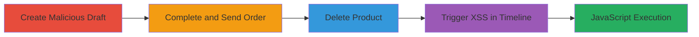

---
tags:
  - xss
  - shopify
  - draft-orders
  - timeline
  - javascript-execution
type: attack_chain
tools: []
tactics:
  - '[[Execution]]'
  - '[[Collection]]'
verified: false
platforms:
  - Web
submitted: true
created_at: '2023-10-01T00:00:00Z'
procedures:
  - '[[procedures/Create-Malicious-Draft-Order-in-Shopify]]'
  - '[[procedures/Complete-Draft-Order-and-Send]]'
  - '[[procedures/Delete-Associated-Product]]'
  - '[[procedures/Trigger-XSS-in-Draft-Orders-Timeline]]'
step_count: 4
techniques:
  - '[[JavaScript]]'
updated_at: '2025-12-14T17:28:58.843Z'
description: >-
  A multi-stage XSS attack exploiting unsanitized product descriptions in
  Shopify's Draft Orders Timeline feature after product deletion, leading to
  arbitrary JavaScript execution in the admin interface.
id: 74e9b1eb-5327-4fca-8927-3a2c7c8f94ae
validated: true
mitre_tactics:
  - '[[Execution]]'
  - '[[Collection]]'
mitre_techniques:
  - '[[JavaScript]]'
---
# XSS in Shopify Draft Orders Timeline via Unsanitized Deleted Product Description

Multi-stage attack chain demonstrating a complete XSS workflow in Shopify's Admin Site, exploiting the lack of sanitization in product descriptions rendered in the Draft Orders Timeline after product deletion.

## Chain Metrics Dashboard

| Metric | Value |
|--------|-------|
| Chain Status | Unverified |
| Total Steps | 4 |
| Execution Time | ~10 minutes |
| Skill Level | Intermediate |
| Complexity | Medium |
| Impact Level | High |

## Attack Flow Visualization

## Prerequisites & Requirements

### Required Tools

- Web browser with developer tools
- Access to Shopify admin account with permissions to create draft orders and products

### Target Environment

- Shopify Admin Site (web platform)
- Required services: Shopify API access via admin interface
- Network access requirements: Authenticated session to Shopify admin

### Initial Access Requirements

- Valid Shopify store owner or admin credentials
- No prior access needed beyond authentication

## Detailed Attack Procedures

### Step 1: Create Malicious Draft Order
procedure: [[procedures/Create-Malicious-Draft-Order-in-Shopify]]

**Objective**: Inject an XSS payload into a product name that will later serve as the unsanitized description.

**Instructions**: Log in to the Shopify admin, navigate to Products, create a new product, and set the name to a malicious payload like ">. Save the product, then create a draft order including this product.

**Expected Output**: Draft order created with the malicious product included.

**Success Indicators**:
- Product saved with injected payload
- Draft order visible in admin with the product listed

### Step 2: Complete Draft Order and Send
procedure: [[procedures/Complete-Draft-Order-and-Send]]

**Objective**: Finalize the order to move it to completed status while preserving the payload.

**Instructions**: In the Shopify admin, open the draft order, send it to a recipient (e.g., via email), and mark it as completed. Verify it appears in the Completed Drafts section.

**Expected Output**: Order status changes to completed; confirmation in admin interface (e.g., screenshot of order details).

**Success Indicators**:
- Order sent and completed
- No immediate payload execution

### Step 3: Delete Associated Product
procedure: [[procedures/Delete-Associated-Product]]

**Objective**: Remove the product to force the timeline to render the raw description containing the XSS payload.

**Instructions**: Navigate to Products in Shopify admin, locate the malicious product, and delete it. Confirm deletion.

**Expected Output**: Product removed from the store; no product link available for the order.

**Success Indicators**:
- Product deletion confirmed
- Order still exists but without product reference

### Step 4: Trigger XSS in Draft Orders Timeline
procedure: [[procedures/Trigger-XSS-in-Draft-Orders-Timeline]]

**Objective**: Render the unsanitized description in the timeline to execute the JavaScript payload.

**Instructions**: In Shopify admin, create a new timeline entry for the completed draft order (e.g., reference /admin/draft_orders/123456), add a note referencing the order, and click POST. The timeline will render the raw description, triggering the XSS.

**Expected Output**: Alert or prompt box appears (e.g., 'XSS' message); JavaScript executes in the admin context.

**Success Indicators**:
- Payload executes (e.g., alert dialog)
- Potential for session theft or data exfiltration

## Attack Chain Summary

### Key Achievements

1. Successful injection of XSS payload via product name
2. Bypassing sanitization by deleting the product post-completion
3. Arbitrary JavaScript execution in authenticated admin session
4. Demonstration of high-impact client-side attack potential

## Technique & Tactic Coverage

### MITRE ATT&CK Techniques

- [[JavaScript]]

### MITRE ATT&CK Tactics

- [[Execution]]
- [[Collection]]

---
*Last updated: 2023-10-01T00:00:00Z*
