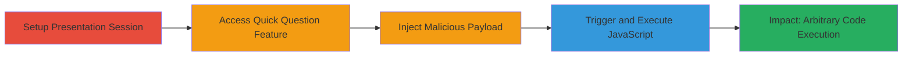

# XSS in Zaption Quick Question Feature for Arbitrary JavaScript Execution

Multi-stage attack chain demonstrating exploitation of a reflected XSS vulnerability in Zaption's interactive presentation tool. The attack targets the 'Quick question' functionality, where unsanitized user input for question text is rendered in the HTML of the presentation interface, allowing attackers to inject HTML and JavaScript that executes in the context of both the presenter's and viewers' browsers. This can lead to session hijacking, data theft, phishing, or further client-side attacks on all participants.

## Chain Metrics Dashboard

| Metric | Value |
|--------|-------|
| Chain Status | Unverified |
| Total Steps | 5 |
| Execution Time | ~5 minutes |
| Skill Level | Beginner |
| Complexity | Low |
| Impact Level | High |

## Attack Flow Visualization

## Prerequisites & Requirements

### Required Tools

- Web browser (e.g., Chrome, Firefox) for simulating presenter and viewer roles
- Access to a Zaption account with lesson creation privileges

### Target Environment

- Zaption web application (presentation feature)
- No specific ports or services required beyond standard HTTPS access
- Multi-browser setup for testing presenter/viewer interactions

### Initial Access Requirements

- Valid Zaption user credentials for creating and presenting lessons
- Network access to Zaption's web platform
- No prior elevated access needed; assumes legitimate user role

## Detailed Attack Procedures

### Step 1: Set Up Zaption Lesson and Presentation Session
procedure: [[procedures/Set-Up-Zaption-Lesson-and-Presentation-Session]]

**Objective**: Establish a controlled environment simulating a live presentation with both presenter and viewer perspectives to prepare for vulnerability exploitation.

**Instructions**: Log in to Zaption, create a new lesson, publish it, and initiate a presentation session. Open a second browser instance to join as a viewer.

**Expected Output**: Active presentation session visible in both browser instances, ready for interactive features.

**Success Indicators**:
- Lesson successfully published and presentation started
- Viewer able to join the session without errors

### Step 2: Access Quick Question Feature in Zaption Presentation
procedure: [[procedures/Access-Quick-Question-Feature-in-Zaption-Presentation]]

**Objective**: Navigate to the interactive 'Quick question' tool within the presentation interface to reach the vulnerable input field.

**Instructions**: In the presenter's browser, select the 'Quick question' option from the presentation controls. Open the response section to access the question text input area.

**Expected Output**: Input field for question text is active and ready for user input.

**Success Indicators**:
- 'Quick question' interface loads correctly
- Question input field is editable

### Step 3: Inject XSS Payload into Quick Question Field
procedure: [[procedures/Inject-XSS-Payload-into-Quick-Question-Field]]

**Objective**: Deliver a malicious payload that breaks out of HTML context and injects executable JavaScript into the rendered question text.

**Instructions**: Enter the payload `asdf">` into the question field. This payload closes any enclosing HTML attributes and uses an onerror event on a broken image tag to execute JavaScript.

**Expected Output**: Payload submitted; question appears in the presentation interface for both presenter and viewers.

**Success Indicators**:
- Payload accepted without validation errors
- Question text renders in the session

### Step 4: Trigger JavaScript Execution Across Participants
procedure: [[procedures/Verify-JavaScript-Execution-in-Zaption-Presentation]]

**Objective**: Confirm the XSS vulnerability by observing arbitrary JavaScript execution in multiple browser contexts.

**Instructions**: Proceed with the presentation to render the injected question. Monitor both presenter and viewer browsers for execution.

**Expected Output**: A prompt(1) alert box appears in both the presenter's and viewers' browsers, executing the injected JavaScript.

**Success Indicators**:
- Alert box triggers in presenter browser
- Identical execution observed in viewer browser(s)

### Step 5: Assess Impact and Potential Escalation

**Objective**: Evaluate the consequences of the XSS, such as potential for session theft or data exfiltration.

**Instructions**: In a real attack, replace the benign prompt(1) with malicious code, e.g., stealing cookies via `document.cookie` or redirecting to a phishing site. Test in the controlled session to measure cross-browser impact.

**Expected Output**: Evidence of arbitrary code control, confirming risks like session hijacking or keylogging on participants.

**Success Indicators**:
- JavaScript executes with full DOM access
- No isolation between presenter and viewer contexts

## Attack Chain Summary

### Key Achievements

1. Successful setup of a multi-user presentation session in Zaption
2. Injection and rendering of unsanitized HTML/JavaScript in the 'Quick question' feature
3. Arbitrary JavaScript execution across all session participants, demonstrating high-impact client-side compromise

## Technique & Tactic Coverage

### MITRE ATT&CK Techniques

- [[JavaScript]]

### MITRE ATT&CK Tactics

- [[Execution]]

---
*Last updated: 2023-10-01T00:00:00Z*
