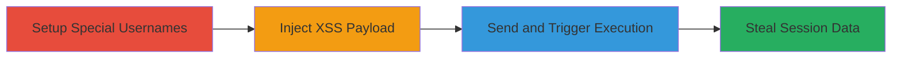

# XSS in ok.ru Private Messages via Unsanitized Special Character Usernames

Multi-stage attack chain demonstrating a complete XSS workflow on ok.ru, exploiting a lack of input sanitization in private messages combined with prior username creation flaws allowing special characters.

## Chain Metrics Dashboard

| Metric | Value |
|--------|-------|
| Chain Status | Unverified |
| Total Steps | 3 |
| Execution Time | ~5 minutes |
| Skill Level | Intermediate |
| Complexity | Medium |
| Impact Level | High |

## Attack Flow Visualization

## Prerequisites & Requirements

### Required Tools

- Web browser (e.g., Chrome with developer tools)
- Valid ok.ru account

### Target Environment

- ok.ru web platform
- Private messaging feature
- No specific ports or services beyond standard HTTPS (443)

### Initial Access Requirements

- Attacker account on ok.ru
- Knowledge of prior vulnerability for special character usernames
- Victim's username for targeting

## Detailed Attack Procedures

### Step 1: Setup Special Character Usernames
procedure: [[procedures/Embed-Special-Characters-in-Usernames-for-XSS-Setup]]

**Objective**: Prepare usernames containing script-like content using a prior vulnerability to enable payload embedding in messages.

**Instructions**: Use an existing account created via the previous bug that allowed special characters in nicknames. Select usernames like '79601920522' or '90177715q' which include elements that can mimic or embed script tags when displayed.

**Expected Output**: Usernames ready for message injection, verifiable by viewing profile display.

**Success Indicators**:
- Username displays special characters without sanitization
- No errors in profile rendering

### Step 2: Inject XSS Payload in Private Message
procedure: [[procedures/Inject-XSS-Payload-in-Private-Message]]

**Objective**: Enter unsanitized malicious JavaScript into the message input field to be rendered in the recipient's view.

**Instructions**: Navigate to the private messaging interface on ok.ru. In the message composition field, input a payload such as `` combined with the special username elements. The field lacks filtering, allowing direct injection.

**Expected Output**: Payload accepted without validation errors, message composes successfully with script intact.

**Success Indicators**:
- No sanitization warnings or blocks
- Preview shows raw script if available

### Step 3: Send and Trigger XSS Execution
procedure: [[procedures/Trigger-XSS-Execution-via-Message-Viewing]]

**Objective**: Deliver the message to the victim and execute the JavaScript when they open it, enabling data theft.

**Instructions**: Send the crafted message to the target user's inbox. When the victim views the message, the unsanitized content renders and executes the JavaScript in their browser context, as demonstrated by alert popups or console logs in attached report screenshots.

**Expected Output**: JavaScript execution in victim's browser, e.g., alert dialog or cookie access.

**Success Indicators**:
- Victim's browser shows execution (e.g., alert)
- Attacker observes effects like stolen session data

## Attack Chain Summary

### Key Achievements

1. Exploited chained vulnerabilities for persistent XSS setup
2. Bypassed input sanitization in messaging
3. Achieved client-side code execution for session theft

## Technique & Tactic Coverage

### MITRE ATT&CK Techniques

- [[JavaScript]]

### MITRE ATT&CK Tactics

- [[Execution]]
- [[Collection]]

---
*Last updated: 2023-10-01T00:00:00Z*
