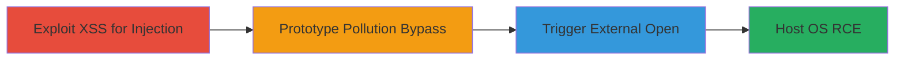

---
tags:
  - xss
  - rce
  - prototype-pollution
  - electron
  - rocketchat
type: attack_chain
tools: []
tactics:
  - '[[Initial Access]]'
  - '[[Execution]]'
verified: false
platforms:
  - Desktop
  - Electron
  - macOS
  - Windows
  - Linux
submitted: true
complexity: medium
created_at: '2023-10-01T00:00:00Z'
procedures:
  - '[[procedures/Exploit-XSS-in-Rocket.Chat-Webview]]'
  - '[[procedures/Inject-JavaScript-Payload-for-Prototype-Pollution]]'
  - '[[procedures/Trigger-Payload-Execution-via-Page-Load]]'
  - '[[procedures/Verify-Arbitrary-Command-Execution]]'
step_count: 4
techniques:
  - '[[Drive-by Compromise]]'
  - '[[JavaScript]]'
  - '[[Exploitation for Client Execution]]'
updated_at: '2025-12-14T17:23:41.676Z'
description: >-
  A multi-stage attack exploiting XSS in Rocket.Chat to perform prototype
  pollution, bypass regex checks in the Electron webview, and achieve arbitrary
  command execution on the host OS by opening external applications or files.
skill_level: intermediate
impact_level: high
id: a0708b2e-7f2a-4514-8e42-328206581e4b
validated: true
mitre_tactics:
  - '[[Initial Access]]'
  - '[[Execution]]'
mitre_techniques:
  - '[[Drive-by Compromise]]'
  - '[[JavaScript]]'
  - '[[Exploitation for Client Execution]]'
---
# XSS to RCE in Rocket.Chat Desktop Client via Prototype Pollution

Multi-stage attack chain demonstrating how an XSS vulnerability in the Rocket.Chat server can be chained with prototype pollution in the desktop client's Electron webview to bypass external link restrictions and execute arbitrary commands on the host operating system.

## Chain Metrics Dashboard

| Metric | Value |
|--------|-------|
| Chain Status | Unverified |
| Total Steps | 4 |
| Execution Time | ~5 minutes |
| Skill Level | Intermediate |
| Complexity | Medium |
| Impact Level | High |

## Attack Flow Visualization



## Prerequisites & Requirements

### Required Tools

- None (relies on browser/JS execution in Electron client)

### Target Environment

- Rocket.Chat desktop client (Electron-based)
- Prerequisite XSS vulnerability in Rocket.Chat server (e.g., reports #894462 or #899954)
- Host OS: macOS, Windows, or Linux (adjust payload URL accordingly)

### Initial Access Requirements

- Access to a Rocket.Chat server with known XSS vuln
- Ability to load malicious content in the desktop client webview
- No special credentials beyond user access to the chat

## Detailed Attack Procedures

### Step 1: Exploit XSS in Rocket.Chat Webview
procedure: [[procedures/Exploit-XSS-in-Rocket.Chat-Webview]]

**Objective**: Gain JavaScript execution context within the Electron webview by exploiting a server-side XSS vulnerability.

**Instructions**: Identify and trigger a known XSS payload in Rocket.Chat server features, such as reports or message inputs (e.g., via HackerOne reports #894462 or #899954). Inject the initial XSS to set up for the follow-on payload.

**Expected Output**: JavaScript execution in the webview, confirmed by console logs or DOM manipulation.

**Success Indicators**:
- Alert box or console output from XSS payload
- Injected script tag visible in webview inspector

### Step 2: Inject JavaScript Payload for Prototype Pollution
procedure: [[procedures/Inject-JavaScript-Payload-for-Prototype-Pollution]]

**Objective**: Overwrite RegExp.prototype.test to bypass the onclick handler's regex validation for external links, enabling arbitrary URLs.

**Instructions**: Via the XSS context, inject the crafted payload using [[commands/rocket-chat-prototype-pollution-payload]]:

```javascript
(function(){const payload =`file:///System/Applications/Calculator.app`;var counter =0;var target = document.createElement(`a`); target.setAttribute(`href`, payload); document.body.appendChild(target);var old_test =RegExp.prototype.test;RegExp.prototype.test=function(s){if(s === payload){return(++counter >3);}returnold_test.call(this, s);}; target.dispatchEvent(newEvent(`click`));})();
```

Adjust the `payload` URL for target OS (e.g., `file:///C:/Windows/System32/calc.exe` for Windows).

**Expected Output**: RegExp.prototype.test overwritten; synthetic link created and appended.

**Success Indicators**:
- Prototype modification verifiable in console: `RegExp.prototype.test.toString()` shows custom function
- Link element present in DOM with arbitrary href

### Step 3: Trigger Payload Execution via Page Load
procedure: [[procedures/Trigger-Payload-Execution-via-Page-Load]]

**Objective**: Load the page containing the injected payload in the Rocket.Chat desktop client to dispatch the click event and invoke electron.shell.openExternal.

**Instructions**: Navigate to or refresh the chat/page in the desktop client where the XSS payload was injected. The payload auto-executes on load, dispatching the click after the regex test is bypassed post-3 calls.

**Expected Output**: Click event dispatched; external URL handler triggered without regex block.

**Success Indicators**:
- No regex validation errors in console
- electron.shell.openExternal called with arbitrary URL

### Step 4: Verify Arbitrary Command Execution
procedure: [[procedures/Verify-Arbitrary-Command-Execution]]

**Objective**: Confirm RCE by observing the host OS response, such as an application launch.

**Instructions**: Monitor the host system for the opened application (e.g., Calculator on macOS). Perform a simple action like calculating 7*191 to validate control.

**Expected Output**: Target application opens (e.g., Calculator launches).

**Success Indicators**:
- Application executable starts on host
- Ability to interact with the app confirms full RCE

## Attack Chain Summary

### Key Achievements

1. Chained server-side XSS to client-side prototype pollution for bypass
2. Bypassed Electron webview's external link protections
3. Achieved host OS command execution without direct access

## Technique & Tactic Coverage

### MITRE ATT&CK Techniques

- [[Drive-by Compromise]]
- [[JavaScript]]
- [[Exploitation for Client Execution]]

### MITRE ATT&CK Tactics

- [[Initial Access]]
- [[Execution]]

---
*Last updated: 2023-10-01T00:00:00Z*
