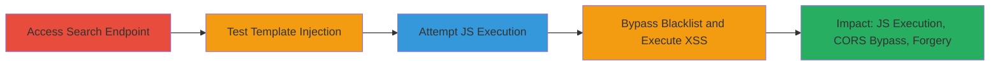

# XSS via Client Side Template Injection in Search Parameter

Multi-stage attack chain demonstrating exploitation of a Client Side Template Injection (CSTI) vulnerability in the Search parameter of the /News/Speeches endpoint, leading to arbitrary JavaScript execution and cross-site scripting (XSS). The attack begins with accessing the search functionality, tests for injection using simple expressions, attempts direct JavaScript, and bypasses blacklists via encoding to execute payloads like alerts or cookie theft.

## Chain Metrics Dashboard

| Metric | Value |
|--------|-------|
| Chain Status | Unverified |
| Total Steps | 4 |
| Execution Time | ~5 minutes |
| Skill Level | Intermediate |
| Complexity | Medium |
| Impact Level | High |

## Attack Flow Visualization



## Prerequisites & Requirements

### Required Tools

- Web browser (e.g., Chrome, Firefox)

### Target Environment

- Web platform with frontend template engine (e.g., Handlebars-like using {{}} syntax)
- Access to public-facing /News/Speeches endpoint
- No special services or ports required beyond standard HTTP/HTTPS (port 80/443)

### Initial Access Requirements

- Public network access to the target website (www.███/News/Speeches)
- No credentials needed
- Victim must interact with the search functionality (e.g., via phishing or direct access)

## Detailed Attack Procedures

### Step 1: Access Search Functionality
procedure: [[procedures/Access-Search-Functionality-on-News-Speeches]]

**Objective**: Navigate to the vulnerable endpoint to prepare for injection testing.

**Instructions**: Open a web browser and directly access the /News/Speeches page, then locate and interact with the Search parameter, typically via a URL query or form input.

**Expected Output**: The page loads with search functionality available, ready for parameter input.

**Success Indicators**:
- Page loads without errors
- Search input field or URL parameter is accessible

### Step 2: Test for Template Injection
procedure: [[procedures/Test-for-Template-Injection-with-Math]]

**Objective**: Confirm the presence of CSTI by injecting a simple mathematical expression that gets evaluated by the template engine.

**Instructions**: Append the Search parameter with a double-curly brace expression to the URL and load it in the browser. Use [[commands/test-template-injection-math]]:

```bash
# In browser URL: www.███/News/Speeches?Search={{7*7}}
```

**Expected Output**: The page renders the evaluated result "49" embedded in the content, indicating template evaluation.

**Success Indicators**:
- Mathematical expression evaluates and displays (e.g., 49 appears)
- No sanitization errors or blocks

### Step 3: Attempt JavaScript Execution
procedure: [[procedures/Attempt-JavaScript-Execution-in-Templates]]

**Objective**: Test direct JavaScript injection within the template to identify blacklisted functions.

**Instructions**: Modify the Search parameter to include JavaScript code inside {{}}, such as an alert, and load the URL. Use [[commands/attempt-js-execution]]:

```bash
# In browser URL: www.███/News/Speeches?Search={{alert(1)}}
```

**Expected Output**: The JavaScript does not execute due to blacklisting (e.g., no alert pops up), confirming restrictions on methods like alert().

**Success Indicators**:
- No execution of simple JS like alert(1)
- Page loads but payload is blocked

### Step 4: Bypass Blacklist and Execute XSS
procedure: [[procedures/Bypass-Blacklist-with-Base64-Encoding]]

**Objective**: Circumvent blacklisted methods by encoding the payload in base64 and using safe functions like eval, atob, and decodeURIComponent to execute arbitrary JS.

**Instructions**: Encode the desired JS payload (e.g., alert(1)) in base64, then construct the injection using window properties to avoid direct blacklisted calls. Load the URL with [[commands/bypass-blacklist-base64-alert]] or [[commands/bypass-blacklist-cookie-theft]]:

```bash
# For alert(1): www.███/News/Speeches?Search={{window['eval'](window['atob'](window['decodeURIComponent']('YWxlcnQoMSk=')))}}
# For cookie theft: www.███/News/Speeches?Search={{window['eval'](window['atob'](window['decodeURIComponent']('YWxlcnQoZG9jdW1lbnQuY29va2llKQ==')))}}
```

**Expected Output**: Arbitrary JS executes, such as an alert box displaying "1" or the victim's cookies.

**Success Indicators**:
- Alert box appears with payload output
- Potential for further impacts like CORS bypass or data forgery confirmed via executed code

## Attack Chain Summary

### Key Achievements

1. Confirmed CSTI vulnerability through template evaluation
2. Bypassed JS blacklists using encoding and safe window methods
3. Achieved full XSS with arbitrary code execution, enabling cookie theft and potential session hijacking
4. Demonstrated high-impact effects like information forgery and CORS manipulation

## Technique & Tactic Coverage

### MITRE ATT&CK Techniques

- [[Exploit Public-Facing Application]] Exploit Public-Facing Application
- [[JavaScript]] JavaScript

### MITRE ATT&CK Tactics

- [[Initial Access]] Initial Access
- [[Execution]] Execution

---
*Last updated: 2023-10-01T00:00:00Z*
