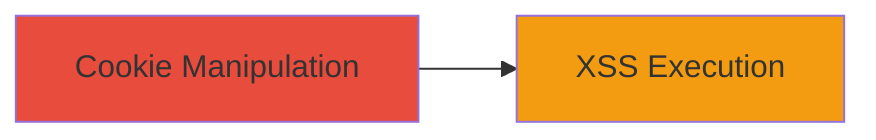

# XSS via Cookie Value Corruption on airbnb.com

Multi-stage attack chain demonstrating a complete attack workflow.

## Chain Metrics Dashboard

| Metric | Value |
|--------|-------|
| Chain Status | Unverified |
| Total Steps | 1 |
| Execution Time | ~5 minutes |
| Skill Level | Intermediate |
| Complexity | Medium |
| Impact Level | Medium |

## Attack Flow Visualization

## Prerequisites & Requirements

### Required Tools

- Browser developer tools (e.g., Chrome DevTools or IE11 F12)

### Target Environment

- Web platform
- Access to airbnb.com domain
- Internet Explorer 11 for full impact (due to CSP bypass limitations in other browsers)

### Initial Access Requirements

- Valid session on airbnb.com (logged-in user)
- No cross-domain cookie setting capability without additional vulnerabilities

## Detailed Attack Procedures

### Step 1: Cookie Value Corruption
procedure: [[procedures/Corrode-Cookie-Value-for-XSS-Injection]]

**Objective**: Inject an XSS payload into the cookie value to trigger script execution when processed by the application.

**Instructions**: Use browser developer tools to manipulate the cookie. Open the site in Internet Explorer 11, access Application/Storage tab in F12 tools, locate the target cookie (e.g., 'flash' cookie), and edit its value to include a payload like ``. Refresh the page to process the cookie.

**Expected Output**: Alert box or script execution on page load, confirming XSS trigger.

**Success Indicators**:
- Script executes (e.g., alert fires)
- No CSP violation in IE11

## Attack Chain Summary

### Key Achievements

1. Successful injection of XSS payload via cookie corruption
2. Script execution limited to IE11, highlighting browser-specific impact
3. Identification of insufficient output encoding in cookie handling

## Technique & Tactic Coverage

### MITRE ATT&CK Techniques

- [[JavaScript]]

### MITRE ATT&CK Tactics

- [[Execution]]

---
*Last updated: 2023-10-01T00:00:00Z*
