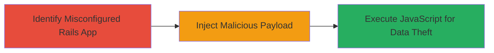

---
tags:
  - xss
  - ruby-on-rails
  - sanitizer-bypass
  - javascript-injection
type: attack_chain
tools: []
tactics:
  - '[[Initial Access]]'
  - '[[Execution]]'
verified: false
platforms:
  - Web
submitted: true
complexity: medium
created_at: '2023-10-01T00:00:00Z'
procedures:
  - '[[procedures/Exploit-XSS-in-Rails-SafeListSanitizer]]'
step_count: 1
techniques:
  - '[[JavaScript]]'
  - '[[Exploit Public-Facing Application]]'
updated_at: '2025-12-13T23:52:55.714Z'
description: >-
  Demonstrates exploitation of a Cross-Site Scripting vulnerability in Ruby on
  Rails' SafeListSanitizer when explicitly configured to permit 'form' and
  'button' tags with the 'formaction' attribute, enabling injection of malicious
  JavaScript.
skill_level: intermediate
impact_level: high
id: c64e5a14-a32b-445c-8ce4-47a01b79ee68
validated: true
mitre_tactics:
  - '[[Initial Access]]'
  - '[[Execution]]'
mitre_techniques:
  - '[[JavaScript]]'
  - '[[Exploit Public-Facing Application]]'
---
# XSS via Custom SafeListSanitizer Configuration Allowing Form and Button Tags in Ruby on Rails

Multi-stage attack chain demonstrating a complete attack workflow exploiting a configuration-based XSS vulnerability in Ruby on Rails.

## Chain Metrics Dashboard

| Metric | Value |
|--------|-------|
| Chain Status | Unverified |
| Total Steps | 1 |
| Execution Time | ~5 minutes |
| Skill Level | Intermediate |
| Complexity | Medium |
| Impact Level | High |

## Attack Flow Visualization



## Prerequisites & Requirements

### Required Tools

- Browser Developer Tools
- [[tools/Burp-Suite]]

### Target Environment

- Ruby on Rails application with SafeListSanitizer explicitly configured to allow 'form', 'button' tags, and 'formaction' attribute
- Web platform accessible via HTTP/HTTPS
- No specific ports beyond standard web (80/443)

### Initial Access Requirements

- Ability to submit user input (e.g., forms, comments) to the vulnerable endpoint
- Network access to the target web application
- No prior credentials needed if input is unauthenticated

## Detailed Attack Procedures

### Step 1: Exploit XSS Vulnerability
procedure: [[procedures/Exploit-XSS-in-Rails-SafeListSanitizer]]

**Objective**: Inject a crafted payload using allowed HTML tags to bypass sanitization and execute arbitrary JavaScript in the victim's browser context.

**Instructions**: Identify a user input field sanitized by SafeListSanitizer. Craft a payload like `<button formaction="javascript:alert('XSS')">Click</button>` or more advanced forms targeting data exfiltration. Submit via a tool like curl or Burp Suite to the vulnerable endpoint.

Use [[commands/curl-inject-xss-payload]] to test injection:

```bash
curl -X POST -d "input=<button formaction=\"javascript:alert(document.cookie)\" onclick=\"this.click()\">Test</button>" http://target.com/submit
```

Monitor the response or rendered page for execution. For exfiltration, modify to send data to an attacker-controlled server.

**Expected Output**: JavaScript alert or network request to attacker server confirming execution.

**Success Indicators**:
- Alert box appears or console logs payload execution
- Cookie or sensitive data exfiltrated to attacker endpoint
- No sanitization errors in server logs

## Attack Chain Summary

### Key Achievements

1. Bypassed Rails SafeListSanitizer by leveraging explicit allowances for 'form' and 'button' tags with 'formaction'.
2. Executed arbitrary JavaScript, enabling session hijacking or data theft.
3. Demonstrated impact in non-default configurations, highlighting risks of custom sanitization setups.

## Technique & Tactic Coverage

### MITRE ATT&CK Techniques

- [[JavaScript]]
- [[Exploit Public-Facing Application]]

### MITRE ATT&CK Tactics

- [[Initial Access]]
- [[Execution]]

---

*Last updated: 2023-10-01T00:00:00Z*
