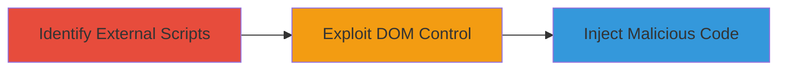

# XSS via External JavaScript Inclusion Bypassing Same-Origin Policy

Multi-stage attack chain demonstrating a complete attack workflow.

## Chain Metrics Dashboard

| Metric | Value |
|--------|-------|
| Chain Status | Unverified |
| Total Steps | 1 |
| Execution Time | ~5 minutes |
| Skill Level | Beginner |
| Complexity | Low |
| Impact Level | Medium |

## Attack Flow Visualization



## Prerequisites & Requirements

### Required Tools

- Browser Developer Tools

### Target Environment

- Web platform
- Publicly accessible website
- No specific services/ports required beyond HTTP/HTTPS

### Initial Access Requirements

- Network access to the target website
- No credentials needed for public pages
- Prior access not required

## Detailed Attack Procedures

### Step 1: Identify and Exploit External JavaScript
procedure: [[procedures/Identify-and-Exploit-External-JavaScript-XSS]]

**Objective**: Locate external JavaScript inclusions on the target website and demonstrate how they bypass the same-origin policy to enable XSS attacks.

**Instructions**: Open the target website in a browser and use developer tools to inspect the page source for script tags with external src attributes. For example, fetch the page using curl and grep for script sources:

```bash
curl -s https://stellar.org | grep -i '<script src='
```

Verify the external domains are unrelated to the site owner. If compromised, these scripts can manipulate the DOM.

**Expected Output**: List of external script URLs, e.g., scripts from analytics providers.

**Success Indicators**:
- External script sources identified
- Confirmation of third-party domain control over DOM

## Attack Chain Summary

### Key Achievements

1. Identified external JavaScript inclusions bypassing same-origin policy
2. Demonstrated potential for malicious code injection via compromised third-party servers
3. Highlighted risks to web application integrity

## Technique & Tactic Coverage

### MITRE ATT&CK Techniques

- [[JavaScript]]

### MITRE ATT&CK Tactics

- [[Execution]]

---
*Last updated: 2023-10-01T00:00:00Z*
