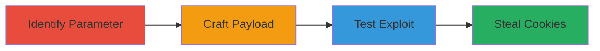

---
tags:
  - xss
  - web
  - slack
  - cookie-theft
type: attack_chain
tools: []
tactics:
  - '[[Initial Access]]'
  - '[[Execution]]'
  - '[[Collection]]'
commands: []
platforms:
  - Web
complexity: medium
procedures:
  - '[[procedures/Identify-Vulnerable-Hash-Parameter-in-Slack]]'
  - '[[procedures/Craft-XSS-Payload-for-Hash-Injection]]'
  - '[[procedures/Test-and-Execute-XSS-Exploit-in-Slack]]'
step_count: 3
techniques:
  - '[[JavaScript]]'
description: >-
  Multi-stage attack exploiting an XSS vulnerability in Slack's location hash
  parameter to inject malicious JavaScript and steal user cookies.
skill_level: intermediate
impact_level: high
id: 971a2237-184d-46f5-beab-809d46cc3ab0
created_at: '2025-12-11T06:10:17.216Z'
updated_at: '2025-12-11T06:10:17.216Z'
verified: false
validated: true
submitted: true
mitre_tactics:
  - '[[TA0001]]'
  - '[[TA0002]]'
  - '[[TA0009]]'
mitre_techniques:
  - '[[T1059.007]]'
---
# XSS via Location Hash Parameter in Slack for Cookie Theft and Account Takeover

## Overview

This attack chain demonstrates the exploitation of a Cross-Site Scripting (XSS) vulnerability in Slack's web pages, specifically in the location hash parameter 'cvo_sid1'. The vulnerability allows attackers to inject malicious JavaScript by manipulating the hash without proper sanitization in live.js, leading to cookie theft or account takeover when victims visit crafted links. The chain covers identification, payload crafting, and testing, based on a reported vulnerability that was fixed by Slack.

## Attack Flow Visualization

## Prerequisites & Requirements

### Required Tools

- None explicitly required; a web browser is sufficient for testing.

### Target Environment

- Web platform targeting Slack web pages.
- Services: Slack web application, convertro integration.
- Tech stack: JavaScript.

### Initial Access Requirements

- Access to a web browser.
- Ability to craft and share malicious URLs.
- No prior credentials needed; exploits public-facing pages.

## Detailed Attack Procedures

## Step 1: Parameter Identification - [[procedures/Identify-Vulnerable-Hash-Parameter-in-Slack]]

### Objective

Locate the vulnerable 'cvo_sid1' parameter in the URL hash used by live.js to call convertro code without sanitization.

### Instructions

Inspect the Slack web page source or use browser developer tools to analyze the location hash. Identify that 'cvo_sid1' is processed in live.js and allows injection via the 'typ' parameter without proper escaping.

Look for patterns where the hash is used to generate JavaScript calls, confirming the lack of sanitization.

### Expected Output

Confirmation of the vulnerable parameter and its usage in generating unsanitized JavaScript.

### Success Indicators

- Parameter 'cvo_sid1' is observed in the hash.
- 'typ' sub-parameter can be manipulated to alter JavaScript output.

## Step 2: Payload Crafting - [[procedures/Craft-XSS-Payload-for-Hash-Injection]]

### Objective

Create a malicious payload that bypasses restrictions by encoding characters to inject arbitrary JavaScript.

### Instructions

Craft the payload by encoding special characters: use \u0026; for ampersand and %3b for semicolon. Inject code like alert(document.cookie) via the 'typ' parameter, e.g., 'typ=55577%5D%22)%3balert(document.cookie)%3b//'.

Combine with 'cvo_sid1=111\u0026;' to form the full hash.

### Expected Output

A crafted hash string that, when appended to the URL, results in malformed JavaScript execution.

### Success Indicators

- Payload successfully encodes restricted characters.
- Injected code appears in the generated JavaScript response.

## Step 3: Exploit Testing - [[procedures/Test-and-Execute-XSS-Exploit-in-Slack]]

### Objective

Test the crafted payload by accessing a malicious URL to trigger the XSS and verify cookie theft potential.

### Instructions

Construct and visit the full URL: https://slack.com/is#?cvo_sid1=111\u0026;typ=55577%5D%22)%3balert(document.cookie)%3b//.

Observe the alert displaying document.cookie, confirming execution of arbitrary JavaScript. In a real attack, replace with code to steal cookies or perform account takeover.

### Expected Output

An alert box showing the cookie contents, indicating successful XSS execution.

### Success Indicators

- JavaScript alert triggers upon loading the URL.
- Potential for cookie exfiltration or further malicious actions.

## Attack Chain Summary

### Key Achievements

1. Identification of unsanitized hash parameter leading to XSS.
2. Successful payload crafting bypassing encoding restrictions.
3. Verified exploit execution enabling cookie theft and account control.

## Technique & Tactic Coverage

### MITRE ATT&CK Techniques

- [[JavaScript]]

### MITRE ATT&CK Tactics

- [[Initial Access]]
- [[Execution]]
- [[Collection]]

*Last updated: 2023-10-01*
