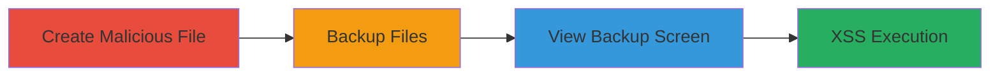

# XSS via Malicious Dropbox File Names in ThisData Backup Screen

Multi-stage attack chain demonstrating a complete XSS exploitation workflow targeting ThisData's backup rendering screen through Dropbox integration.

## Chain Metrics Dashboard

| Metric | Value |
|--------|-------|
| Chain Status | Unverified |
| Total Steps | 3 |
| Execution Time | ~5 minutes |
| Skill Level | Intermediate |
| Complexity | Medium |
| Impact Level | High |

## Attack Flow Visualization

## Prerequisites & Requirements

### Required Tools

- Dropbox account
- ThisData account with backup access

### Target Environment

- Web platform
- Dropbox service integration
- No specific ports required; assumes authenticated access

### Initial Access Requirements

- Valid Dropbox and ThisData credentials
- Ability to upload files to Dropbox
- Network access to ThisData web interface

## Detailed Attack Procedures

### Step 1: Create Malicious File Name
procedure: [[procedures/Create-Malicious-File-Name-in-Dropbox]]

**Objective**: Prepare a Dropbox file with a name containing an XSS payload to inject JavaScript when rendered.

**Instructions**: Log into Dropbox and create or rename a file using a payload like `'>.png`. This injects HTML and JavaScript without needing file content exploitation.

**Expected Output**: File uploaded successfully with the malicious name visible in Dropbox.

**Success Indicators**:
- File name includes the payload without errors
- File is accessible in Dropbox listing

### Step 2: Backup Dropbox Files
procedure: [[procedures/Backup-Dropbox-Files-with-ThisData]]

**Objective**: Sync the Dropbox contents, including the malicious file, into ThisData's backup system.

**Instructions**: Access ThisData's backup feature, connect to the Dropbox account, and initiate a sync or backup operation to pull in the files.

**Expected Output**: Backup completes, showing the files from Dropbox in ThisData's interface.

**Success Indicators**:
- Backup sync succeeds without errors
- Malicious file appears in ThisData's file list

### Step 3: Trigger XSS in Backup Screen
procedure: [[procedures/Trigger-XSS-in-ThisData-Backup-Screen]]

**Objective**: Render the backup screen to execute the injected JavaScript payload.

**Instructions**: Navigate to the backup rendering screen in ThisData where file names are displayed. The unescaped rendering will trigger the payload, such as alerting cookies.

**Expected Output**: JavaScript executes, e.g., alert box shows cookies or other client-side actions occur.

**Success Indicators**:
- Payload executes (e.g., alert fires)
- Cookies or session data can be exfiltrated

## Attack Chain Summary

### Key Achievements

1. Successful injection of XSS payload via Dropbox file naming
2. Backup integration pulls in the malicious artifact
3. Client-side execution steals sensitive data like cookies

## Technique & Tactic Coverage

### MITRE ATT&CK Techniques

- [[JavaScript]]

### MITRE ATT&CK Tactics

- [[Execution]]
- [[Collection]]

---

*Last updated: 2023-10-01T12:00:00Z*
