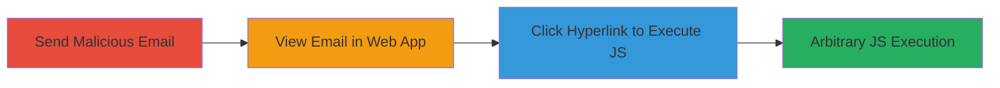

---
tags:
  - xss
  - javascript-uri
  - email
  - respondly
  - client-side
type: attack_chain
tools: []
tactics:
  - '[[Execution]]'
  - '[[Collection]]'
commands: []
platforms:
  - Web
complexity: low
procedures:
  - '[[procedures/Send-Malicious-Email-with-JavaScript-URI-Hyperlink]]'
  - '[[procedures/View-Email-in-Original-HTML-Mode]]'
  - '[[procedures/Trigger-XSS-by-Clicking-Hyperlink]]'
step_count: 3
techniques:
  - '[[JavaScript]]'
description: >-
  A multi-step attack exploiting insufficient sanitization in Respondly's email
  viewing feature to achieve arbitrary JavaScript execution via a javascript:
  URI in an email hyperlink.
skill_level: intermediate
impact_level: high
id: 40dd356b-f3d5-477c-bb30-337645f6dba7
created_at: '2025-12-14T03:15:53.267Z'
updated_at: '2025-12-14T03:15:53.267Z'
verified: false
validated: true
submitted: true
mitre_tactics:
  - '[[Execution]]'
  - '[[Collection]]'
mitre_techniques:
  - '[[JavaScript]]'
---
# XSS via Malicious Email Hyperlink in Respondly Viewer

Multi-stage attack chain demonstrating a complete attack workflow exploiting a Cross-Site Scripting (XSS) vulnerability in Respondly's email viewing feature.

## Chain Metrics Dashboard

| Metric | Value |
|--------|-------|
| Chain Status | Unverified |
| Total Steps | 3 |
| Execution Time | ~5 minutes |
| Skill Level | Intermediate |
| Complexity | Low |
| Impact Level | High |

## Attack Flow Visualization

## Prerequisites & Requirements

### Required Tools

- Email client or service for sending test emails

### Target Environment

- Respondly web application
- Access to send emails to team addresses (e.g., kfvm@mail.respond.ly)
- Authenticated access to the Respondly web interface for viewing emails

### Initial Access Requirements

- Knowledge of target email address
- Valid user session in Respondly (for viewing)
- No special privileges required beyond email sending capability

## Detailed Attack Procedures

### Step 1: Send Malicious Email
procedure: [[procedures/Send-Malicious-Email-with-JavaScript-URI-Hyperlink]]

**Objective**: Deliver a payload via email containing a hyperlink with a javascript: URI to bypass sanitization in the email viewer.

**Instructions**: Compose and send an email to the target team address, such as kfvm@mail.respond.ly, including a hyperlink in the body with a javascript: URI payload like javascript:alert(0);. Use any email client to craft the message, ensuring the link appears clickable.

**Expected Output**: Email successfully sent and received in the Respondly system.

**Success Indicators**:
- Email appears in the team's inbox within Respondly
- Hyperlink is present in the email body without alteration

### Step 2: View Email in Web Application
procedure: [[procedures/View-Email-in-Original-HTML-Mode]]

**Objective**: Access the email through the Respondly web interface and render it in a mode that does not sanitize the HTML content.

**Instructions**: Log in to the Respondly web application as an authenticated user, navigate to the received email, and select the 'original HTML' view option to display the raw email content, including unsanitized hyperlinks.

**Expected Output**: Email content rendered in the browser, showing the malicious hyperlink intact.

**Success Indicators**:
- 'Original HTML' view option available and selectable
- Hyperlink visible and clickable in the rendered view

### Step 3: Trigger XSS Execution
procedure: [[procedures/Trigger-XSS-by-Clicking-Hyperlink]]

**Objective**: Execute the JavaScript payload by interacting with the malicious link, leading to arbitrary code execution in the user's browser context.

**Instructions**: In the rendered email view, click on the hyperlink containing the javascript: URI. The browser will interpret and execute the URI as JavaScript, triggering the payload (e.g., alert(0) for testing).

**Expected Output**: JavaScript alert or other payload effects visible in the browser, confirming execution.

**Success Indicators**:
- Alert dialog or console output from the payload
- Potential access to browser APIs like document.cookie for session theft

## Attack Chain Summary

### Key Achievements

1. Successful delivery of unsanitized malicious email content to Respondly
2. Bypassing HTML sanitization in the 'original HTML' view
3. Achieving client-side JavaScript execution for potential session hijacking or data theft

## Technique & Tactic Coverage

### MITRE ATT&CK Techniques

- [[JavaScript]]

### MITRE ATT&CK Tactics

- [[Execution]]
- [[Collection]]

*Last updated: 2023-10-01*
