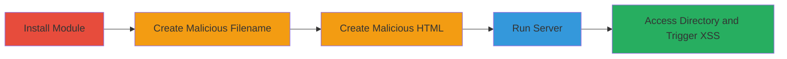

---
tags:
  - xss
  - node.js
  - directory-listing
  - javascript-execution
type: attack_chain
tools:
  - '[[tools/npm]]'
tactics:
  - '[[Execution]]'
verified: false
platforms:
  - Web
  - Node.js
submitted: true
complexity: medium
created_at: '2023-10-01T00:00:00Z'
procedures:
  - '[[procedures/Install-Statics-Server-Module]]'
  - '[[procedures/Create-Malicious-Filename-for-XSS]]'
  - '[[procedures/Create-Malicious-HTML-File-for-Iframe]]'
  - '[[procedures/Run-Statics-Server]]'
  - '[[procedures/Access-Directory-Index-to-Trigger-XSS]]'
step_count: 5
techniques:
  - '[[JavaScript]]'
updated_at: '2025-12-14T03:16:37.217Z'
description: >-
  A multi-stage attack exploiting an XSS vulnerability in the statics-server
  Node.js module by injecting HTML via a malicious filename, leading to
  arbitrary JavaScript execution in the browser.
skill_level: intermediate
impact_level: high
id: 8c8604c0-b064-47ea-be6e-e33def4e7196
validated: true
mitre_tactics:
  - '[[Execution]]'
mitre_techniques:
  - '[[JavaScript]]'
---
# XSS via Malicious Filename Injection in Statics-Server Directory Listing

Multi-stage attack chain demonstrating exploitation of an XSS vulnerability in the statics-server Node.js module version 0.0.9, where unescaped filenames in directory listings allow HTML injection, leading to arbitrary JavaScript execution via an injected iframe.

## Chain Metrics Dashboard

| Metric | Value |
|--------|-------|
| Chain Status | Unverified |
| Total Steps | 5 |
| Execution Time | ~5 minutes |
| Skill Level | Intermediate |
| Complexity | Medium |
| Impact Level | High |

## Attack Flow Visualization



## Prerequisites & Requirements

### Required Tools

- [[tools/npm]]

### Target Environment

- Node.js runtime (version compatible with npm)
- Local development environment for file creation and server execution
- Web browser for accessing the directory listing
- Required ports: 8080 (default for statics-server)

### Initial Access Requirements

- Local machine access with Node.js installed
- No network credentials needed; runs on localhost
- Prior access: Administrative privileges to install npm packages

## Detailed Attack Procedures

### Step 1: Install Statics-Server Module
procedure: [[procedures/Install-Statics-Server-Module]]

**Objective**: Set up the vulnerable statics-server module to enable directory serving.

**Instructions**: Use [[commands/npm-install-statics-server]] to install the module via npm.

```bash
npm install statics-server
```

**Expected Output**: Installation logs confirming the package is added to node_modules, including version 0.0.9.

**Success Indicators**:
- Package installed in node_modules/statics-server
- No errors in npm output

### Step 2: Create Malicious Filename for XSS
procedure: [[procedures/Create-Malicious-Filename-for-XSS]]

**Objective**: Craft a filename that injects HTML to close the <a> tag and embed an iframe for XSS payload delivery.

**Instructions**: Create a file named "><iframe src="malware_frame.html"> (note: this is a dummy file with no content needed beyond the name).

**Expected Output**: File created in the current directory with the specified malicious name.

**Success Indicators**:
- Filename appears in directory listing with injected HTML
- No file system errors during creation

### Step 3: Create Malicious HTML File for Iframe
procedure: [[procedures/Create-Malicious-HTML-File-for-Iframe]]

**Objective**: Prepare the payload HTML file that the injected iframe will load and execute JavaScript.

**Instructions**: Create a file named malware_frame.html with content including a script tag for alert execution.

**Expected Output**: HTML file saved with embedded JavaScript.

**Success Indicators**:
- File readable and contains <script>alert('Uh oh, I am bad, bad malware!!!')</script>
- Valid HTML structure

### Step 4: Run Statics-Server
procedure: [[procedures/Run-Statics-Server]]

**Objective**: Start the vulnerable server to generate the directory index listing.

**Instructions**: Execute [[commands/run-statics-server]] from the node_modules directory.

```bash
./node_modules/statics-server/index.js
```

**Expected Output**: Server startup message: "服务器已经启动 访问localhost:8080" (Server started, access localhost:8080).

**Success Indicators**:
- Server listening on port 8080
- No startup errors

### Step 5: Access Directory Index to Trigger XSS
procedure: [[procedures/Access-Directory-Index-to-Trigger-XSS]]

**Objective**: View the directory listing in a browser to trigger the XSS payload and execute JavaScript.

**Instructions**: Open http://localhost:8080 in a web browser to load the index and activate the iframe.

**Expected Output**: Directory listing displays, iframe loads malware_frame.html, and JavaScript alert pops up with "Uh oh, I am bad, bad malware!!!".

**Success Indicators**:
- Alert dialog appears in browser
- Iframe content executes without errors

## Attack Chain Summary

### Key Achievements

1. Successful installation and execution of the vulnerable statics-server.
2. Injection of XSS payload via filename, bypassing HTML escaping.
3. Arbitrary JavaScript execution in the victim's browser context, enabling potential session hijacking or data theft.

## Technique & Tactic Coverage

### MITRE ATT&CK Techniques

- [[JavaScript]]

### MITRE ATT&CK Tactics

- [[Execution]]

---
*Last updated: 2023-10-01T00:00:00Z*
