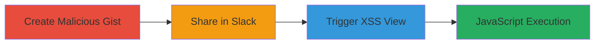

# XSS via Malicious Filename in Slack Gist Integration

Multi-stage attack chain demonstrating exploitation of an XSS vulnerability in Slack's GitHub Gist integration through a malicious filename containing an SVG onload payload.

## Chain Metrics Dashboard

| Metric | Value |
|--------|-------|
| Chain Status | Unverified |
| Total Steps | 3 |
| Execution Time | ~5 minutes |
| Skill Level | Intermediate |
| Complexity | Low |
| Impact Level | High |

## Attack Flow Visualization

## Prerequisites & Requirements

### Required Tools

- GitHub account
- Slack workspace with Gist integration enabled

### Target Environment

- Web platform
- Services: Slack, GitHub Gist
- Network access: Internet connectivity for GitHub and Slack

### Initial Access Requirements

- Access to a Slack workspace where you can post messages
- Ability to create GitHub Gists
- Victim interaction: Victim must view the shared Gist in Slack

## Detailed Attack Procedures

### Step 1: Create Malicious Gist
procedure: [[procedures/Create-Malicious-GitHub-Gist]]

**Objective**: Prepare a GitHub Gist with a filename that embeds an XSS payload, exploiting SVG onload to execute JavaScript.

**Instructions**: Log in to GitHub and create a new Gist. Set the filename to a payload like "><svg onload=alert(1)>" to inject script when rendered unsanitized.

**Expected Output**: A public Gist URL with the malicious filename.

**Success Indicators**:
- Gist created successfully
- Filename contains the payload without alteration

### Step 2: Share Gist in Slack Channel
procedure: [[procedures/Share-Gist-in-Slack-Channel]]

**Objective**: Integrate the malicious Gist into a Slack workspace to set up the delivery mechanism.

**Instructions**: Post the Gist link in a Slack channel with Gist integration enabled. Slack will process and display the Gist preview.

**Expected Output**: Gist link posted, with Slack generating preview views on its domain.

**Success Indicators**:
- Link shared without errors
- Slack recognizes and embeds the Gist

### Step 3: Trigger XSS in Slack Gist View
procedure: [[procedures/Trigger-XSS-in-Slack-Gist-View]]

**Objective**: Access the vulnerable views in Slack to execute the XSS payload, demonstrating arbitrary JavaScript execution.

**Instructions**: From the shared Gist in Slack, click to open the 'raw' or 'new window' view, which renders the filename in an HTML/SVG context on Slack's domain (e.g., https://outpost.slack.com/files/...).

**Expected Output**: Alert box or scripted action (e.g., alert(1)) pops up in the browser.

**Success Indicators**:
- JavaScript executes in the context of Slack's domain
- Potential for session hijacking or data exfiltration confirmed

## Attack Chain Summary

### Key Achievements

1. Successful injection of XSS payload via Gist filename
2. Delivery through Slack's integration without direct payload in message
3. Arbitrary code execution on Slack's domain, enabling client-side attacks like cookie theft

## Technique & Tactic Coverage

### MITRE ATT&CK Techniques

- [[JavaScript]]

### MITRE ATT&CK Tactics

- [[Execution]]

---
*Last updated: 2023-10-01T00:00:00Z*
