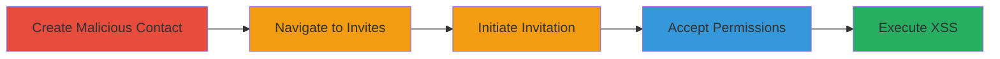

# XSS via Malicious Gmail Contact in Uzbey Invite Feature

Multi-stage attack chain demonstrating a complete XSS exploitation workflow in the Uzbey application by leveraging unsanitized Gmail contacts during the invitation process.

## Chain Metrics Dashboard

| Metric | Value |
|--------|-------|
| Chain Status | Unverified |
| Total Steps | 5 |
| Execution Time | ~5 minutes |
| Skill Level | Beginner |
| Complexity | Low |
| Impact Level | Medium |

## Attack Flow Visualization

## Prerequisites & Requirements

### Required Tools

- Web browser (e.g., Chrome with Gmail access)
- Uzbey application account

### Target Environment

- Web platform
- Gmail service integration
- No specific ports required; standard HTTPS

### Initial Access Requirements

- Valid Uzbey user account
- Access to Gmail account for contact creation
- No prior privileged access needed

## Detailed Attack Procedures

### Step 1: Create Malicious Contact
procedure: [[procedures/Create-Malicious-Gmail-Contact-with-XSS-Payload]]

**Objective**: Inject an XSS payload into a Gmail contact's email field to prepare for exploitation during the Uzbey invitation process.

**Instructions**: Log into Gmail, create a new contact, and set the email field to a payload like `a">`. Save the contact.

**Expected Output**: Contact saved successfully in Gmail with the malicious email.

**Success Indicators**:
- Contact appears in Gmail contacts list
- Payload is visible in the email field without errors

### Step 2: Navigate to Invites
procedure: [[procedures/Navigate-to-Uzbey-Invites-Section]]

**Objective**: Access the section of the Uzbey application where Gmail integration for invitations is available.

**Instructions**: Log into the Uzbey application and click on the 'Invites' tab or section in the navigation menu.

**Expected Output**: Invites page loads, showing options for inviting friends via Gmail.

**Success Indicators**:
- Invites section is accessible
- Gmail invitation option is visible

### Step 3: Initiate Invitation
procedure: [[procedures/Initiate-Gmail-Friends-Invitation]]

**Objective**: Trigger the Gmail contacts pull to include the malicious contact in the invitation process.

**Instructions**: On the Invites page, click the 'Invite Gmail Friends' button to start the integration and select contacts.

**Expected Output**: Gmail contacts are fetched and displayed for selection, including the malicious one.

**Success Indicators**:
- Contacts list populates
- Malicious contact appears in the list

### Step 4: Accept Permissions
procedure: [[procedures/Accept-Gmail-Permission-Popup]]

**Objective**: Grant necessary permissions to allow the Uzbey app to access and render Gmail contacts, setting up for payload rendering.

**Instructions**: When the Gmail permission popup appears, click 'Accept' or 'Allow' to confirm access.

**Expected Output**: Permissions granted; contacts render in the Uzbey interface.

**Success Indicators**:
- Popup dismissed successfully
- No permission errors

### Step 5: Trigger XSS Execution
procedure: [[procedures/Trigger-and-Observe-XSS-Execution]]

**Objective**: Cause the application to process the malicious email, executing the injected JavaScript.

**Instructions**: Proceed with the invitation by selecting or interacting with the malicious contact; observe the email field rendering.

**Expected Output**: JavaScript prompt dialog appears (e.g., alerting the domain); AJAX interactions fail, and server errors may occur on reproduction attempts.

**Success Indicators**:
- Prompt dialog executes
- AJAX functionality breaks on malicious email interaction
- Server-side errors logged during attempts to invite or reproduce

## Attack Chain Summary

### Key Achievements

1. Successful injection of XSS payload via Gmail contact email field
2. Arbitrary JavaScript execution in the victim's browser upon invitation processing
3. Disruption of application functionality including AJAX failures and server errors

## Technique & Tactic Coverage

### MITRE ATT&CK Techniques

- [[JavaScript]]

### MITRE ATT&CK Tactics

- [[Execution]]

---
*Last updated: 2023-10-01T00:00:00Z*
