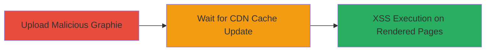

---
tags:
  - xss
  - upload
  - svg
  - json
  - cdn
  - khan-academy
  - dom-injection
type: attack_chain
tools:
  - '[[tools/Fetch-API]]'
  - '[[tools/Browser-DevTools]]'
tactics:
  - '[[Initial Access]]'
  - '[[Execution]]'
verified: false
platforms:
  - Web
  - AWS
submitted: true
complexity: medium
created_at: '2023-10-01T00:00:00Z'
procedures:
  - '[[procedures/Upload-Malicious-Graphie-via-Legacy-API]]'
  - '[[procedures/Verify-XSS-Execution-after-CDN-Update]]'
step_count: 2
techniques:
  - '[[Exploit Public-Facing Application]]'
  - '[[JavaScript]]'
updated_at: '2025-12-13T23:55:20.701Z'
description: >-
  Exploits a legacy Graphie to PNG API in Khan Academy by uploading malicious
  SVG and JSON files to inject XSS payloads, overriding hashes and enabling
  DOM-based XSS on rendered pages.
skill_level: intermediate
impact_level: high
id: 0b3c5d5f-5599-4384-a47b-8dcdc6e79956
validated: true
mitre_tactics:
  - '[[Initial Access]]'
  - '[[Execution]]'
mitre_techniques:
  - '[[Exploit Public-Facing Application]]'
  - '[[JavaScript]]'
---
# XSS via Malicious Graphie Upload in Khan Academy Legacy API

Multi-stage attack chain demonstrating exploitation of the legacy Graphie to PNG API to inject XSS payloads via malicious SVG and JSON uploads, leading to DOM-based XSS on Khan Academy pages and CDNs.

## Chain Metrics Dashboard

| Metric | Value |
|--------|-------|
| Chain Status | Unverified |
| Total Steps | 2 |
| Execution Time | ~5-10 minutes |
| Skill Level | Intermediate |
| Complexity | Medium |
| Impact Level | High |

## Attack Flow Visualization



## Prerequisites & Requirements

### Required Tools

- [[tools/Fetch-API]]
- [[tools/Browser-DevTools]]

### Target Environment

- Web platform with access to Khan Academy's legacy Graphie to PNG API endpoints (e.g., http://graphie-to-png.kasandbox.org/)
- Services: S3 (ka-perseus-graphie.s3.amazonaws.com), CDN (cdn.kastatic.org)
- Tech stack: JavaScript, SVG
- No specific ports required; operates over HTTP/HTTPS

### Initial Access Requirements

- Network access to public API endpoints
- No credentials needed for upload (public-facing legacy API)
- Browser environment for JavaScript execution

## Detailed Attack Procedures

### Step 1: Upload Malicious Graphie
procedure: [[procedures/Upload-Malicious-Graphie-via-Legacy-API]]

**Objective**: Prepare and upload malicious SVG and JSON containing XSS payloads to override an existing graphie hash, exploiting insufficient validation.

**Instructions**: Use [[commands/upload-malicious-graphie-fetch]] to create a FormData object with original JS for hashing, malicious SVG with onload attribute, and JSON with script tag set to typesetAsMath: false, then POST to the API endpoint.

```javascript
var form = new FormData();
form.append("js", ORIGINAL_JS);
form.append("svg", XSS_SVG);
form.append("other_data", JSON.stringify(XSS_JSON));
await fetch("http://graphie-to-png.kasandbox.org/svg", {"method": "POST", "body": form }).then(r => r.text())
```

Replace ORIGINAL_JS with legitimate JS from a target graphie, XSS_SVG with `<svg onload="alert('XSS')">`, and XSS_JSON with `{content: '<script>alert("XSS")</script>"', typesetAsMath: false}.

**Expected Output**: Server response text, typically the generated hash or URL for the uploaded graphie.

**Success Indicators**:
- HTTP 200 response from API
- No validation errors in response
- Generated hash matches target for override

### Step 2: Verify XSS Execution after CDN Update
procedure: [[procedures/Verify-XSS-Execution-after-CDN-Update]]

**Objective**: Monitor CDN cache propagation and confirm XSS payload execution when the malicious graphie is rendered on Khan Academy pages.

**Instructions**: Use [[tools/Browser-DevTools]] to override network responses or wait for natural cache update, then load a page rendering the affected graphie and inspect for payload execution.

In DevTools, go to Network tab, right-click the graphie JSON request, and select "Override content" to simulate the malicious JSON with script tag. Refresh the page rendering the graphie.

**Expected Output**: Alert or console log from the injected script (e.g., alert('XSS')) when the graphie loads.

**Success Indicators**:
- Payload executes in browser (e.g., alert pops up)
- DOM inspection shows injected script or onload attribute
- Affects pages on khanacademy.org and cdn.kastatic.org

## Attack Chain Summary

### Key Achievements

1. Successful upload of malicious files bypassing validation
2. Override of existing graphie hashes via JS-only hashing
3. DOM-based XSS execution leading to potential account takeover on Khan Academy

## Technique & Tactic Coverage

### MITRE ATT&CK Techniques

- [[Exploit Public-Facing Application]]
- [[JavaScript]]

### MITRE ATT&CK Tactics

- [[Initial Access]]
- [[Execution]]

---
*Last updated: 2023-10-01T00:00:00Z*
