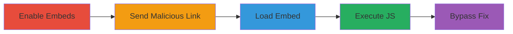

---
tags:
  - xss
  - javascript
  - session-hijacking
  - mastodon
  - irccloud
  - web-embed
type: attack_chain
tools: []
tactics:
  - '[[Initial Access]]'
  - '[[Execution]]'
  - '[[Collection]]'
verified: false
platforms:
  - Web
submitted: true
complexity: medium
created_at: '2023-10-01T00:00:00Z'
procedures:
  - '[[procedures/Enable-IRCCloud-Embed-Settings]]'
  - '[[procedures/Send-Malicious-Mastodon-Toot-Link]]'
  - '[[procedures/Trigger-Malicious-Embed-Loading]]'
  - '[[procedures/Observe-JavaScript-Execution-and-Cookie-Theft]]'
  - '[[procedures/Bypass-URL-Validation-with-Whitespace]]'
step_count: 5
techniques:
  - '[[JavaScript]]'
  - '[[Drive-by Compromise]]'
updated_at: '2025-12-13T23:08:55.574Z'
description: >-
  A cross-site scripting attack exploiting IRCCloud's Mastodon embed feature to
  execute arbitrary JavaScript and steal session cookies via a controlled
  Mastodon server.
skill_level: intermediate
impact_level: high
id: 9233ca80-1f36-402c-a304-f1542b94daae
validated: true
mitre_tactics:
  - '[[Initial Access]]'
  - '[[Execution]]'
  - '[[Collection]]'
mitre_techniques:
  - '[[JavaScript]]'
  - '[[Drive-by Compromise]]'
---
# XSS via Malicious Mastodon Embeds in IRCCloud for Session Hijacking

Multi-stage attack chain demonstrating a complete XSS workflow exploiting IRCCloud's web client embed feature for Mastodon links, leading to arbitrary JavaScript execution and session cookie theft.

## Chain Metrics Dashboard

| Metric | Value |
|--------|-------|
| Chain Status | Unverified |
| Total Steps | 5 |
| Execution Time | ~2 minutes |
| Skill Level | Intermediate |
| Complexity | Medium |
| Impact Level | High |

## Attack Flow Visualization

## Prerequisites & Requirements

### Required Tools

- A controlled Mastodon instance (self-hosted or test server)
- Access to IRCCloud web client

### Target Environment

- IRCCloud web client (browser-based)
- Mastodon API endpoint on attacker's server
- Enabled social media embeds in IRCCloud settings

### Initial Access Requirements

- Ability to send messages in an IRC channel where the victim is present
- No prior credentials needed; social engineering to get victim to view the message
- Network access to IRCCloud and attacker's Mastodon server

## Detailed Attack Procedures

### Step 1: Ensure Embed Settings are Enabled
procedure: [[procedures/Enable-IRCCloud-Embed-Settings]]

**Objective**: Verify or enable the Mastodon embed feature in IRCCloud to allow iframe loading from API responses.

**Instructions**: Log into the IRCCloud web client, navigate to settings under 'Chat & embeds', and ensure 'Embed social media links' is toggled on (default is enabled). This prepares the client to query and embed Mastodon links.

**Expected Output**: Settings confirmation; embeds will now process Mastodon URLs.

**Success Indicators**:
- Embed option visible and enabled in settings
- No errors in client console related to embed disabling

### Step 2: Send Malicious Mastodon Toot Link
procedure: [[procedures/Send-Malicious-Mastodon-Toot-Link]]

**Objective**: Deliver a link to a malicious Mastodon toot that triggers an API query returning a javascript: URL.

**Instructions**: In the IRC channel, send a message with a link to a fake toot on your controlled Mastodon instance, e.g., `https://sm4.ca/@a/123456789012345678`. Ensure the Mastodon API at `/api/v1/statuses/123456789012345678` responds with JSON containing `'url': 'javascript:top.document.body.innerHTML = "hi your cookie is " + document.cookie;//'` in the toot's URL field.

**Expected Output**: Victim sees the link in chat; IRCCloud initiates API query upon hover or load.

**Success Indicators**:
- Link sent successfully in channel
- Victim views the message (social engineering success)

### Step 3: Trigger Malicious Embed Loading
procedure: [[procedures/Trigger-Malicious-Embed-Loading]]

**Objective**: Cause IRCCloud to create an iframe with the malicious javascript: URL from the API response.

**Instructions**: Wait for the victim to interact with the link in IRCCloud; the client queries the Mastodon API, receives the JSON, and appends '/embed' to the URL, setting it as iframe src. The javascript: protocol executes in the iframe context, accessing the parent document.

**Expected Output**: Iframe loads silently; JavaScript runs without visible errors.

**Success Indicators**:
- API query logged on attacker's Mastodon server
- No CSP or URL validation blocks the load

### Step 4: Observe JavaScript Execution and Cookie Theft
procedure: [[procedures/Observe-JavaScript-Execution-and-Cookie-Theft]]

**Objective**: Confirm the JavaScript executes to steal and display the victim's session cookie.

**Instructions**: Monitor the victim's IRCCloud session; the executed JS modifies the body to show the stolen cookie value. Use this to hijack the session by replaying the cookie in a new browser session.

**Expected Output**: Body innerHTML updated with cookie value; attacker obtains session token.

**Success Indicators**:
- Cookie value exfiltrated (via display or further payload)
- Attacker can impersonate victim in IRCCloud

### Step 5: Bypass URL Validation with Whitespace
procedure: [[procedures/Bypass-URL-Validation-with-Whitespace]]

**Objective**: Evade any partial fixes by obfuscating the javascript: protocol.

**Instructions**: Modify the JSON response on the Mastodon server to include leading whitespace or ASCII control characters in the URL field, e.g., `'url': ' javascript:top.document.body.innerHTML = "hi your cookie is " + document.cookie;//'`. Send a new link like `https://sm4.ca/@a/000000000000000002` and repeat the embed process.

**Expected Output**: Validation bypassed; JS executes despite fixes checking for 'javascript:'.

**Success Indicators**:
- Embed loads and executes post-fix
- Cookie theft succeeds on patched client

## Attack Chain Summary

### Key Achievements

1. Enabled embeds to process malicious Mastodon links
2. Delivered and triggered XSS payload via API response
3. Stole session cookies for hijacking
4. Bypassed URL protocol validation

## Technique & Tactic Coverage

### MITRE ATT&CK Techniques

- [[JavaScript]]
- [[Drive-by Compromise]]

### MITRE ATT&CK Tactics

- [[Initial Access]]
- [[Execution]]
- [[Collection]]

---
*Last updated: 2023-10-01T00:00:00Z*
