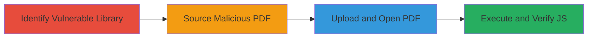

# XSS via Malicious PDF in Nextcloud PDF Viewer Exploiting CVE-2018-5158

Multi-stage attack chain demonstrating exploitation of CVE-2018-5158 in an outdated PDF.js library used by Nextcloud's PDF viewer. An attacker uploads a specially crafted PDF containing malicious JavaScript, which executes in the victim's browser upon viewing, potentially enabling session hijacking, data theft, or further attacks. This vulnerability affects browsers like Safari 13.0.5 and Firefox 74.0 but not Chrome due to rendering differences.

## Chain Metrics Dashboard

| Metric | Value |
|--------|-------|
| Chain Status | Unverified |
| Total Steps | 4 |
| Execution Time | ~5 minutes |
| Skill Level | Intermediate |
| Complexity | Medium |
| Impact Level | High |

## Attack Flow Visualization

## Prerequisites & Requirements

### Required Tools

- Web browser (Safari 13.0.5 or Firefox 74.0 for reliable execution)
- Access to Nextcloud instance with PDF viewer enabled

### Target Environment

- Nextcloud platform with outdated PDF.js (vulnerable to CVE-2018-5158)
- Web-based file upload and viewing capabilities
- No specific ports required beyond standard HTTPS (443)

### Initial Access Requirements

- Authenticated user access to Nextcloud for file upload
- No prior network position needed; assumes legitimate user context
- Malicious PDF file prepared externally

## Detailed Attack Procedures

### Step 1: Identify Outdated PDF.js Library
procedure: [[procedures/Identify-Outdated-PDF-js-in-Nextcloud]]

**Objective**: Confirm the presence of the vulnerable PDF.js version in Nextcloud's PDF viewer to validate exploit feasibility.

**Instructions**: Inspect the Nextcloud instance's PDF viewer implementation by accessing a PDF file and examining the loaded scripts or source code for PDF.js version details. Look for indicators of an outdated library susceptible to CVE-2018-5158.

**Expected Output**: Identification of PDF.js version confirming vulnerability (e.g., pre-2018 patches).

**Success Indicators**:
- Vulnerable PDF.js version detected
- CVE-2018-5158 applicability confirmed

### Step 2: Source Malicious PDF POC
procedure: [[procedures/Obtain-Malicious-PDF-POC-for-CVE-2018-5158]]

**Objective**: Acquire a proof-of-concept PDF file that exploits the JavaScript execution flaw in PDF.js.

**Instructions**: Download the POC PDF from Mozilla Bugzilla, which contains embedded JavaScript that triggers upon rendering in vulnerable viewers.

**Expected Output**: A downloadable PDF file ready for upload.

**Success Indicators**:
- POC PDF obtained successfully
- File integrity verified (e.g., no corruption)

### Step 3: Upload and Trigger XSS in PDF Viewer
procedure: [[procedures/Upload-and-Trigger-XSS-in-Nextcloud-PDF-Viewer]]

**Objective**: Deliver the malicious PDF to the target Nextcloud instance and open it in the integrated PDF viewer to initiate the exploit.

**Instructions**: Log in to Nextcloud, navigate to the file upload section, and upload the POC PDF. Then, open the uploaded file using the built-in PDF viewer, which leverages the vulnerable PDF.js.

**Expected Output**: PDF renders in the viewer, triggering JavaScript execution.

**Success Indicators**:
- File uploaded without errors
- Viewer loads the PDF and executes embedded code

### Step 4: Verify JavaScript Execution
procedure: [[procedures/Verify-JavaScript-Execution-from-PDF-XSS]]

**Objective**: Confirm arbitrary JavaScript execution in the browser context, assessing potential for further exploitation like session theft.

**Instructions**: Open the browser's developer console while viewing the PDF. Observe logs from the executed JavaScript, noting any attempts to fetch external resources (which may be blocked by CORS).

**Expected Output**: Console output such as 'Hello, this is code running in' followed by the file path.

**Success Indicators**:
- JavaScript logs appear in console
- Execution confirmed in Safari or Firefox (no execution in Chrome)

## Attack Chain Summary

### Key Achievements

1. Identified and validated the CVE-2018-5158 vulnerability in Nextcloud's PDF.js integration.
2. Successfully delivered and triggered XSS via a malicious PDF upload.
3. Demonstrated browser-specific JavaScript execution, highlighting risks of session hijacking and data exfiltration.
4. Noted limitations like CORS blocking external fetches, but potential for cookie theft or DOM manipulation.

## Technique & Tactic Coverage

### MITRE ATT&CK Techniques

- [[JavaScript]]
- [[Drive-by Compromise]]

### MITRE ATT&CK Tactics

- [[Execution]]
- [[Initial Access]]

---
*Last updated: 2023-10-01T12:00:00Z*
