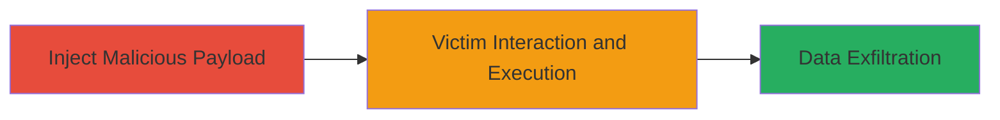

---
tags:
  - xss
  - vimeo
  - flash-player
  - subtitles
  - client-side-attack
type: attack_chain
tools: []
tactics:
  - '[[Execution]]'
  - '[[Collection]]'
verified: false
platforms:
  - Web
submitted: true
complexity: medium
created_at: '2023-10-01T00:00:00Z'
procedures:
  - '[[procedures/Inject-Malicious-Subtitles-for-XSS]]'
step_count: 2
techniques:
  - '[[JavaScript]]'
updated_at: '2025-12-14T03:15:47.206Z'
description: >-
  Attack chain exploiting insufficient sanitization in Vimeo's subtitles feature
  to inject and execute arbitrary JavaScript, leading to session hijacking or
  data theft when victims view affected videos.
skill_level: intermediate
impact_level: high
id: 8de0c186-6100-401f-85fb-e20c5c5f499e
validated: true
mitre_tactics:
  - '[[Execution]]'
  - '[[Collection]]'
mitre_techniques:
  - '[[JavaScript]]'
---
# XSS via Malicious Subtitles in Vimeo Flash Player and Hubnut

Multi-stage attack chain demonstrating exploitation of a Cross-Site Scripting (XSS) vulnerability in Vimeo's subtitles feature within the Flash Player and Hubnut components. Discovered and reported by opnsec on May 7, 2016, via HackerOne, this vulnerability allows attackers to inject malicious scripts into subtitle content. When users view videos with these subtitles, the scripts execute in the victim's browser context, enabling attacks such as session hijacking, cookie theft, or keylogging.

## Chain Metrics Dashboard

| Metric | Value |
|--------|-------|
| Chain Status | Unverified |
| Total Steps | 2 |
| Execution Time | ~5 minutes |
| Skill Level | Intermediate |
| Complexity | Medium |
| Impact Level | High |

## Attack Flow Visualization

## Prerequisites & Requirements

### Required Tools

- Web browser developer tools for payload testing
- Access to a Vimeo account with subtitle upload privileges (e.g., video owner or collaborator)

### Target Environment

- Vimeo platform using Flash Player or Hubnut components
- Web browser supporting JavaScript execution
- No specific ports or services beyond standard HTTPS (port 443)

### Initial Access Requirements

- Valid Vimeo credentials for uploading or editing video subtitles
- Knowledge of the target video ID
- Network access to Vimeo's web interface

## Detailed Attack Procedures

### Step 1: Inject Malicious Payload
procedure: [[procedures/Inject-Malicious-Subtitles-for-XSS]]

**Objective**: Craft and inject a malicious JavaScript payload into subtitle content to bypass sanitization in Vimeo's Flash Player and Hubnut.

**Instructions**: Log in to your Vimeo account and navigate to a target video. Access the subtitles editor (via the video settings or upload interface). Prepare a subtitle file (e.g., SRT format) containing an XSS payload, such as embedding a script tag in a subtitle line. For example, use a payload like `` disguised within subtitle text. Upload or save the subtitles to the video.

**Expected Output**: Subtitles are accepted and associated with the video without error.

**Success Indicators**:
- Subtitles upload successfully
- No immediate validation errors in the interface

### Step 2: Trigger Execution and Exfiltrate Data
procedure: [[procedures/Inject-Malicious-Subtitles-for-XSS]]

**Objective**: Induce a victim to view the video, triggering script execution for data theft.

**Instructions**: Share the video link with the target victim via email, social media, or embedded in a malicious site. When the victim plays the video in a browser using Flash Player or Hubnut, the subtitles load, and the injected script executes. Modify the payload to exfiltrate data, e.g., ``, sending session tokens to the attacker's server.

**Expected Output**: Script runs in victim's browser, potentially alerting or sending data to attacker-controlled endpoint.

**Success Indicators**:
- Victim's browser executes the payload (verifiable via network logs on attacker side)
- Stolen data (e.g., cookies) received by attacker

## Attack Chain Summary

### Key Achievements

1. Successful injection of unsanitized subtitle content
2. Arbitrary JavaScript execution in victim browsers
3. Potential for session hijacking and client-side data theft

## Technique & Tactic Coverage

### MITRE ATT&CK Techniques

- [[JavaScript]]

### MITRE ATT&CK Tactics

- [[Execution]]
- [[Collection]]

---
*Last updated: 2023-10-01T00:00:00Z*
