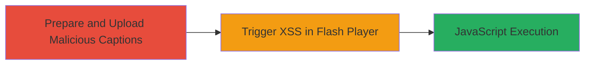

---
tags:
  - xss
  - vimeo
  - flash
  - captions
  - subtitles
  - web
type: attack_chain
tools: []
tactics:
  - '[[Execution]]'
verified: false
platforms:
  - Web
submitted: true
complexity: medium
procedures:
  - '[[procedures/Upload-and-Configure-Malicious-VTT-Captions]]'
  - '[[procedures/Trigger-XSS-in-Hubnut-Flash-Player]]'
step_count: 2
techniques:
  - '[[JavaScript]]'
description: >-
  A cross-site scripting attack exploiting unescaped .vtt caption files in
  Vimeo's Flash-based video player, requiring user interaction to enable
  captions for JavaScript execution.
skill_level: intermediate
impact_level: medium
id: 3c86fdf6-a9ca-4e5f-b4f1-b89571c8a298
created_at: '2025-12-14T03:16:30.644Z'
updated_at: '2025-12-14T03:16:30.644Z'
validated: true
mitre_tactics:
  - '[[Execution]]'
mitre_techniques:
  - '[[JavaScript]]'
---
# XSS via Malicious VTT Captions in Vimeo Flash Player

Multi-stage attack chain demonstrating a complete attack workflow exploiting a cross-site scripting vulnerability in Vimeo's Flash-based video player through unescaped .vtt caption files.

## Chain Metrics Dashboard

| Metric | Value |
|--------|-------|
| Chain Status | Unverified |
| Total Steps | 2 |
| Execution Time | ~10 minutes |
| Skill Level | Intermediate |
| Complexity | Medium |
| Impact Level | Medium |

## Attack Flow Visualization

## Prerequisites & Requirements

### Required Tools

- None (manual web interactions)

### Target Environment

- Vimeo account with video upload privileges
- Access to video management interface
- Another account or browser for victim simulation
- Malicious .vtt file with payload (e.g., containing `` in subtitle content)

### Initial Access Requirements

- Valid Vimeo account credentials
- Public or accessible video
- No prior access needed beyond account creation

## Detailed Attack Procedures

### Step 1: Prepare and Upload Malicious VTT Captions
procedure: [[procedures/Upload-and-Configure-Malicious-VTT-Captions]]

**Objective**: Upload a video, add malicious .vtt captions, and enable them to inject unescaped HTML/JavaScript payload.

**Instructions**: Create or use an existing public video, navigate to its settings, upload the .vtt file via the Advanced tab, enable captions, select English as the language and Captions as the type, then save changes. This stores the unescaped payload on Vimeo's servers.

**Expected Output**: Captions successfully configured and persisted for the video.

**Success Indicators**:
- Malicious .vtt file uploaded without errors
- Status toggled to ON and saved
- Video settings reflect enabled English captions

### Step 2: Trigger XSS in Hubnut Flash Player
procedure: [[procedures/Trigger-XSS-in-Hubnut-Flash-Player]]

**Objective**: Force the use of the vulnerable Flash player via Hubnut widget and enable captions to execute the injected JavaScript in the victim's browser context.

**Instructions**: From a separate account or browser, access the Hubnut player URL (e.g., https://player.vimeo.com/hubnut/user/[user_url]), play the video, click the CC button, and select English to activate captions. This renders the unescaped content in Flash, executing the payload.

**Expected Output**: Alert or other JavaScript execution (e.g., alert(document.domain)) upon enabling captions.

**Success Indicators**:
- Video plays in Flash player (not HTML5)
- CC button enables English captions
- Payload executes, confirming XSS

## Attack Chain Summary

### Key Achievements

1. Successful upload of malicious .vtt file bypassing sanitization
2. Configuration of captions to inject executable script
3. Triggering of XSS via user interaction in Flash player context

## Technique & Tactic Coverage

### MITRE ATT&CK Techniques

- [[JavaScript]]

### MITRE ATT&CK Tactics

- [[Execution]]

---
*Last updated: 2023-10-01T00:00:00Z*
