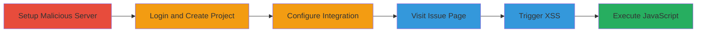

# XSS via Malicious ZenTao Integration in Self-Hosted GitLab

Multi-stage attack chain demonstrating a complete attack workflow exploiting insufficient validation in GitLab's ZenTao integration to achieve XSS on self-hosted instances without strict CSP.

## Chain Metrics Dashboard

| Metric | Value |
|--------|-------|
| Chain Status | Unverified |
| Total Steps | 6 |
| Execution Time | ~15 minutes |
| Skill Level | Intermediate |
| Complexity | Medium |
| Impact Level | High |

## Attack Flow Visualization



## Prerequisites & Requirements

### Required Tools

- [[tools/GitLab]]
- [[tools/Apache]]
- [[tools/ZenTao]]

### Target Environment

- Self-hosted GitLab instance with premium subscription
- Required services/ports: HTTP/HTTPS on port 80/443
- Network access requirements: Attacker controls a domain/server for mock ZenTao

### Initial Access Requirements

- Valid user credentials for GitLab (premium access)
- Network position: Attacker needs to lure victim to visit the issue page
- Prior access needed: None, but social engineering to get victim to click

## Detailed Attack Procedures

### Step 1: Log In to Self-Hosted GitLab
procedure: [[procedures/Log-In-to-Self-Hosted-GitLab]]

**Objective**: Gain access to the GitLab instance to configure integrations.

**Instructions**: Use a valid user account with premium features to log in via the web interface.

**Expected Output**: Successful login to the dashboard.

**Success Indicators**:
- Access to project creation and integration settings
- Premium features available

### Step 2: Create GitLab Project
procedure: [[procedures/Create-GitLab-Project]]

**Objective**: Establish a project to enable ZenTao integration configuration.

**Instructions**: Navigate to the projects section and create a new project.

**Expected Output**: New project created with default settings.

**Success Indicators**:
- Project dashboard accessible
- Integration options visible

### Step 3: Configure Malicious ZenTao Integration
procedure: [[procedures/Configure-Malicious-ZenTao-Integration]]

**Objective**: Point GitLab to the attacker's malicious ZenTao server.

**Instructions**: Go to project settings > integrations > ZenTao, set server URL to attacker-controlled endpoint like https://joaxcar.com, leave API empty, add dummy credentials.

**Expected Output**: Integration saved and active.

**Success Indicators**:
- Integration configuration persists
- No immediate errors on save

### Step 4: Visit ZenTao Issue Details Page
procedure: [[procedures/Visit-ZenTao-Issue-Details-Page]]

**Objective**: Trigger GitLab to fetch and render data from the malicious server.

**Instructions**: Navigate to a URL like https://gitlab.example.com/user1/project1/-/integrations/zentao/issues/story-1.

**Expected Output**: Page loads with injected content from malicious JSON.

**Success Indicators**:
- Breadcrumb shows injected HTML elements
- Malicious content visible but not yet executed

### Step 5: Trigger XSS by Clicking Link
procedure: [[procedures/Trigger-XSS-by-Clicking-Link]]

**Objective**: Execute the JavaScript payload via user interaction.

**Instructions**: Click on the injected large image or link in the breadcrumb, which contains a javascript: URL.

**Expected Output**: Arbitrary JavaScript executes in the browser context.

**Success Indicators**:
- Alert or payload effects visible (e.g., console logs, token generation)
- Potential account takeover actions

### Step 6: Setup Mock ZenTao Server with Apache
procedure: [[procedures/Setup-Mock-ZenTao-Server-with-Apache]]

**Objective**: Host the malicious JSON payload for API responses.

**Instructions**: Configure Apache with .htaccess rewrites using [[commands/apache-rewritecond-match-api-requests]] and [[commands/apache-rewritrule-serve-malicious-json]] to serve issue.json containing HTML injection in 'id' and javascript: URL in 'url'.

```apache
RewriteCond %{REQUEST_URI} ^/api.php/v1/issues
RewriteRule .* /zentao/issue.json [L]
```

**Expected Output**: Server responds with malicious JSON to /api.php/v1/issues/story-1.

**Success Indicators**:
- Requests to API endpoint return the payload
- JSON includes  in id and url: javascript:alert(document.cookie)

## Attack Chain Summary

### Key Achievements

1. Successful injection of HTML and JavaScript via unvalidated ZenTao API responses
2. Triggering of XSS leading to arbitrary JS execution in GitLab context
3. Potential for account takeover, SSH key addition, or data exfiltration on self-hosted instances

## Technique & Tactic Coverage

### MITRE ATT&CK Techniques

- [[JavaScript]]
- [[Drive-by Compromise]]

### MITRE ATT&CK Tactics

- [[Initial Access]]
- [[Execution]]

---

*Last updated: 2023-10-01T00:00:00Z*
