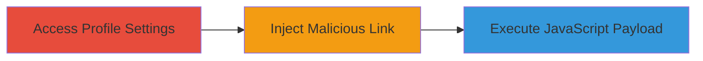

---
tags:
  - xss
  - javascript-url
  - profile-settings
  - vimeo
type: attack_chain
tools: []
tactics:
  - '[[Execution]]'
verified: false
platforms:
  - Web
submitted: true
complexity: low
created_at: '2024-10-01T12:00:00Z'
procedures:
  - '[[procedures/Access-Vimeo-Profile-Settings]]'
  - '[[procedures/Inject-JavaScript-URL-in-Vimeo-Profile-Link]]'
  - '[[procedures/Execute-XSS-Payload-via-Vimeo-Profile-Link]]'
step_count: 3
techniques:
  - '[[JavaScript]]'
updated_at: '2025-12-14T03:15:35.807Z'
description: >-
  A multi-step attack exploiting a Cross-Site Scripting (XSS) vulnerability in
  Vimeo's profile settings by injecting a javascript: URL into a profile link
  field, leading to arbitrary JavaScript execution upon clicking the link.
skill_level: beginner
impact_level: medium
id: ff6f24bf-9a24-4631-9762-0d6e9c3a8ceb
validated: true
mitre_tactics:
  - '[[Execution]]'
mitre_techniques:
  - '[[JavaScript]]'
---
# XSS via Malicious javascript: URL in Vimeo Profile Settings

Multi-stage attack chain demonstrating a complete attack workflow exploiting XSS in Vimeo's profile settings.

## Chain Metrics Dashboard

| Metric | Value |
|--------|-------|
| Chain Status | Unverified |
| Total Steps | 3 |
| Execution Time | ~1 minute |
| Skill Level | Beginner |
| Complexity | Low |
| Impact Level | Medium |

## Attack Flow Visualization

## Prerequisites & Requirements

### Required Tools

- Web browser (e.g., Chrome on Android for PoC validation)

### Target Environment

- Web platform
- Access to Vimeo account with profile editing permissions
- No specific services or ports required beyond standard HTTPS

### Initial Access Requirements

- Valid Vimeo user credentials
- Network access to vimeo.com
- No prior access needed beyond account login

## Detailed Attack Procedures

### Step 1: Access Profile Settings
procedure: [[procedures/Access-Vimeo-Profile-Settings]]

**Objective**: Navigate to the profile settings page to access the link addition feature.

**Instructions**: Log in to your Vimeo account and directly access the profile settings URL. This positions you to interact with the vulnerable link field.

**Expected Output**: Profile settings page loads, displaying fields for adding links.

**Success Indicators**:
- Page loads at https://vimeo.com/settings/profile without errors
- Link addition interface is visible

### Step 2: Inject Malicious Link
procedure: [[procedures/Inject-JavaScript-URL-in-Vimeo-Profile-Link]]

**Objective**: Add a link containing a javascript: URL payload to bypass validation and store the malicious script.

**Instructions**: In the link addition field on the profile settings page, enter a javascript: payload such as 'javascript:alert(document.domain+"http://")'. Save the profile to persist the link.

**Expected Output**: The malicious link is added to the profile without rejection.

**Success Indicators**:
- Link saves successfully
- Profile updates to include the new link

### Step 3: Execute Payload
procedure: [[procedures/Execute-XSS-Payload-via-Vimeo-Profile-Link]]

**Objective**: Trigger the XSS by clicking the injected link, resulting in JavaScript execution.

**Instructions**: View the updated profile and click the added malicious link. This executes the javascript: payload in the browser context.

**Expected Output**: An alert box or other JavaScript effect (e.g., alert displaying document domain) appears.

**Success Indicators**:
- JavaScript code executes (e.g., alert pops up)
- No sanitization blocks the execution

## Attack Chain Summary

### Key Achievements

1. Successfully injected a javascript: URL into Vimeo's profile link field due to lack of validation.
2. Demonstrated arbitrary JavaScript execution via a simple click, confirmed with PoC in Chrome on Android.
3. Highlighted potential for session hijacking or data theft if the profile link is clicked by victims.

## Technique & Tactic Coverage

### MITRE ATT&CK Techniques

- [[JavaScript]]

### MITRE ATT&CK Tactics

- [[Execution]]

---
*Last updated: 2024-10-01T12:00:00Z*
