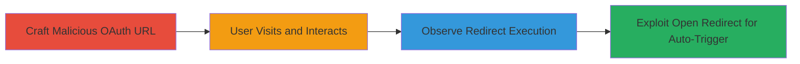

# XSS via Malicious redirect_uri in Uber OAuth Authorization Endpoint

Multi-stage attack chain demonstrating exploitation of an XSS vulnerability in Uber's OAuth authorization endpoint through improper redirect_uri validation, allowing javascript: URIs to execute payloads in vulnerable browsers, combined with open redirects for phishing or non-interactive attacks.

## Chain Metrics Dashboard

| Metric | Value |
|--------|-------|
| Chain Status | Unverified |
| Total Steps | 4 |
| Execution Time | ~5 minutes |
| Skill Level | Intermediate |
| Complexity | Medium |
| Impact Level | High |

## Attack Flow Visualization



## Prerequisites & Requirements

### Required Tools

- Web browser (e.g., Opera Mini, Firefox with 302 redirects disabled, or older Mozilla versions for javascript: URI execution)
- URL encoder/decoder for crafting payloads

### Target Environment

- Uber OAuth endpoint: https://login.uber.com/oauth/authorize
- Web platform with OAuth 2.0 implementation
- Vulnerable browsers where Location header redirects to javascript: URIs execute JS

### Initial Access Requirements

- No credentials required; social engineering to lure user to crafted URL
- Network access to Uber's login domain
- User interaction for standard flow, or invalid params for automatic

## Detailed Attack Procedures

### Step 1: Craft Malicious OAuth URL for XSS
procedure: [[procedures/Craft-Malicious-OAuth-URL-for-XSS]]

**Objective**: Construct an OAuth authorization URL with a malicious redirect_uri using the javascript: protocol to prepare for XSS payload execution.

**Instructions**: Use a valid client_id (e.g., obtained from public apps or testing) and encode the javascript: payload to alert document.domain or execute arbitrary JS. Example URL:

```url
https://login.uber.com/oauth/authorize?client_id=MXeE1dl-5R3yTCbufMHsfz3KhfY2UGyS&response_type=code&scope=profile&redirect_uri=javascript://goog.com/%0Aalert(document.domain);//
```

**Expected Output**: A fully formed URL ready for distribution to the target user.

**Success Indicators**:
- URL validates without errors in a browser address bar
- Payload encoding preserves JS execution (test with %0A for newline)

### Step 2: Trigger XSS via User Interaction
procedure: [[procedures/Trigger-XSS-via-User-Interaction]]

**Objective**: Have the user visit the crafted URL and interact with the OAuth consent page to initiate the redirect to the malicious URI.

**Instructions**: Distribute the URL via phishing or direct link. Upon visiting, the user sees the Uber consent page and clicks Allow or Deny, triggering a server redirect via Location header to the javascript: URI.

**Expected Output**: Browser executes the JS payload, e.g., an alert box showing the domain.

**Success Indicators**:
- User clicks Allow/Deny button
- Alert or JS execution occurs in vulnerable browsers

### Step 3: Observe and Execute Redirect Payload
procedure: [[procedures/Observe-and-Execute-Redirect-Payload]]

**Objective**: Monitor the redirect response and manually or automatically trigger the payload if the browser shows an intermediate page.

**Instructions**: After interaction, the server may return a 'Redirecting...' page with a link to the javascript: URI. In vulnerable browsers (e.g., Opera Mini), click the link or allow automatic redirect to execute the XSS.

**Expected Output**: JS payload runs, demonstrating control over the user's browser context.

**Success Indicators**:
- 'Object Moved' or 'Redirecting...' page appears
- Payload executes on click or auto-redirect

### Step 4: Exploit Open Redirect for Automatic XSS
procedure: [[procedures/Exploit-Open-Redirect-for-Automatic-XSS]]

**Objective**: Bypass user interaction by using invalid response_type or scope to force direct redirect to the malicious URI without consent buttons.

**Instructions**: Craft URL with invalid response_type (e.g., 'invalid'):

```url
https://login.uber.com/oauth/authorize?client_id=p2Onb3CmBMMx9bJU5nfmRao-0cpZ8pWV&response_type=invalid&scope=profile&redirect_uri=javascript%3A%2F%2Fx.com%2F%250Aalert(1)%3B%2F%2F
```

Visit the URL to trigger immediate redirect and JS execution.

**Expected Output**: Direct execution of alert(1) or custom payload without clicks.

**Success Indicators**:
- No consent page; immediate redirect
- JS alert fires automatically

## Attack Chain Summary

### Key Achievements

1. Successful XSS execution via javascript: redirect_uri in OAuth flow
2. Account hijacking potential through cookie theft or form manipulation
3. Enhanced phishing via open redirects to malicious sites
4. Non-interactive exploitation using invalid OAuth parameters

## Technique & Tactic Coverage

### MITRE ATT&CK Techniques

- [[Exploit Public-Facing Application]]
- [[JavaScript]]

### MITRE ATT&CK Tactics

- [[Initial Access]]
- [[Execution]]

---

*Last updated: 2023-10-01T00:00:00Z*
