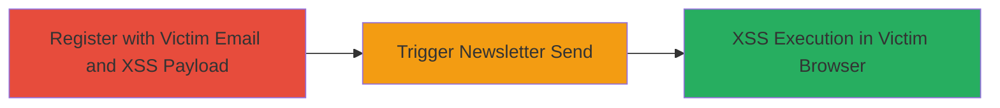

# XSS via Newsletter Username Injection for Victim Session Hijacking

Multi-stage attack chain demonstrating a complete attack workflow exploiting unsanitized username input in RelateIQ's newsletter mailing system to deliver XSS payloads to victims via email.

## Chain Metrics Dashboard

| Metric | Value |
|--------|-------|
| Chain Status | Unverified |
| Total Steps | 2 |
| Execution Time | ~5 minutes |
| Skill Level | Intermediate |
| Complexity | Medium |
| Impact Level | High |

## Attack Flow Visualization

## Prerequisites & Requirements

### Required Tools

- Web browser for registration and payload testing
- Email access to monitor delivery (attacker's own for verification)

### Target Environment

- RelateIQ web platform
- Newsletter mailing service
- Webmail client or email viewer in victim's browser

### Initial Access Requirements

- No prior credentials needed; public registration endpoint
- Knowledge of victim's email address
- Network access to RelateIQ site

## Detailed Attack Procedures

### Step 1: Account Registration with Payload
procedure: [[procedures/Register-Account-with-XSS-Payload-in-Username]]

**Objective**: Create a malicious account tied to the victim's email, injecting an XSS payload into the username field to be reflected in the newsletter.

**Instructions**: Navigate to the RelateIQ registration page. Enter the victim's email address and a username containing an XSS payload, such as `` or a more advanced payload like `` to exfiltrate cookies. Submit the registration form.

**Expected Output**: Account created successfully; confirmation email sent to the provided (victim's) address if applicable.

**Success Indicators**:
- Registration completes without errors
- Payload is accepted in username field (no immediate sanitization visible)

### Step 2: Trigger Newsletter Delivery
procedure: [[procedures/Trigger-Newsletter-Email-for-XSS-Execution]]

**Objective**: Initiate the newsletter mailing process to embed the malicious username in the email content, executing the XSS when the victim opens it.

**Instructions**: Once registered, log in as the new account if required, or wait for automated newsletter triggers. Manually trigger a newsletter send via any available dashboard or API endpoint in the system that processes user data for mailing. The unsanitized username will be injected into the email template.

**Expected Output**: Newsletter email delivered to the victim's inbox with the payload reflected in the content.

**Success Indicators**:
- Victim receives email with visible username injection
- Script executes (e.g., alert pops or data exfiltrated to attacker's server)

## Attack Chain Summary

### Key Achievements

1. Bypassed partial XSS fixes from prior reports by targeting newsletter username handling
2. Achieved client-side script execution in victim's browser context without direct access
3. Enabled potential session hijacking or data theft via cookie exfiltration

## Technique & Tactic Coverage

### MITRE ATT&CK Techniques

- [[JavaScript]]

### MITRE ATT&CK Tactics

- [[Execution]]
- [[Collection]]

---
*Last updated: 2023-10-01T00:00:00Z*
