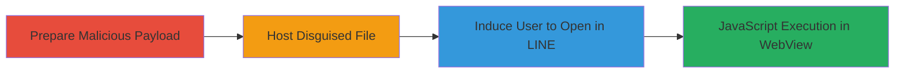

---
tags:
  - xss
  - webview
  - ios
  - mobile
  - line-app
  - misconfiguration
type: attack_chain
tools: []
tactics:
  - '[[Execution]]'
commands:
  - '[[commands/python-http-server-host-payload]]'
platforms:
  - iOS
  - Mobile App
  - WebView
complexity: low
procedures:
  - '[[procedures/Exploit-LINE-iOS-WebView-XSS-via-Octet-Stream]]'
step_count: 1
techniques:
  - '[[JavaScript]]'
description: >-
  Exploits a webview misconfiguration in the LINE iOS client where
  application/octet-stream files are rendered as HTML, enabling arbitrary
  JavaScript execution for cross-site scripting attacks.
skill_level: intermediate
impact_level: high
id: d0310563-eb93-435e-8492-d382ed04ffc4
created_at: '2025-12-14T17:24:44.896Z'
updated_at: '2025-12-14T17:24:44.896Z'
verified: false
validated: true
submitted: true
mitre_tactics:
  - '[[Execution]]'
mitre_techniques:
  - '[[JavaScript]]'
---
# XSS via Octet-Stream Misconfiguration in LINE iOS WebView

Multi-stage attack chain demonstrating exploitation of a webview flaw in the LINE client for iOS, allowing attackers to execute malicious JavaScript by disguising HTML as binary octet-stream files.

## Chain Metrics Dashboard

| Metric | Value |
|--------|-------|
| Chain Status | Unverified |
| Total Steps | 1 |
| Execution Time | ~5 minutes |
| Skill Level | Intermediate |
| Complexity | Low |
| Impact Level | High |

## Attack Flow Visualization



## Prerequisites & Requirements

### Required Tools

- None specific; uses built-in Python server for hosting.

### Target Environment

- LINE iOS client app installed on target device.
- iOS platform with webview component.
- No specific ports or services required; client-side exploitation.

### Initial Access Requirements

- Ability to deliver the malicious file to the victim (e.g., via link or attachment).
- Victim must open the file within the LINE app's webview.
- No prior credentials or network position needed; relies on social engineering.

## Detailed Attack Procedures

### Step 1: Exploit WebView Misconfiguration
procedure: [[procedures/Exploit-LINE-iOS-WebView-XSS-via-Octet-Stream]]

**Objective**: Create and serve a malicious HTML file disguised as an octet-stream binary, tricking the LINE iOS webview into rendering it as HTML to execute arbitrary JavaScript, enabling XSS attacks such as session hijacking or data theft.

**Instructions**: Begin by preparing a malicious HTML file containing JavaScript payload, such as one that alerts or exfiltrates data. Save it with a .bin or generic extension to mimic binary data. Then, host the file using a simple HTTP server configured to serve it with 'Content-Type: application/octet-stream' header. Use [[commands/python-http-server-host-payload]] to start the server:

```bash
python3 -m http.server 8000 --bind 0.0.0.0
```

Upload or link the file to the victim via LINE messaging or external means. When the victim opens the link or file in the LINE app, the webview misconfiguration causes it to render the HTML, executing the JS.

**Expected Output**: JavaScript executes within the webview context, potentially displaying an alert or sending data to an attacker-controlled server.

**Success Indicators**:
- Victim's device shows JS execution (e.g., alert popup or network request to attacker server).
- Sensitive data like session tokens captured on attacker side.

## Attack Chain Summary

### Key Achievements

1. Bypassed content-type handling to render HTML as binary.
2. Achieved arbitrary JS execution in a trusted mobile app webview.
3. Enabled potential compromise of user sessions or theft of sensitive information.

## Technique & Tactic Coverage

### MITRE ATT&CK Techniques

- [[JavaScript]]

### MITRE ATT&CK Tactics

- [[Execution]]

*Last updated: 2023-10-01*
