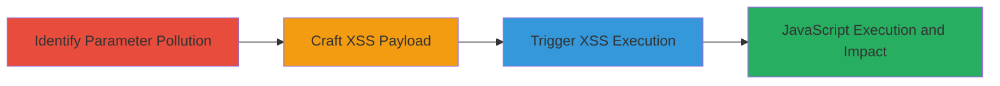

# XSS via Parameter Pollution on IRCCloud Badges Page

Multi-stage attack chain demonstrating exploitation of a Cross-Site Scripting (XSS) vulnerability on IRCCloud's badges page through HTTP parameter pollution, allowing evasion of strong XSS filters and execution of arbitrary JavaScript.

## Chain Metrics Dashboard

| Metric | Value |
|--------|-------|
| Chain Status | Unverified |
| Total Steps | 3 |
| Execution Time | ~5 minutes |
| Skill Level | Intermediate |
| Complexity | Medium |
| Impact Level | High |

## Attack Flow Visualization

## Prerequisites & Requirements

### Required Tools

- Web browser (e.g., Chrome or Firefox with developer tools)

### Target Environment

- Web platform
- Access to IRCCloud badges page (www.irccloud.com/badges)
- No specific ports or services required beyond standard HTTP/HTTPS

### Initial Access Requirements

- Valid user session on IRCCloud (authenticated access to badges page)
- Network access to irccloud.com
- No prior elevated access needed

## Detailed Attack Procedures

### Step 1: Identify Parameter Pollution
procedure: [[procedures/Identify-Parameter-Pollution-on-Badges-Page]]

**Objective**: Detect the parameter pollution vulnerability by observing inconsistent server-side handling of duplicate 'hostname' parameters on the badges page.

**Instructions**: Navigate to the IRCCloud badges page and manually test by appending multiple 'hostname' parameters with conflicting values to the URL, such as www.irccloud.com/badges?hostname=value1&hostname=value2. Observe the page output for manipulation or unexpected rendering, indicating poor normalization of duplicate parameters.

**Expected Output**: Inconsistent page rendering or altered output based on parameter order/duplication, confirming the pollution vulnerability.

**Success Indicators**:
- Server processes multiple 'hostname' values differently, leading to manipulable output
- No errors thrown; page loads with altered behavior

### Step 2: Craft XSS Payload
procedure: [[procedures/Craft-XSS-Payload-with-JavaScript-Comment-Evasion]]

**Objective**: Develop an XSS payload that leverages parameter pollution and JavaScript comments to close HTML attributes and inject a script tag, bypassing the site's strong XSS filters.

**Instructions**: Construct the payload by combining the polluted 'hostname' parameter with JavaScript comments. Use a URL like: www.irccloud.com/badges?hostname=hostname" type="text/javascript"> /*&hostname=*/alert('XSS\n-Rohit Dua'); //. Test iteratively in the browser's developer console or by direct URL entry to refine the evasion technique.

**Expected Output**: The payload closes the existing script or attribute tag and injects a new script without triggering filters, preparing for execution.

**Success Indicators**:
- Payload evades filters; no sanitization errors
- HTML source shows injected script tag structure

### Step 3: Trigger XSS Execution
procedure: [[procedures/Trigger-XSS-via-Crafted-URL]]

**Objective**: Load the crafted URL in the victim's browser to execute the injected JavaScript, demonstrating arbitrary code execution.

**Instructions**: Visit the full POC URL in an authenticated browser session: www.irccloud.com/badges?hostname=hostname" type="text/javascript"> /*&hostname=*/alert('XSS\n-Rohit Dua'); //. Monitor the page load for the alert dialog.

**Expected Output**: An alert box displays 'XSS - Rohit Dua', confirming JavaScript execution.

**Success Indicators**:
- Alert pops up in the browser
- Browser console logs show script execution without blocks

## Attack Chain Summary

### Key Achievements

1. Identified parameter pollution enabling output manipulation on the badges page.
2. Bypassed strong XSS filters using JavaScript comments and tag closure.
3. Achieved arbitrary JavaScript execution, enabling potential session hijacking or phishing.

## Technique & Tactic Coverage

### MITRE ATT&CK Techniques

- [[JavaScript]]
- [[Exploit Public-Facing Application]]

### MITRE ATT&CK Tactics

- [[Execution]]
- [[Collection]]

---
*Last updated: 2023-10-01T00:00:00Z*
