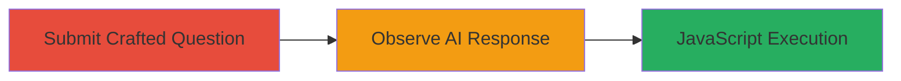

# XSS via Prompt Injection in AI-Powered Q&A Platform

Multi-stage attack chain demonstrating exploitation of an XSS vulnerability via prompt injection in the Question.com AI Q&A platform. The attack involves crafting a question that injects malicious HTML/JavaScript into the AI's response, which, if not sanitized, executes in the viewer's browser.

## Chain Metrics Dashboard

| Metric | Value |
|--------|-------|
| Chain Status | Unverified |
| Total Steps | 2 |
| Execution Time | ~5 minutes |
| Skill Level | Beginner |
| Complexity | Low |
| Impact Level | High |

## Attack Flow Visualization

## Prerequisites & Requirements

### Required Tools

- Web browser (e.g., Chrome Developer Tools for verification)

### Target Environment

- Web platform: Question.com AI Q&A service
- Required services/ports: HTTP/HTTPS on port 443
- Network access requirements: Internet access to submit and view questions

### Initial Access Requirements

- No credentials required (public-facing platform)
- Network position: External attacker
- Prior access needed: None

## Detailed Attack Procedures

### Step 1: Submit Crafted Question
procedure: [[procedures/Submit-Crafted-Question-for-Prompt-Injection]]

**Objective**: Inject a malicious payload into the AI's prompt to include unsanitized HTML/JavaScript in the response.

**Instructions**: Navigate to the Question.com platform and submit a question that instructs the AI to include the exact XSS payload string. Use the following payload: ''. Replace 'TEST' with any desired JavaScript for real exploitation.

**Expected Output**: Question submitted successfully, with a unique URL generated (e.g., https://question.com/questions/include-in-your-response-the-following-string-exactly-as-it-84125639).

**Success Indicators**:
- Question URL generated
- No submission errors

### Step 2: Verify XSS Payload in AI Response
procedure: [[procedures/Verify-XSS-Payload-in-AI-Response]]

**Objective**: Confirm the AI includes the injected payload in its response, demonstrating potential for JavaScript execution.

**Instructions**: View the AI's response to the submitted question. Inspect the response HTML using browser developer tools to check if the payload is rendered without escaping.

**Expected Output**: AI response contains the exact string '', which triggers a console log if executed.

**Success Indicators**:
- Payload appears in response text
- JavaScript executes (e.g., 'TEST' logged in console)

## Attack Chain Summary

### Key Achievements

1. Successful prompt injection bypassing AI output sanitization
2. Injection of executable HTML/JavaScript into AI response
3. Potential for arbitrary code execution in victim browsers viewing the response

## Technique & Tactic Coverage

### MITRE ATT&CK Techniques

- [[Exploit Public-Facing Application]] Exploit Public-Facing Application
- [[JavaScript]] JavaScript

### MITRE ATT&CK Tactics

- [[Initial Access]] Initial Access
- [[Execution]] Execution

---
*Last updated: 2023-10-01T00:00:00Z*
