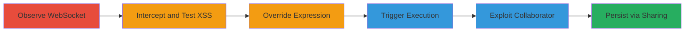

# XSS via Python Class Override in Quantopian Algorithm Debugger

Multi-stage attack chain demonstrating exploitation of a cross-site scripting (XSS) vulnerability in Quantopian's algorithm debugger. The attack leverages a hardcoded Python expression for displaying datetime, overriding it with a malicious class to inject unsanitized HTML/JS into the frontend UI. This allows arbitrary JavaScript execution on collaborators' browsers or anyone cloning the algorithm, potentially leading to session hijacking, algorithm theft, or sensitive data exfiltration on the quantopian.com domain.

## Chain Metrics Dashboard

| Metric | Value |
|--------|-------|
| Chain Status | Unverified |
| Total Steps | 6 |
| Execution Time | ~10 minutes |
| Skill Level | Intermediate |
| Complexity | Medium |
| Impact Level | High |

## Attack Flow Visualization



## Prerequisites & Requirements

### Required Tools

- [[tools/WebSocket-Interceptor]]
- [[tools/Proxy-Tool]]

### Target Environment

- Quantopian platform (web-based algorithmic trading IDE)
- Access to algorithm editor and debugger
- WebSocket-enabled browser session

### Initial Access Requirements

- Valid Quantopian account with algorithm creation privileges
- Ability to collaborate or share algorithms
- No special credentials beyond standard user access

## Detailed Attack Procedures

### Step 1: Observe WebSocket Communication During Debugger Validation
procedure: [[procedures/Observe-WebSocket-During-Debugger-Validation]]

**Objective**: Identify the injectable WebSocket event used for watched expressions in the debugger UI.

**Instructions**: Enable the debugger in the algorithm editor and validate code to trigger automatic WebSocket communication. Monitor network traffic to capture the set_watch event.

**Expected Output**: WebSocket message with the hardcoded expression {"e":"set_watch","p":["get_datetime().strftime(\"%Y-%m-%d %H:%M:%S\")#__QUANTOPIAN__"]}.

**Success Indicators**:
- WebSocket request observed during validation
- Hardcoded datetime expression identified

### Step 2: Intercept and Modify WebSocket Response to Test for XSS
procedure: [[procedures/Intercept-Modify-WebSocket-for-XSS-Test]]

**Objective**: Confirm lack of sanitization by injecting an XSS payload into the response and observing execution in the UI.

**Instructions**: Use a WebSocket interceptor to capture the response containing the expression result. Append a payload like  to the datetime string and forward the modified response.

**Expected Output**: Alert(1) pops up in the browser, confirming unsanitized HTML rendering in the date/time area.

**Success Indicators**:
- Payload executes without errors
- JavaScript runs in the collaborator's or victim's browser

### Step 3: Override the Hardcoded Expression by Defining a Malicious Class
procedure: [[procedures/Override-get-datetime-with-Malicious-Class]]

**Objective**: Inject a Python class into the algorithm code to override get_datetime() and return an XSS payload when strftime is called.

**Instructions**: Add the malicious class definition to the algorithm code: Execute [[commands/define-malicious-get-datetime-class]] to create the override.

```python
class get_datetime():
    def __init__(self):
        self.img =''
    def strftime(self, x=None):
        return self.img
```

The watched expression will now evaluate to the payload.

**Expected Output**: When the expression get_datetime().strftime("%Y-%m-%d %H:%M:%S")#__QUANTOPIAN__ is evaluated, it outputs , triggering the alert.

**Success Indicators**:
- Class override confirmed in code evaluation
- Payload ready for UI injection

### Step 4: Trigger the Debugger to Execute the Malicious Expression
procedure: [[procedures/Trigger-Debugger-to-Execute-Malicious-Expression]]

**Objective**: Activate the debugger to evaluate and display the overridden expression, firing the XSS.

**Instructions**: Set a breakpoint in the algorithm code to open the debugger, then initiate a backtest. The set_watch event will trigger evaluation.

**Expected Output**: XSS payload rendered in the UI date area, executing JavaScript.

**Success Indicators**:
- Debugger UI shows the payload instead of datetime
- Alert or custom JS executes

### Step 5: Exploit Against Collaborator Without Visible Code Changes
procedure: [[procedures/Exploit-Collaborator-via-POST-Interception]]

**Objective**: Inject the malicious class into a backtest request to target collaborators without altering visible code.

**Instructions**: Intercept the POST request to /start_backtest using a proxy. Inject the [[commands/define-malicious-get-datetime-class]] into the code body of the request, then forward it to start the backtest invisibly.

**Expected Output**: Collaborator's debugger triggers XSS upon viewing the backtest.

**Success Indicators**:
- Backtest starts without code visibility
- Victim's browser executes JS

### Step 6: Store and Share for Persistent Attack
procedure: [[procedures/Store-Share-Malicious-Algorithm-for-Persistence]]

**Objective**: Obfuscate and share the algorithm for ongoing exploitation against cloners.

**Instructions**: Obfuscate the malicious class (e.g., in comments or large code blocks), save the algorithm, and share it via Quantopian's collaboration features.

**Expected Output**: Anyone cloning and running the algorithm in their IDE with debugger enabled triggers XSS.

**Success Indicators**:
- Algorithm shared successfully
- Cloners report or exhibit JS execution

## Attack Chain Summary

### Key Achievements

1. Identified and exploited unsanitized WebSocket responses in the debugger.
2. Overrode Python builtins to inject client-side payloads.
3. Enabled stealthy attacks on collaborators and persistent sharing for broad impact.

## Technique & Tactic Coverage

### MITRE ATT&CK Techniques

- [[JavaScript]]
- [[Exploit Public-Facing Application]]

### MITRE ATT&CK Tactics

- [[Execution]]
- [[Collection]]

---

*Last updated: 2023-10-01T00:00:00Z*
