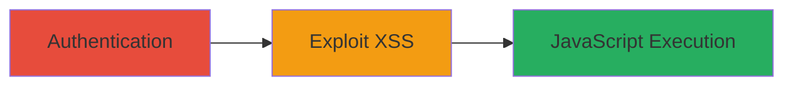

# XSS via Referer Parameter in Informatica Network Login Form

Multi-stage attack chain demonstrating exploitation of a reflected XSS vulnerability in the Informatica Network login form through the referer parameter, leading to arbitrary JavaScript execution in an authenticated session.

## Chain Metrics Dashboard

| Metric | Value |
|--------|-------|
| Chain Status | Unverified |
| Total Steps | 2 |
| Execution Time | ~2 minutes |
| Skill Level | Intermediate |
| Complexity | Medium |
| Impact Level | High |

## Attack Flow Visualization

## Prerequisites & Requirements

### Required Tools

- [[tools/Firefox]]
- [[tools/Chrome]]

### Target Environment

- Web platform
- Access to Informatica Network (https://network.informatica.com)
- Valid user credentials for authentication

### Initial Access Requirements

- User account on Informatica Network
- Network access to the login page
- No prior session required, but authentication is necessary

## Detailed Attack Procedures

### Step 1: Authentication
procedure: [[procedures/Authenticate-to-Informatica-Network]]

**Objective**: Establish an authenticated session on the Informatica Network platform to enable post-login exploitation.

**Instructions**: Navigate to the login page at https://network.informatica.com/login!input.jspa and enter valid credentials to authenticate. This creates a session that will be used for the subsequent redirection.

**Expected Output**: Successful login redirect to the dashboard or intended page, with session cookies set.

**Success Indicators**:
- Login success message or dashboard access
- Session established (verifiable via browser developer tools)

### Step 2: Trigger XSS Exploitation
procedure: [[procedures/Exploit-XSS-with-Malicious-Referer-URL]]

**Objective**: Craft and visit a malicious URL that injects a javascript: payload via the referer parameter, executing arbitrary code in the authenticated context.

**Instructions**: After authentication, construct the URL https://network.informatica.com/login!input.jspa?referer=javascript:alert(document.domain) and navigate to it in the browser. The referer value is inserted unsanitized into JavaScript code (e.g., finalPageURL='%ref%';) and executed during redirection via InfaAutoLogin.authenticateUser.

**Expected Output**: Alert box displaying the document domain (e.g., network.informatica.com), confirming JavaScript execution.

**Success Indicators**:
- JavaScript alert or payload execution
- Potential for further actions like session hijacking or data theft

## Attack Chain Summary

### Key Achievements

1. Authenticated session establishment
2. Injection and execution of arbitrary JavaScript via referer parameter
3. Demonstration of high-impact XSS leading to browser compromise

## Technique & Tactic Coverage

### MITRE ATT&CK Techniques

- [[JavaScript]]
- [[Exploit Public-Facing Application]]

### MITRE ATT&CK Tactics

- [[Execution]]
- [[Initial Access]]

---

*Last updated: 2023-10-01T00:00:00Z*
