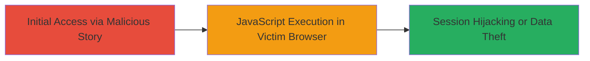

# XSS via Story Title on VK.com Mobile Site Leading to Session Hijacking

Multi-stage attack chain demonstrating a complete attack workflow exploiting a reflected XSS vulnerability in the story title feature on m.vk.com.

## Chain Metrics Dashboard

| Metric | Value |
|--------|-------|
| Chain Status | Unverified |
| Total Steps | 1 |
| Execution Time | ~5 minutes |
| Skill Level | Beginner |
| Complexity | Low |
| Impact Level | High |

## Attack Flow Visualization

## Prerequisites & Requirements

### Required Tools

- Web browser (e.g., Chrome with developer tools)

### Target Environment

- Platform: Web (mobile site m.vk.com)
- Required services/ports: HTTPS on port 443
- Network access requirements: Internet access to VK.com

### Initial Access Requirements

- Credential requirements: Valid VK.com account to create stories
- Network position: Attacker must be able to share stories publicly or via links
- Prior access needed: None, but social engineering to lure victims

## Detailed Attack Procedures

### Step 1: Inject and Deliver Malicious Payload
procedure: [[procedures/Inject-Malicious-Script-in-VK-Story-Title]]

**Objective**: Create a story on m.vk.com with a malicious JavaScript payload in the title field to execute code in the victim's browser when viewed.

**Instructions**: Log in to m.vk.com using a VK account. Navigate to the stories creation feature. In the title field, input a payload such as `` to test for XSS. Publish the story and share the link with the victim via social engineering (e.g., direct message or public post). When the victim views the story on m.vk.com, the payload executes.

**Expected Output**: Alert box displaying cookies or other client-side data in the victim's browser.

**Success Indicators**:
- Payload executes without sanitization (e.g., alert fires)
- Victim's session cookies are accessible via the script

## Attack Chain Summary

### Key Achievements

1. Successful injection of arbitrary JavaScript via story title
2. Execution of code in victim browsers leading to potential session theft
3. Demonstration of client-side attack surface on VK.com mobile

## Technique & Tactic Coverage

### MITRE ATT&CK Techniques

- [[JavaScript]]

### MITRE ATT&CK Tactics

- [[Execution]]
- [[Collection]]

---
*Last updated: 2023-10-01T00:00:00Z*
