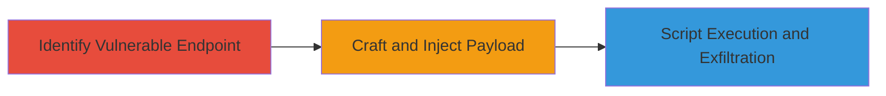

---
tags:
  - xss
  - web
  - url-manipulation
  - script-injection
  - rockstar-games
type: attack_chain
tools: []
tactics:
  - '[[Initial Access]]'
  - '[[Execution]]'
  - '[[Collection]]'
verified: false
platforms:
  - Web
submitted: true
complexity: medium
created_at: '2023-10-01T00:00:00Z'
procedures:
  - '[[procedures/Identify-XSS-Vulnerable-Endpoint-in-URL-Path]]'
  - '[[procedures/Craft-Hashed-Payload-to-Load-External-Script]]'
step_count: 2
techniques:
  - '[[Exploit Public-Facing Application]]'
  - '[[JavaScript]]'
updated_at: '2025-12-13T23:56:19.729Z'
description: >-
  A multi-stage attack exploiting an XSS vulnerability in the Rockstar Games GTA
  Online screens page by manipulating the URL path to load and execute an
  external script, enabling potential cookie theft or further attacks.
skill_level: intermediate
impact_level: high
id: 90159204-d229-4fd7-963d-9c3eb4f24792
validated: true
mitre_tactics:
  - '[[Initial Access]]'
  - '[[Execution]]'
  - '[[Collection]]'
mitre_techniques:
  - '[[Exploit Public-Facing Application]]'
  - '[[JavaScript]]'
---
# XSS via URL Path Manipulation and Hashing on Rockstar Games GTA Online Screens

Multi-stage attack chain demonstrating a complete attack workflow exploiting an XSS vulnerability on the Rockstar Games website.

## Chain Metrics Dashboard

| Metric | Value |
|--------|-------|
| Chain Status | Unverified |
| Total Steps | 2 |
| Execution Time | ~5 minutes |
| Skill Level | Intermediate |
| Complexity | Medium |
| Impact Level | High |

## Attack Flow Visualization

## Prerequisites & Requirements

### Required Tools

- Browser developer tools for URL observation and testing

### Target Environment

- Web platform
- Access to the public-facing Rockstar Games website
- No specific services or ports required beyond standard HTTP/HTTPS

### Initial Access Requirements

- Public internet access
- No credentials needed
- Ability to craft and navigate to manipulated URLs

## Detailed Attack Procedures

### Step 1: Identify Vulnerable Endpoint
procedure: [[procedures/Identify-XSS-Vulnerable-Endpoint-in-URL-Path]]

**Objective**: Observe and confirm the page's behavior in processing arbitrary content in the URL path after the screens endpoint without validation.

**Instructions**: Navigate to the base URL https://www.rockstargames.com/GTAOnline/jp/screens/ and append arbitrary content after the last slash, such as /test. Use browser developer tools to inspect network requests and page rendering to verify that the content is decoded and loaded without sanitization.

**Expected Output**: The page attempts to load or render the appended content, indicating lack of validation.

**Success Indicators**:
- Arbitrary URL path content is processed by the page
- No errors or blocks on loading unsanitized input

### Step 2: Craft and Inject Payload
procedure: [[procedures/Craft-Hashed-Payload-to-Load-External-Script]]

**Objective**: Manipulate the URL using a hashing strategy to inject and execute an externally hosted malicious script, enabling XSS payload delivery.

**Instructions**: Develop a hashed payload that encodes a script tag pointing to an external host, such as a JavaScript file on a controlled server. Append this hashed value to the URL path after /GTAOnline/jp/screens/. For example, construct a hash that resolves to  upon decoding. Load the URL in a browser and monitor the console for script execution.

**Expected Output**: The external script loads and executes, potentially alerting or exfiltrating data like cookies.

**Success Indicators**:
- External script is fetched and run
- Evidence of payload execution in browser console or network tab

## Attack Chain Summary

### Key Achievements

1. Identified unvalidated URL path processing leading to XSS
2. Successfully injected and executed external script via hashing bypass
3. Demonstrated potential for cookie theft or session hijacking

## Technique & Tactic Coverage

### MITRE ATT&CK Techniques

- [[Exploit Public-Facing Application]]
- [[JavaScript]]

### MITRE ATT&CK Tactics

- [[Initial Access]]
- [[Execution]]
- [[Collection]]

---

*Last updated: 2023-10-01T00:00:00Z*
